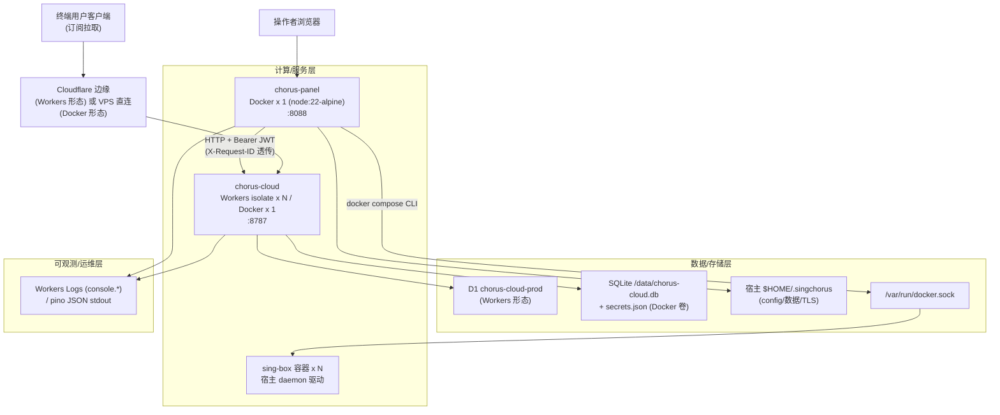
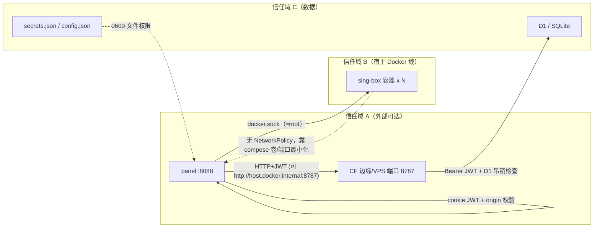

# 部署视图（物理部署与拓扑）

## 1. 全局部署拓扑

系统为自托管优先的单机（VPS）拓扑 + 可选的 Cloudflare Workers 托管形态。cloud 与 panel 是两个独立镜像；sing-box 由 panel 通过宿主 docker.sock（DooD，非 DinD）拉起。

- 双形态证据：Workers 入口 `packages/cloud/wrangler.toml:1-4`（`main = "src/index.ts"` + `nodejs_compat`）；Node 入口复用同一 Hono app，仅替换平台绑定（D1→SqliteD1、Secrets→env、RateLimit→内存实现）`packages/cloud/src/node/entry.ts:1-16`。
- DooD 证据：panel 容器内只装 docker CLI 不跑 dockerd，通过挂载的宿主 sock 驱动 sing-box `packages/panel/Dockerfile:6-9`、`packages/panel/docker-compose.yml:1-9`。
- panel→cloud 同步链路：后台 30s tick + 变更即时触发 `packages/panel/server/core-provider.ts:41,122-131`；core 侧重试退避 `packages/core/src/services/sync-service.ts:19`。
- code_mapping：`packages/cloud/`（API/渲染/双运行时入口）、`packages/panel/`（Web 面板 + Express server）、`packages/core/`（嵌入式核心库，非独立进程）、`packages/ctl/`（CLI，操作者机器上临时进程）、`.github/workflows/`（CI/镜像发布）。

## 2. 运行时单元与资源配置

### 2.1 单元划分与调度

|单元名称|职责|实例数(min/max)|资源约束|调度/扩缩策略|
|-|-|-|-|-|
|chorus-cloud (Workers)|配置/模板/订阅交付 API|CF 托管自动弹性|免费计划约束：D1 subrequest 预算 50（`packages/cloud/src/db/schema.ts:4-9`）；Workers Logs 免费版 200k 条/天（`packages/cloud/wrangler.toml:35-38`）|CF 平台托管，无自管 HPA|
|chorus-cloud (Docker)|同上，自托管形态|1（单容器）|未设 CPU/Mem limit（`packages/cloud/docker-compose.yml:3-28` 无 deploy.resources）|`restart: unless-stopped`（compose:22）|
|chorus-panel|Web 管理面板 + 驱动 sing-box|1（单容器，`container_name: chorus-panel`）|未设 CPU/Mem limit（`packages/panel/docker-compose.yml:15-38`）|`restart: unless-stopped`（compose:23）|
|sing-box (x N)|代理数据面|由 panel 写 compose 后 `docker compose up` 决定|由 cloud 渲染的 docker compose 模板决定（`packages/cloud/src/engine/docker_renderer.ts:1-60`）|宿主 daemon 管理；panel 部署操作经 opQueue 串行化（`packages/core/src/services/docker-manager.ts:78-79`）|
|chorus (ctl)|CLI 运维|按需临时进程|无|操作者手动执行（`packages/ctl/src/index.ts`）|

健康检查（两单元均内置）：
- cloud：compose healthcheck 探 `/health`，interval 30s / retries 3 / start_period 10s（`packages/cloud/docker-compose.yml:23-28`）。
- panel：Dockerfile HEALTHCHECK 探 `/`（首页无鉴权，200 即存活），interval 30s / start_period 10s（`packages/panel/Dockerfile:56-58`）。

优雅停机：cloud Node 入口处理 SIGINT/SIGTERM，closeIdleConnections + 5s 强退兜底（`packages/cloud/src/node/entry.ts:133-148`）。

### 2.2 部署制品与关键资源位置

|制品/资源类型|位置|说明|
|-|-|-|
|镜像构建/发布|.github/workflows/docker-cloud.yml、docker-panel.yml|tag `cloud-v*`/`panel-v*` → GHCR `{semv,latest}`；main → `edge` 持续通道；推送双架构 amd64+arm64，PR 仅单架构校验（docker-cloud.yml:45-69）|
|镜像仓库|ghcr.io/\<owner\>/chorus-cloud、ghcr.io/\<owner\>/chorus-panel|仅需 GITHUB_TOKEN 推送（docker-cloud.yml:29-43）；compose 经 `CLOUD_IMAGE`/`PANEL_IMAGE` 变量切换 GHCR 镜像（两个 docker-compose.yml:9/21）|
|镜像构建配方|packages/cloud/Dockerfile、packages/panel/Dockerfile|多阶段：先装 workspace 清单缓存依赖层，`pnpm deploy --prod --legacy` 裁剪生产依赖树（cloud/Dockerfile:15-22）；构建上下文为仓库根（.dockerignore:1）|
|DB 迁移|packages/cloud/migrations/0001_init.sql|初始 schema 完整幂等，与 eager DDL 由测试钉死一致（0001_init.sql:1-2）；部署时 `wrangler d1 migrations apply DB --remote`（packages/cloud/package.json `deploy:prod`）|
|DB Schema 兜底|packages/cloud/src/db/schema.ts|eager DDL 每 isolate 执行一次并 memoized，含幂等 ALTER（schema.ts:10-63）|
|cloud 密钥 (Workers)|Cloudflare secrets（`wrangler secret put`）|由 scripts/setup-prod.mjs:165-168 设置；wrangler.prod.toml 不含 secrets（wrangler.prod.toml:3）|
|cloud 密钥 (Docker)|/data/secrets.json，mode 0600|env 缺失时首次启动随机生成并持久化，重启/重建不变（`packages/cloud/src/node/entry.ts:53-85`）|
|panel 密钥|~/.singchorus/panel/config.json|jwt_secret 首次生成；admin_password_hash bcrypt rounds 10（`packages/panel/server/config.ts:42-72`、`packages/panel/server/auth.ts:12-14`）|
|本地敏感文件|.gitignore|`.dev.vars`/`**/secrets.json`/`**/wrangler.prod.toml`/`**/.prod.vars` 均已忽略（.gitignore「Wrangler/Local env」段）|
|数据卷|`cloud-data:/data`（cloud compose:12-13）；`${SINGCHORUS_HOME:-/root}/.singchorus` 双侧同路径挂载（panel compose:36-38）|备份策略 = 备份卷（cloud compose:13 注释）|
|网络隔离策略|无 K8s NetworkPolicy/安全组配置入库|信任域靠容器边界 + 应用层鉴权，见 §3|
|禁止入库产物|packages/cloud/bin/（sing-box 二进制）、packages/*/dist*、logs/|.gitignore「Vendored binaries」段；logs/ 为运行产物，不作代码证据|

## 3. 隔离边界与访问控制

|来源|目标|端口/接口|协议/机制|规则|
|-|-|-|-|-|
|公网|chorus-cloud|8787/tcp|HTTPS(Workers)/HTTP(Docker 默认无 TLS)|`/health` 免鉴权（src/index.ts:58-60）；`/s/:path` 订阅 token；`/api/*` Bearer JWT（packages/cloud/src/auth/middleware.ts:28-38）|
|公网|chorus-panel|8088/tcp|HTTP（TLS 交反代）|SPA `/` 免鉴权；`/api/auth` 登录锁定；`/api/core|settings|info|init` 经 requireAuth + originCheck（packages/panel/server/app.ts:116-123）|
|panel 容器|宿主 daemon|/var/run/docker.sock|Unix socket，DooD|等价宿主 root，compose 注释明示风险（packages/panel/docker-compose.yml:13-14,37）|
|panel 容器|chorus-cloud|8787|HTTP，AUTH_TOKEN 换 JWT|core_url 初始化向导填入；容器访问宿主 cloud 用 host.docker.internal + host-gateway（panel compose:39-42）|
|sing-box|宿主网络|渲染产物声明的端口|TCP/UDP|由 cloud docker_renderer 渲染 YAML，panel 只落盘执行（packages/cloud/src/engine/docker_renderer.ts:56-60）|

应用层访问控制要点：
- cloud：JWT HS256 + D1 吊销表查询；D1 宕机时对签名合法但查无记录的 token **fail-open**（注释明示为受控取舍，packages/cloud/src/auth/middleware.ts:40-55）。
- panel：cookie `httpOnly + SameSite:strict(prod) + secure:req.secure`，12h TTL，token_version 换发吊销旧会话（packages/panel/server/auth.ts:9,101-121,139-141）；非同源写请求 403（app.ts:28-56）；登录失败 5 次/IP 锁 15min，进程内存态（packages/panel/server/routes/auth.ts:11-19）。
- 生产 CORS 缺省拒绝跨源（未设 `CHORUS_PANEL_CORS_ORIGIN` 时 production 返回 false，仅同源可用；dev 反射 origin），packages/panel/server/env.ts:24-31。

## 4. 入口路径与流量/事件调度

### 4.1 入口路由规则

|入口标识|目标单元|中间处理（认证/限流/熔断/转换）|说明|
|-|-|-|-|
|GET /health|cloud|无|存活探针（packages/cloud/src/index.ts:58-60）|
|GET /s/:path?token=|cloud|订阅 token 明文比对；限流器存在才生效（429）；D1 宕机走 stale 缓存（subscriptions.ts:152-235）|订阅交付面，与管控面隔离降级|
|/api/*（13 组路由）|cloud|全局：请求日志+X-Request-ID（index.ts:29-43）→ DB 初始化失败显式 503 DB_UNAVAILABLE（index.ts:45-56）→ 各路由 adminAuth + zValidator 入参校验（routes/*.ts 全量使用 zod）|统一 onError：PluginError→400，其余 500 不回栈（index.ts:81-94）|
|GET /（SPA）|panel|无鉴权|兼作容器健康探针（panel/Dockerfile:56-58）|
|POST /api/auth/login|panel|IP 锁定 5 次/15min（routes/auth.ts:11-19）|bcrypt 验证（≤100ms 目标，auth.ts:13-14）|
|/api/core、/api/settings、/api/info、/api/init|panel|originCheck（CSRF）→ authMiddleware（cookie JWT）→ 路由内 requireAuth + zod safeParse（routes/core/deploy.ts:9-24）|body 上限 10mb（app.ts:91）|
|docker compose 事件|sing-box|panel 侧 opQueue 串行化 + DeployInProgressError 409；execFile 60s 超时（docker-manager.ts:10,19-25,36-48）|防并发部署互相踩踏|

限流/熔断现状：cloud 订阅限流为**可选**内存滑动窗（`CHORUS_CLOUD_SUB_RATE_LIMIT_RPM`，compose 默认 120rpm，packages/cloud/docker-compose.yml:21；实现 packages/cloud/src/node/rate-limiter.ts:1-27）；Workers 形态的 SUBSCRIPTION_RATE_LIMITER 绑定**有意未绑**（free-tier 友好，rate-limiter.ts:2-7）→ 生产 Workers 形态默认**无限流**。限流器异常时 fail-open 放行（subscriptions.ts:198-202）。无熔断器组件；降级依赖 stale 缓存与重试退避（§6）。

### 4.2 （可选）边缘缓存/缓冲策略

|资源/事件类型|缓存/缓冲策略|失效/回压策略|说明|
|-|-|-|-|
|订阅交付|D1 表 sub_delivery_cache，仅存 token SHA-256 哈希|TTL 24h 惰性清理；写节流 5min/path/isolate；订阅禁用/token/模板变更即删缓存（subscriptions.ts:47-83,189-192,508-533）|D1 宕机时 stale 兜底并打 `X-Subscription-Cache: stale`（subscriptions.ts:96）|
|client_configs 读|isolate 内存缓存|TTL 300s；D1 失败回退旧缓存（subscriptions.ts:25-26,140-149）|LIMIT 40 上限|
|panel→cloud JWT|CloudClient 内存缓存|过期前 60s 刷新（packages/core/src/services/cloud-client.ts:60,86-120）||
|panel 同步队列|变更即时 + 30s tick 重试|退避 5s→15min（sync-service.ts:19；core-provider.ts:41）||

## 5. 环境矩阵

|环境|用途|运行平台|存储|外部依赖|访问控制|
|-|-|-|-|-|-|
|dev|本地开发|wrangler dev（本地模拟 D1，占位 database_id 仅作存储键）/ tsx+vite|本地 D1 模拟 / data/chorus-cloud.db|.dev.vars（gitignored）|wrangler.toml [vars] 内非机密占位 token（wrangler.toml:27-33）|
|CI|typecheck/test/build|GitHub Actions ubuntu-latest, node 22, pnpm frozen-lockfile|vitest-pool-workers 内存 D1|无外部密钥（GITHUB_TOKEN 仅镜像 job）|占位 AUTH_TOKEN/JWT_SECRET 保证 /api/auth/login 可用（wrangler.toml:27-31）|
|prod (Workers)|云端管控+交付|Cloudflare Workers + D1|D1 chorus-cloud-prod（真实 ID 见本地 wrangler.prod.toml:11-15，gitignored）|Cloudflare 平台|`wrangler secret put` 存 AUTH_TOKEN/JWT_SECRET（setup-prod.mjs:165-168）|
|prod (自托管)|VPS 单机全家桶|Docker Compose：cloud(node:22-slim)+panel(node:22-alpine)+sing-box|cloud-data 卷(SQLite+secrets.json)、$HOME/.singchorus|宿主 docker.sock、（可选）GHCR 镜像|compose 环境变量/0600 文件；TLS 依赖外置反代（panel compose:29-35）|
|staging|—|无任何 staging 环境配置入库|—|—|[待确认: 是否存在代码库之外的手动 staging 流程]|

环境差异开关：NODE_ENV 驱动 panel cookie/CORS/错误脱敏（env.ts:9；app.ts:146）；LOG_LEVEL 双运行时同名注入（entry.ts:99-105）。

## 6. 容灾与高可用设计

|故障场景|影响范围|恢复机制|RTO|RPO|
|-|-|-|-|-|
|单容器故障|cloud/panel 单实例|`restart: unless-stopped` + healthcheck 自愈（两个 compose 文件）|healthcheck 周期内（30s×3）|0（卷持久化）|
|D1/SQLite 不可用|管控面 503；交付面 stale 续命|DB 中间件显式 503 DB_UNAVAILABLE（index.ts:45-56）；订阅走 sub_delivery_cache（≤24h 旧）（subscriptions.ts:36-101）；吊销检查 fail-open（middleware.ts:53-55）|即时降级|RPO：交付数据最多 stale 24h|
|进程内队列/单点内存态|限流计数、登录锁定、isolate 缓存随实例丢失|设计上接受（单实例/单管理员前提，routes/auth.ts:15-18 注释）|重启即清|—|
|部署中断电/半写|sing-box 部署产物|原子写（temp+rename，同目录防 EXDEV）+ 备份保留 5 份 + deploy-meta.json 留痕（docker-manager.ts:8,29-34,50-66）|手动重部署|最近一次成功部署|
|主存储故障（自托管卷丢失）|全部配置/密钥|手动备份卷恢复（"备份 = 备份这个卷"，cloud compose:13）；无自动备份任务入库|[待确认: 无代码定义]|自上次手动备份|
|整站点故障|自托管单机全灭|无 DR 方案入库；Workers 形态由 CF 平台容灾|—|—|

跨服务韧性契约（部署相关的耦合约束）：
- core 请求总预算 25s，必须小于 panel 前端 axios 30s 超时，三处锚定需同改（cloud-client.ts:48-59）。
- cloud 5xx 语义（DB_UNAVAILABLE/KV_UNAVAILABLE）是 core 退避重试的触发契约（index.ts:49-51 注释；cloud-client.ts:34 RETRY_DELAYS=[1s,4s,16s,64s]）。
- panel 容器内 `$HOME/.singchorus` 绝对路径必须与宿主一致，否则 sing-box 挂卷指向不存在路径——以 SINGCHORUS_HOME 同控两侧（panel compose:8-11,36-38）。

## 7. 架构风险（部署视角）

|编号|风险|证据|评级依据|
|-|-|-|-|
|R1|panel 挂载 docker.sock ≈ 宿主 root，panel 被攻破即宿主失守；且面板以 0.0.0.0 对外、HTTP 明文（TLS 依赖用户自配反代）|packages/panel/docker-compose.yml:13-14,37；packages/panel/Dockerfile:39-41,55|单机自托管固有取舍，注释已明示，但无 mTLS/网络分段兜底|
|R2|订阅 token 明文存 D1（subscriptions.token）、以 URL query 传输、非常量时间比对（`!==`）；query 形态易泄入访问日志/代理日志|packages/cloud/migrations/0001_init.sql:59；packages/cloud/src/routes/subscriptions.ts:152-158,184|交付缓存侧已用哈希（:75），主表未跟进|
|R3|Workers 形态默认无限流（RATE_LIMITER 绑定有意不绑），Node 形态限流可选且为进程内存实现——多实例/重启即失效；限流器异常 fail-open|packages/cloud/src/node/rate-limiter.ts:2-7；subscriptions.ts:198-202|订阅交付面为公网可达，缺省裸奔|
|R4|吊销检查 D1 宕机 fail-open：已吊销 token 若恰逢 D1 故障且不在缓存判定路径上仍可用（注释已声明接受）|packages/cloud/src/auth/middleware.ts:40-55|窗口受限于 JWT 24h TTL|
|R5|wrangler.toml 提交了 dev 占位 AUTH_TOKEN/JWT_SECRET；若运维复用到生产即成后门（注释要求生产走 secret，但无技术强制）|packages/cloud/wrangler.toml:25-33|文件自身声明非机密，风险在流程|
|R6|.prod.vars 明文落盘 + AUTH_TOKEN 打印到终端/手动 seed 命令中回显|packages/cloud/scripts/setup-prod.mjs:170-178,218,260-261|本机泄露面（gitignored 已做）|
|R7|自托管无自动备份、无 DR、RTO/RPO 未定义；`deploy:prod` 迁移+部署一步完成，无 staging/金丝雀|packages/cloud/docker-compose.yml:13；packages/cloud/package.json scripts `deploy:prod`；§5 环境矩阵|单机 SPOF|
|R8|panel 登录锁定为进程内存态，重启即清零；trust proxy 需手工配置，配错则限流按代理 IP 计数（形同虚设）或伪造 XFF|packages/panel/server/routes/auth.ts:15-18；packages/panel/server/env.ts:33-50|注释已给出部署约束|
|R9|express body 上限 10mb 偏大（公网面板）|packages/panel/server/app.ts:91|DoS 放大面积|

[待确认清单]
- 自托管生产实例数量/规格/地域及是否实际启用 GHCR 镜像通道（代码只提供能力，无实例清单）。
- Workers 生产是否确在免费计划运行（wrangler.toml:36 与 rate-limiter.ts:5-6 注释指向 free-tier，但无账单类配置可证）。
- staging 环境是否存在（代码库外）。
- 备份执行频率/保留策略（无自动化脚本入库）。
