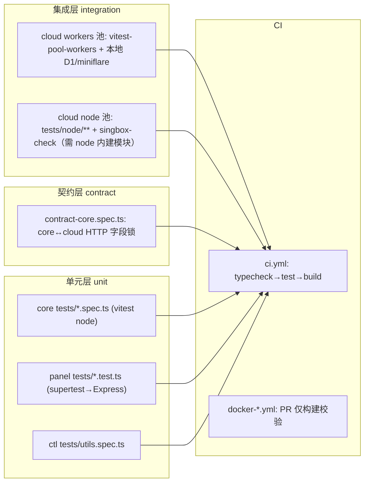

# 开发视图（源码结构与开发者视角）

## 1. 源码仓库工程结构

pnpm workspace monorepo（`packages/*`），四个包按「共享引擎 → 三种交付形态」分层：

```text
SingChorus/
├── packages/
│   ├── core/                  # @chorus/core 共享引擎（0 依赖，产出 npm 包）
│   │   ├── src/services/      # 引擎服务：store/config-manager/cloud-client/docker-manager/sync-service/validator/merger/lock/hash
│   │   ├── src/schemas/       # 配置 schema（zod 类型的单一来源）
│   │   ├── src/index.ts       # 公共 API 面：仅导出 ChorusCore 门面 + 服务类 + 类型（packages/core/src/index.ts:1-13）
│   │   ├── tests/             # 10 个 vitest spec（node 环境）
│   │   └── dist/              # 构建产物（tsc 直接输出，panel/ctl 引用其 dist）
│   ├── cloud/                 # chorus-cloud 云端（private，双入口同构）
│   │   ├── src/index.ts       # Workers 入口：Hono app（wrangler 直接跑 TS，无构建）
│   │   ├── src/node/          # Node/VPS 入口：同一 Hono app + better-sqlite3 适配 D1（packages/cloud/src/node/entry.ts:1-20）
│   │   ├── src/routes/        # 12 个 REST 路由模块（protocols/clients/subscriptions/nodes/render/deploy/auth/users/tags/templates/protocol-instances/admin）
│   │   ├── src/engine/        # 模板渲染插件引擎：registry/interpolator/validator/docker_renderer + generators/（uuid/x25519/random_port 等）
│   │   ├── src/templates/     # 内置模板资产（JSON，经 seed.ts 导入，packages/cloud/src/db/seed.ts:3-12）
│   │   ├── src/db/            # schema.ts（运行时建表+种子）与 seed.ts
│   │   ├── migrations/        # wrangler d1 migrations（0001_init.sql）
│   │   ├── tests/             # 26 spec：workers 池为主，tests/node/ + tests/plugins/singbox-check 走 node 池
│   │   └── dist-node/         # esbuild 产出的单文件 Node 入口（gitignore，仅 Docker/自托管）
│   ├── panel/                 # @chorus/panel Web 管理台（Vue3 SPA + Express API，前后端同包）
│   │   ├── src/               # Vue SPA：views/components/stores/composables/router（别名 @/*）
│   │   ├── server/            # Express 后端：routes/（auth/core/settings/info/init）+ auth/api-error/request-context/env
│   │   ├── bin/chorus-panel.mjs  # npm bin：加载预编译 dist-server（packages/panel/bin/chorus-panel.mjs:1-9）
│   │   ├── tests/             # 11 个 spec（supertest 打 Express app）
│   │   ├── dist-web/          # vite 构建产物（Express 静态托管，packages/panel/server/app.ts:131-132）
│   │   └── dist-server/       # tsc -p tsconfig.server.json 产物
│   └── ctl/                   # @chorus/ctl CLI（chorusctl，commander）
│       ├── src/commands/      # 8 个子命令：config/deploy/cloud/node/remote/panel/subscription/validate
│       └── tests/             # 仅 utils.spec.ts（1 个）
├── .github/workflows/         # ci.yml + docker-cloud.yml + docker-panel.yml
└── pnpm-workspace.yaml        # workspace 定义 + allowBuilds 原生包白名单（pnpm-workspace.yaml:5-10）
```

依赖方向（构建期）：`ctl → core`、`panel(server) → core`（`workspace:*`，指向 core 的 **dist 产物**，packages/ctl/package.json:30、packages/panel/package.json:38）；`cloud` 不依赖任何 workspace 包。

|构建产物|源码根|构建目标|对应运行时单元（deployment §2）|
|-|-|-|-|
|@chorus/core|packages/core/src/|`tsc` → dist/（ESM NodeNext + d.ts，packages/core/package.json:11-19）|被 panel/ctl 打包引用，无独立运行时|
|@chorus/ctl|packages/ctl/src/|`tsc` → dist/index.js（bin `chorusctl`）|VPS 上的 CLI 进程|
|@chorus/panel|packages/panel/src/ + server/|`vue-tsc && vite build` → dist-web/；`tsc -p tsconfig.server.json` → dist-server/（packages/panel/package.json:30-31）|Node 进程（容器内经 docker.sock 驱动 sing-box）|
|chorus-cloud (Workers)|packages/cloud/src/index.ts|无构建：`wrangler deploy` 直接打包 TS 源（wrangler.toml:1-4）|Cloudflare Worker + D1|
|chorus-cloud (Node)|packages/cloud/src/node/entry.ts|`esbuild --bundle --external:better-sqlite3` → dist-node/entry.mjs（packages/cloud/package.json:19）|自托管 Node 容器（SQLite）|

## 2. 构建与依赖工具链

### 2.1 构建命令

|动作|命令|说明|
|-|-|-|
|并行开发|`pnpm dev`（根 package.json:7）|递归跑各包 dev；cloud=wrangler dev、panel=concurrently(tsx watch+vite)、core=tsc --watch|
|单包开发|`pnpm dev:cloud` / `pnpm dev:panel`|`--filter` 定位（根 package.json:8-9）|
|构建|`pnpm build`|`pnpm -r build`：仅 core/ctl/panel 有 build 脚本；cloud 无 `build`（仅 `build:node`）|
|测试|`pnpm test`|`pnpm -r test`：core/cloud/panel/ctl 四包均定义 test|
|类型检查|`pnpm typecheck`|`pnpm -r typecheck`：core/ctl/panel 有；**cloud 无该脚本，被跳过**|
|静态检查|`pnpm lint`|**空转**：无任何包定义 lint 脚本，仓库也无 eslint/prettier 配置|
|云端部署|`pnpm --filter chorus-cloud deploy` / `deploy:prod`|先 `wrangler d1 migrations apply DB --remote` 再 `wrangler deploy`（packages/cloud/package.json:8-9）|
|云端 Node 版|`pnpm --filter chorus-cloud build:node && start:node`|esbuild 打包 + node 直跑（packages/cloud/package.json:19-20）|
|npm 发布|`pnpm publish:core` / `publish:panel` / `publish:ctl`|先 build 再 publish（根 package.json:17-19）|
|CI 门禁|`pnpm --filter @chorus/core build && pnpm typecheck && pnpm test && pnpm build`|typecheck/test 任务均先构建 core（.github/workflows/ci.yml:20-21,33-34）|

> 注意：panel/ctl 消费 core 的 `dist/index.js`，**改动 core 后必须先 `pnpm --filter @chorus/core build`**，否则下游跑的是旧产物；CI 通过显式 build 步骤规避（.github/workflows/ci.yml:20）。

### 2.2 依赖与版本管理

|依赖层面|管理机制|版本锁定|备注|
|-|-|-|-|
|语言依赖|pnpm workspace（pnpm-workspace.yaml:1-2）|单一根 pnpm-lock.yaml；`.gitignore:5` 明令禁止子包 lockfile|workspace 内依赖用 `workspace:*` 协议|
|原生构建包|`allowBuilds` 白名单放行 build 脚本|pnpm-workspace.yaml:5-10|better-sqlite3/esbuild/workerd/sharp/vue-demi|
|工具链版本|`packageManager: pnpm@11.5.0`（根 package.json:5）|engines `node >=20`（core/ctl/panel）；CI 与 Docker 均用 node 22（ci.yml:17、Dockerfile:5,24）|三方一致锁 node22，本地允许 >=20|
|云端机密|Workers: `wrangler secret put`；Node: env 首启生成持久化到 /data/secrets.json|不进仓库：`**/.dev.vars`、`**/.prod.vars`、`**/wrangler.prod.toml` 均被 gitignore|wrangler.toml:19-21 注释明确密钥策略|
|生产配置|wrangler.prod.toml 由 scripts/setup-prod.mjs 自动生成|含真实 D1 ID，gitignore（.gitignore 「Wrangler production config」段）|wrangler.prod.toml:1-4 头注「请勿手动编辑」|
|发布物|core/ctl/panel 设 `files: [dist…]` + `publishConfig.access: public`|GHCR 镜像按 `cloud-v*`/`panel-v*` tag 打标，main 分支持续发 `edge`（docker-cloud.yml:49-56）|panel npm 包内含预编译 dist-web/dist-server|

## 3. 测试策略与布局



|测试层|位置|跑法（命令/触发）|覆盖目标|
|-|-|-|-|
|单元（core）|packages/core/tests/|`vitest run`（默认 node 环境）|store/config-manager/cloud-client/docker-manager/sync/validator/merger/lock|
|集成（cloud）|packages/cloud/tests/（26 spec）|`vitest run`（workers 池：singleWorker=1、miniflare 覆盖 LOG_LEVEL，vitest.config.ts:6-17）|Hono 全路由 + D1 真实行为（workers 池内跑真 SQL）|
|集成（cloud Node）|packages/cloud/tests/node/、tests/plugins/singbox-check.spec.ts|`vitest run --config vitest.config.node.ts`（vitest.config.node.ts:6-11）|需要 node:child_process/fs 的 sing-box 校验逻辑|
|契约|packages/cloud/tests/contract-core.spec.ts|同 workers 池|锁死 core.CloudClient 依赖的 HTTP 字段名与状态码语义（contract-core.spec.ts:10-19：「change core and cloud together in the same commit」）|
|单元/集成（panel）|packages/panel/tests/（11 spec）|`vitest run`（node 环境 + supertest）|Express 路由：auth/configs/settings/cloud 转发/policy/app 加固|
|单元（ctl）|packages/ctl/tests/utils.spec.ts|`vitest run --passWithNoTests`|仅工具函数；8 个命令无测试|
|CI 门禁|.github/workflows/ci.yml|push/PR→main：typecheck、test 两 job 并行，build job `needs:[typecheck,test]`（ci.yml:36-38）|合并前全量回归|
|镜像门禁|.github/workflows/docker-cloud.yml、docker-panel.yml|PR 仅 build 不推送；paths 过滤（panel 触发含 packages/core/**）|Dockerfile/依赖破坏提前暴露|

**改动某模块该跑什么**：core 改动 → `pnpm --filter @chorus/core build && pnpm --filter @chorus/core test`，且因契约测试与 panel 路由转发测试的存在，还应跑 `pnpm --filter chorus-cloud test` 与 `pnpm --filter @chorus/panel test`；cloud 路由改动 → 对应 `tests/<路由>.spec.ts` + contract-core.spec.ts；panel server 改动 → `pnpm --filter @chorus/panel test`。

## 4. 开发者入手路径

|步骤|做什么|关键文件/命令|
|-|-|-|
|1. 定位入口|四包各有一个装配点：core 门面类 `ChorusCore`（packages/core/src/core.ts:26）、cloud 双入口共用同一 Hono app（packages/cloud/src/index.ts:15；packages/cloud/src/node/entry.ts:7-20）、panel Express 装配（packages/panel/server/app.ts:1-18）、ctl commander 注册（packages/ctl/src/index.ts:11-39）|`packages/*/src/index.ts`、`packages/panel/src/main.ts`|
|2. 理解一个功能|docs/knowledge/subsystems/ 尚为空；以代码目录为索引：REST 功能看 `packages/cloud/src/routes/<域>.ts`，管理台页面看 `packages/panel/src/views/` + `server/routes/core/`，CLI 命令看 `packages/ctl/src/commands/`|grep 路由前缀（如 `/api/clients`）跨三包追踪|
|3. 本地改起|cloud：`pnpm dev:cloud`（wrangler dev，本地 D1 在 .wrangler/state，wrangler.toml:6-8）或 Node 版 `pnpm --filter chorus-cloud dev:node`；panel：`pnpm dev:panel`（tsx watch 8088 + vite 5173，vite 将 /api 代理到 8088，vite.config.ts:23-27）；密钥：`cp .dev.vars.example .dev.vars`|端口：cloud 8787 / panel 8088 / vite 5173|
|4. 验证|改哪包跑哪包 test + 全局 typecheck；core 改动先 build 再测下游|§2.1、§3 命令表|
|5. 提交规范|无 CONTRIBUTING.md、无 git hooks 工具链；实践约定从 git log 可见：conventional commits（feat/fix/refactor/chore + 可选 scope），中文主题，跨包联动单提交|`git log --oneline`（如 7b1ef0e、contract-core.spec.ts:21 的「same commit」约定）|

## 5. 开发环境与产物一致性

|构建服务|环境|产物差异|一致性保障|
|-|-|-|-|
|本地开发|wrangler dev（workerd + 本地 D1）/ tsx 直跑 TS|不产出 dist；panel/vite 有 HMR；AUTH_TOKEN/JWT_SECRET 用 wrangler.toml:31-33 的非机密占位（或 .dev.vars 覆盖）|同一套 TS 源与 tsconfig strict；模板 JSON 走同一 seed 路径|
|CI|ubuntu + node22 + `--frozen-lockfile`|仅校验（typecheck/test/build），不产发布物|ci.yml:19,32 强制锁文件一致；先 build core 再校验下游|
|产线（Cloudflare）|`wrangler deploy`（dev 用 wrangler.toml / prod 用自动生成的 wrangler.prod.toml）|直接打包 TS 源，无中间产物|migrations 先 apply 再 deploy（package.json:8-9）；密钥走 wrangler secret，与本地 .dev.vars 隔离|
|产线（自托管）|GHCR 镜像：cloud=Node+SQLite 单文件 entry；panel=node:22-alpine + docker CLI（DooD）|Docker 构建上下文=仓库根，先 `--filter ... install` 再 build，`pnpm deploy --prod` 裁剪依赖（packages/cloud/Dockerfile:21-22）|镜像与本地产物同源（esbuild/tsc/vite 同一命令）；PR 阶段 docker-*.yml 已做构建校验；panel 镜像带 HEALTHCHECK（panel/Dockerfile:57-58）|

**已知双轨差异**：cloud 同一份业务代码跑两种持久化绑定（D1 ↔ SqliteD1 适配器、限流 Workers 原生 ↔ MemoryRateLimiter），由 node/entry.ts:11-19 注释声明映射关系；日志级别字段名在两运行时不同（Workers var `LOG_LEVEL` ↔ Node env `CHORUS_CLOUD_LOG_LEVEL`，wrangler.toml:23-26、node/entry.ts:37-41）。
