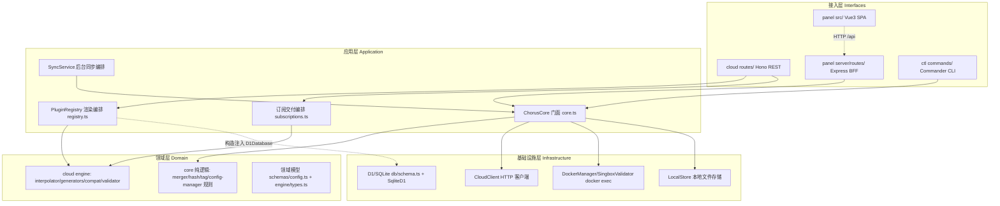
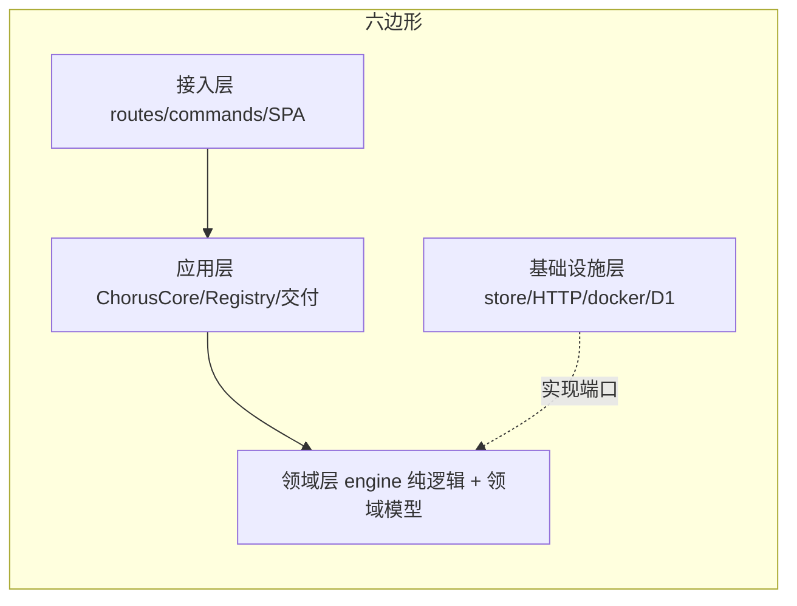
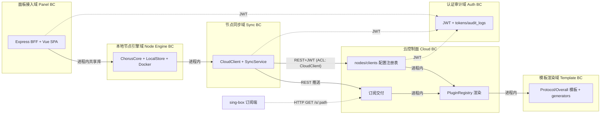

# 逻辑视图

## 代码结构与模块划分

<!-- guideline: 展示项目模块结构，说明每个模块的职责与归属层次。重点标注模块之间的依赖方向（可通过构建系统配置约束），禁止出现循环依赖。 -->

```text
SingChorus/                            # pnpm workspace 根（pnpm-workspace.yaml:1-3）
├── package.json                       # 聚合脚本：dev/build/test 均走 pnpm -r（package.json:7-16）
└── packages/
    ├── core/        @chorus/core      # 本地节点引擎（领域+应用层共享内核）
    │   └── src/
    │       ├── core.ts                  # ChorusCore 门面：组装服务+用例编排（core.ts:35-51）
    │       ├── schemas/config.ts        # 领域模型类型：ConfigEntry/Subscription/AppConfig/NodeIdentity（schemas/config.ts:25-82）
    │       ├── errors.ts                # AppError + ERRORS 错误目录（errors.ts:1-21）
    │       ├── logger.ts                # Logger 端口（console/noop 两实现）（logger.ts:14-38）
    │       ├── tag.ts, hash.ts          # 纯函数：tag 组合、内容哈希（tag.ts:25, hash.ts:19）
    │       └── services/                # store(本地文件存储)/config-manager/cloud-client(HTTP)/
    │                                    #   docker-manager(执行部署)/sync-service(后台同步)/
    │                                    #   validator(docker 校验)/merger(配置合并)/lock(文件锁)
    ├── cloud/       chorus-cloud       # 云控制面（独立部署单元，不依赖 core）
    │   └── src/
    │       ├── index.ts                 # Hono app：路由挂载/请求日志/统一错误出口（index.ts:62-104）
    │       ├── node/entry.ts            # Node/VPS 入口：SqliteD1+MemoryRateLimiter 适配同一 Env（node/entry.ts:96-106）
    │       ├── routes/                  # HTTP 接入层：protocols/templates/clients/subscriptions/nodes/deploy/render/auth/users/tags 等 13 模块
    │       ├── engine/                  # 模板渲染引擎：validator/interpolator/generators/compat/docker_renderer（纯逻辑）
    │       │   └── registry.ts          # PluginRegistry：模板仓储（D1 构造注入）+渲染编排（registry.ts:146-155）
    │       ├── db/                      # D1 schema（7 表）+ seed（db/schema.ts:69-188）
    │       ├── auth/                    # JWT 签发/校验 + adminAuth 中间件（auth/middleware.ts:28-64）
    │       └── services/                # audit/crypto/fire-and-forget
    ├── panel/       @chorus/panel      # Web 管理面板（Express BFF + Vue3 SPA）
    │   ├── server/
    │   │   ├── app.ts                   # 中间件链：CORS/CSRF originCheck/auth/pinoHttp/requestContext（app.ts:62-154）
    │   │   ├── core-provider.ts         # ChorusCore 单例缓存 + SyncService 后台同步定时器（core-provider.ts:74-135）
    │   │   └── routes/                  # BFF 路由：auth/core(configs|cloud|deploy)/settings/info/init
    │   └── src/                         # Vue3 SPA：views/stores/router；仅访问自家 /api（src/lib/http.ts:11）
    └── ctl/         @chorus/ctl        # CLI（chorusctl，Commander）
        └── src/
            ├── index.ts                 # 命令注册 + --json 全局输出契约（index.ts:17-34）
            └── commands/                # config/deploy/cloud/node/remote/panel/subscription/validate 8 命令组
```

### 模块依赖矩阵

|模块名|依赖模块|禁止依赖|说明|
|-|-|-|-|
|core|无（运行时零依赖）|cloud / panel / ctl|`dependencies: {}`（packages/core/package.json:37-38）；IO 全部通过注入反转（logger/getRequestId，core.ts:13-22）|
|cloud|hono/zod/semver/better-sqlite3 等|@chorus/core、panel、ctl|独立部署单元，无 workspace 依赖（packages/cloud/package.json:33-41）|
|panel|@chorus/core（workspace:*）+ express/vue 等|cloud（直接依赖）|进程内使用 core，经 core 的 CloudClient 间访问云（packages/panel/package.json:38）|
|ctl|@chorus/core（workspace:*）+ commander|cloud / panel|进程内使用 core（packages/ctl/package.json:30-31）|

依赖方向为单向无环：`ctl/panel → core → (HTTP) → cloud`；cloud 不反向依赖任何包。
注意：禁止依赖为**约定**，仓库内无 dependency-cruiser / eslint boundaries 等构建期强制手段（全仓 grep 无匹配）。

## DDD 架构分层

<!-- guideline: 用图示清晰表达各层职责边界与依赖规则（依赖倒置原则）。在非面向对象语言中，依赖倒置通常通过函数指针、回调、接口结构体或抽象头文件实现。 -->

本项目非经典 DDD 四层，而是**门面 + 端口适配**的分层（TypeScript 类 + 接口注入实现依赖倒置）：



依赖倒置的三个端口证据：
- Logger 端口：core 定义 `Logger` 接口（core/src/logger.ts:14），panel 注入 pino child + AsyncLocalStorage 取 requestId（panel/server/core-provider.ts:94-95 → core.ts:21）。
- D1Database 端口：engine/registry.ts 构造函数只接收 `D1Database` 接口（registry.ts:147-155），Workers 用真 D1，Node 用 `SqliteD1` 适配器（node/entry.ts:25,102）。
- 存储端口：ConfigManager/DockerManager 只依赖 LocalStore 实例（config-manager.ts:34），host 可通过 `ChorusCore.fromStore()` 换入自定义 store（core.ts:53-57）。

### 架构层因果关系

<!-- policy: 领域层不得直接依赖基础设施层，必须通过端口（接口）反转依赖。 -->



|层|核心职责|允许依赖|禁止事项|
|-|-|-|-|
|接入层|协议转换、鉴权（adminAuth/requireAuth）、zod 参数校验、错误码映射|应用层|不得包含业务规则——如 PluginError→400 的映射在 index.ts:81-85，校验规则在 engine|
|应用层|用例编排（syncAllToCloud 五步：core.ts:170-303）、重试与预算、渲染/交付编排|领域层 + 端口|不感知存储格式/SQL 细节（编排走 store/configs 门面方法）|
|领域层|模板渲染规则（interpolator/compat）、配置合并/哈希/端口冲突规则、领域模型|无（纯逻辑，唯一例外 registry.ts 因持有 D1 仓储归入应用层）|不 import fs/exec/fetch——engine/interpolator.ts、generators/*、merger.ts 均为零 IO 纯函数|
|基础设施层|文件原子写（store.ts:40-45）、HTTP 重试（cloud-client.ts:34）、docker exec（docker-manager.ts:36-48）、D1 DDL（db/schema.ts:34-52）|领域层类型 + 端口接口|不含业务规则——如 compat semver 判定只在 cloud engine，"panel / panel-server 只消费 cloud 的过滤结果，不复制判定逻辑"（engine/compat.ts:5-7）|

跨层错误契约：core `AppError`（errors.ts:1-8）→ panel `toCoreError`（panel/server/routes/core/helpers.ts）；cloud `PluginError`（engine/errors.ts）→ Hono onError 统一 400（index.ts:83-85）。

### 领域边界划分（Bounded Context Map）

<!-- guideline: 描述各 Bounded Context 之间的关系模式（ACL/OHS/Partnership 等）。说明跨域调用的集成方式（同步 RPC / 异步事件 / IPC / 共享内存 等）。 -->



- 面板前端**从不直连 cloud**：axios baseURL 固定 `/api` 指向自家 BFF（panel/src/lib/http.ts:11），cloud URL 只存在于 server 侧 core 配置（core-provider.ts:28-33）——BFF 即对 cloud API 的防腐层。
- 集成方式全部为同步 HTTP REST + 进程内调用；无 MQ/事件总线。跨进程最终一致性靠 SyncService 后台重试（backoff 5s→15min，sync-service.ts:19）。

|上游 BC|下游 BC|集成模式|集成方式|防腐层位置|
|-|-|-|-|-|
|面板接入域|本地节点引擎域|客户/供应商（共享库）|进程内 ChorusCore 方法|`packages/panel/server/routes/core/`（含 toCoreError helpers.ts）|
|本地节点引擎域(core)|云控制面(cloud)|ACL（下游隔离）|HTTP REST + JWT|`packages/core/src/services/cloud-client.ts`（错误摘要 describeBody，cloud-client.ts:40-47）|
|云控制面|本地节点引擎域|OHS（配置注册表）|REST push/pull（registerNode/uploadNodeClient/getNodeClients）|`packages/cloud/src/routes/clients.ts` 契约（zod schema）|
|模板渲染域|订阅交付/部署渲染|OHS（同服务内消费）|进程内 PluginRegistry|`packages/cloud/src/routes/subscriptions.ts`（渲染失败回退 stale cache，subscriptions.ts:98）|
|云控制面|终端订阅客户端|OHS（公开只读契约）|GET /s/:path 订阅 JSON + token|`subscriptions.ts:156`|

## 领域映射

<!-- guideline: 列出所有限界上下文及其对应的 模块子路径。 -->

|限界上下文|模块路径|核心聚合|上下游上下文|关系类型|
|-|-|-|-|-|
|模板渲染|packages/cloud/src/engine/ + routes/{templates,protocols,protocol-instances}.ts|Template（category: protocol/overall-server/overall-client/overall-docker，db/schema.ts:84-102）、ProtocolInstance|订阅交付、部署渲染|被共享（OHS）|
|节点同步|packages/core/src/{core.ts,services/{cloud-client,sync-service,store,config-manager}.ts} + packages/cloud/src/routes/{nodes,clients}.ts|Node(fingerprint 唯一索引，db/schema.ts:204-206)、ConfigEntry|→订阅交付域（client_configs 表，db/schema.ts:137-152）|客户/供应商|
|订阅交付|packages/cloud/src/routes/subscriptions.ts + db/schema.ts(subscriptions/sub_delivery_cache)|Subscription(token/path/singbox_version，db/schema.ts:122-134)|←节点同步推送配置；→终端订阅客户端|OHS（公开端点）|
|认证与审计|packages/cloud/src/auth/ + routes/auth.ts + packages/panel/server/auth.ts|JWT Token（cloud 24h/panel 12h cookie）、AuditLog|全部域|通用子域|
|本地节点引擎|packages/core/src/services/{store,docker-manager,validator,lock,merger}.ts|LocalStore（configs/enabled|disabled/.history 目录布局，store.ts:9-18）、DeployMeta|面板/CLI 进程内消费|客户/供应商|
|面板接入|packages/panel/server/ + packages/panel/src/|PanelConfig（会话/token_version，server/config.ts:6-16）|用户→云|ACL（BFF 屏蔽 cloud API）|
