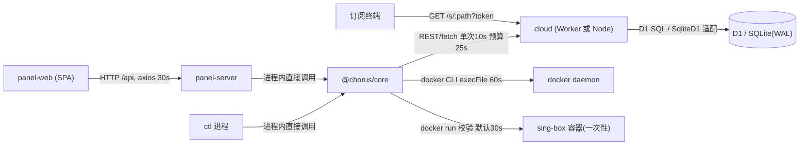
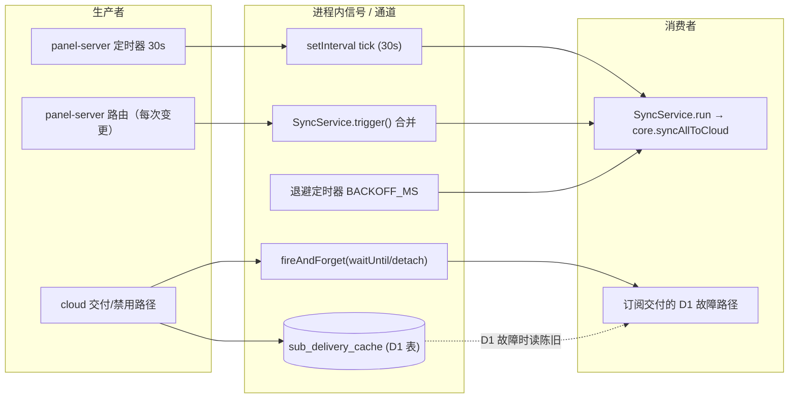
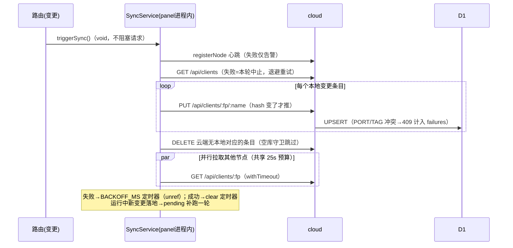
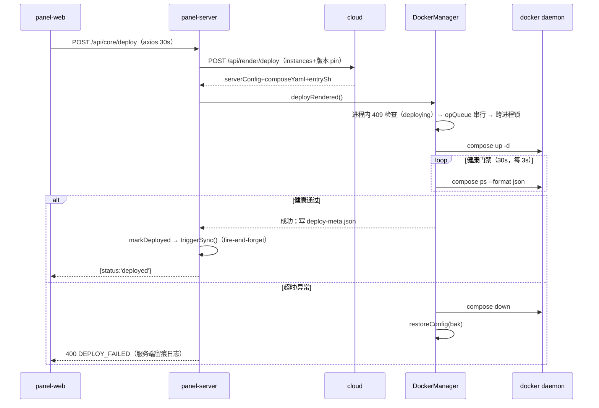
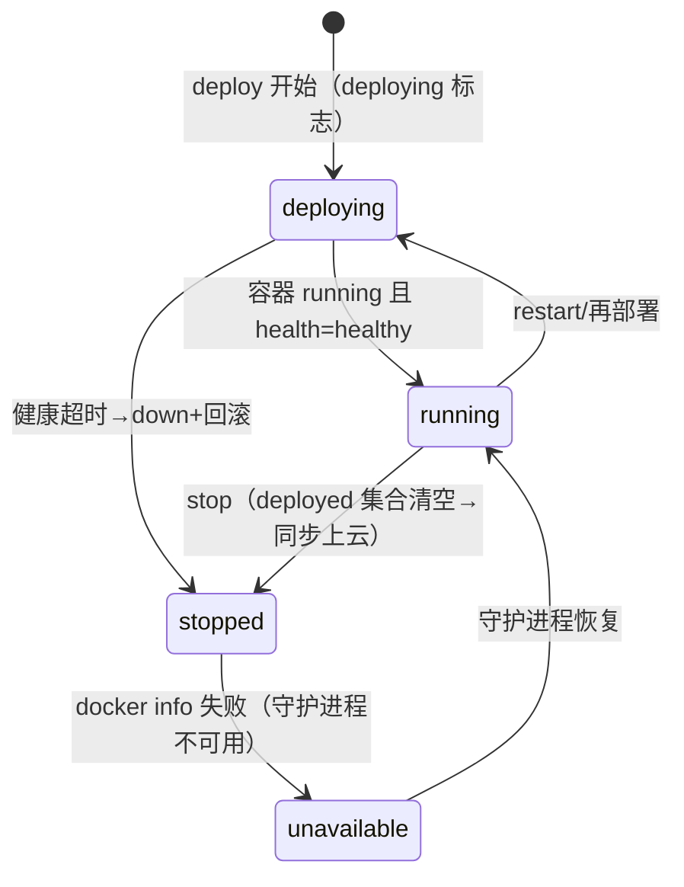
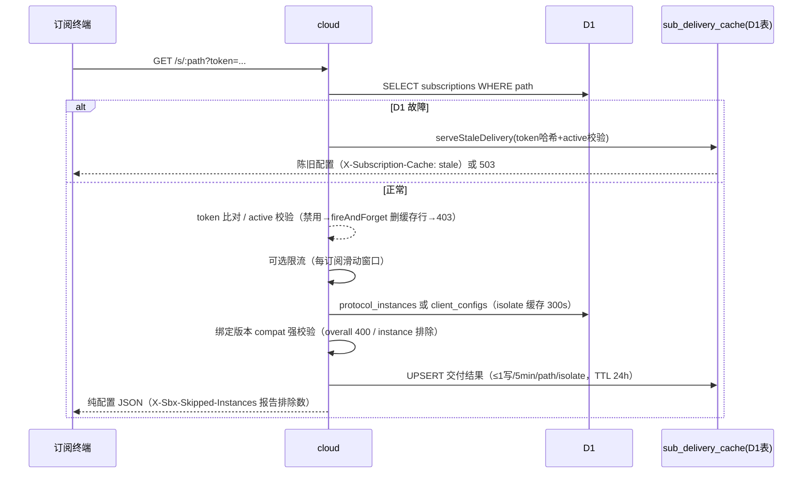

# 进程视图（跨单元运行时协作）

## 0. 运行时单元清单

|单元|形态|入口|说明|
|-|-|-|-|
|panel-server|Node 进程（Express，默认 127.0.0.1:8088）|packages/panel/server/index.ts:4-12|Web 管理面 + core 能力代理，持有 SyncService 后台引擎|
|panel-web|浏览器 SPA（Vue3）|packages/panel/src/lib/http.ts:10-22|轮询部署状态（10s）|
|ctl|CLI 短生命周期进程（chorusctl）|packages/ctl/src/commands/deploy.ts:24-63|与 panel 共享 `~/.singchorus/data`，是文件锁的另一方|
|cloud|同一 Hono app 的两种运行时：Cloudflare Worker isolate（packages/cloud/src/index.ts:100-104）或 Node/VPS 进程（packages/cloud/src/node/entry.ts:125-131）|packages/cloud/src/index.ts:62-74|运行时差异以适配器注入（D1↔SqliteD1，packages/cloud/src/node/d1-sqlite.ts:1-12）|
|sing-box 容器|docker compose 栈|packages/core/src/services/docker-manager.ts:132-139|由 panel/ctl 经 docker CLI 驱动|
|订阅终端|外部 sing-box 等客户端|packages/cloud/src/routes/subscriptions.ts:152-156|轮询 `GET /s/:path?token=`|

---

## 1. 跨单元协作流程总览

|流程 ID|流程名称|涉及单元|协作模式|一致性级别|详情章节|
|-|-|-|-|-|-|
|GP-001|配置自动同步（推/拉/对账删除）|panel-server ↔ cloud（ctl 可手动触发）|进程内异步信号（trigger/tick 定时器）+ HTTP 推拉|最终一致（content_hash 对账）|§5.1|
|GP-002|部署交付链路（渲染→写工件→容器→健康门禁→回滚）|panel-web → panel-server → cloud → docker daemon → sing-box 容器|同步 HTTP 编排 + 子进程调用|本地强一致（健康门禁+回滚），云端状态最终一致|§5.2|
|GP-003|订阅交付|订阅终端 → cloud|同步 HTTP 读 + D1 陈旧缓存降级|最终一致（交付缓存 TTL 24h）|§5.3|
|GP-004|panel/ctl 双进程共享数据目录互斥|panel-server ↔ ctl|跨进程咨询文件锁（独占创建+陈旧回收）|每操作串行化（强）|§4.1|
|GP-005|节点身份注册/心跳|panel-server/ctl → cloud|随同步轮次的 best-effort 上报|最终一致|§5.1|
|GP-006|订阅/模板管理面代理|panel-web → panel-server → cloud|同步 HTTP 转发（Zod 校验）|云端 D1 单点写，强|§2|

---

## 2. 同步调用拓扑



|调用方|被调用方|协议/机制|超时|重试策略|熔断/降级|关键文件|
|-|-|-|-|-|-|-|
|panel-server/ctl（core）|cloud|HTTP fetch|单次 10s，总预算 25s（REQUEST_BUDGET_MS）|4 级退避 [1,4,16,64]s，仅 5xx/网络错误；401 换新 token 后仅重试 1 次；`noRetry` 选项跳过|无熔断；失败抛 CLOUD_UNREACHABLE(503)|packages/core/src/services/cloud-client.ts:34-35,49-59,156-239|
|panel-web|panel-server|axios|30s（须 > 25s 云预算，core-D2 契约）|无（401 重定向登录）|超时转译为 REQUEST_TIMEOUT 提示|packages/panel/src/lib/http.ts:18-21,73-78|
|panel-server|cloud（渲染/订阅 CRUD）|同上|同上|同上|渲染失败 → 部署整体失败（无本地回退模板）|packages/core/src/core.ts:421-427|
|panel-server/ctl|docker daemon|execFile 参数数组（不经 shell）|docker 操作 60s、docker info 5s、chmod 5s|无自动重试；restart 失败降级为 down+up|状态观测失败时区分 'unavailable'（守护进程挂）与 'stopped'|packages/core/src/services/docker-manager.ts:10,132-139,328-342,344-370|
|panel-server/ctl|sing-box 容器（`docker run check`）|execFile|默认 30s（validate_timeout_seconds）|内容哈希缓存(5min) + single-flight + 串行队列，1 次实际执行|docker 不可用 → 跳过校验返回 valid|packages/core/src/services/validator.ts:23-26,100-141|
|cloud|D1/SQLite|SQL|随 Workers 子请求预算；Node 侧 busy_timeout=5000|无|DDL 初始化失败 → 全局 503 DB_UNAVAILABLE；交付路径降级陈旧缓存|packages/cloud/src/index.ts:45-56; packages/cloud/src/node/entry.ts:90-92; packages/cloud/src/routes/subscriptions.ts:169-176|
|订阅终端|cloud|HTTP GET|无（客户端侧）|由客户端轮询语义兜底|每订阅滑动窗口限流（可选）；D1 故障时 `sub_delivery_cache` 陈旧交付|packages/cloud/src/routes/subscriptions.ts:196-206,236-240|

---

## 3. 异步消息/事件拓扑

> 本系统无外部消息中间件。"异步交互"由三类机制承载：**进程内信号**（Promise 合并/定时器）、**fire-and-forget 后台任务**、**存储型交付缓存**（D1 表充当脏读缓冲）。

### 3.1 拓扑与清单



|通道|分区/并发|保留/缓冲|生产者|消费者|消费保障|备注|
|-|-|-|-|-|-|-|
|SyncService.trigger 合并|单飞（running/pending 标志），并发触发合并为一轮|pending 标志|panel 变更路由（configs.ts/deploy.ts/settings.ts/init.ts 共 9 处调用）|SyncService.run|变更不丢：run 结束后 pending 补跑一轮|packages/core/src/services/sync-service.ts:50-60,111-118; packages/panel/server/routes/core/configs.ts:46|
|同步 tick 定时器|单线程 setInterval，30s|无|core-provider.ensureSyncTimer|SyncService.tick|tick 前判空（未配置 token 直接返回）|packages/panel/server/core-provider.ts:40-41,120-128|
|退避重试定时器|单 timer；5/15/60/300/900s 五级|单槽（已有 timer 不重复）|SyncService.run 失败路径|run|成功即 clear（防冗余轮次）；`unref()` 不阻塞进程退出|packages/core/src/services/sync-service.ts:19,100-105,121-133|
|fireAndForget|Workers: executionCtx.waitUntil 保活 isolate；Node：detached promise 吞异常|无|订阅禁用路径（删缓存行）|D1|尽力而为（.catch 吞错）|packages/cloud/src/services/fire-and-forget.ts:13-19; packages/cloud/src/routes/subscriptions.ts:188-195|
|sub_delivery_cache（D1 表）|按 path 单行 UPSERT；每 isolate 每 path 限频 1 写/5min|TTL 24h（写时惰性清除）|订阅交付成功路径|D1 故障时的 serveStaleDelivery|陈旧可用（token 哈希校验 + active 位）|packages/cloud/src/routes/subscriptions.ts:36-54,59-101,317-319|
|isolate 级 configsCache|模块级单例（每 isolate 一份），TTL 300s|单值|loadConfigsFromD1|订阅交付 fallback|D1 失败回退上一份陈旧值|packages/cloud/src/routes/subscriptions.ts:15-33,116-150|
|DockerManager.opQueue|Promise 链串行（无并发）|链式|deploy/stop/restart 调用|docker CLI|顺序执行；单任务失败不断链|packages/core/src/services/docker-manager.ts:78-103|
|SingboxValidator 队列|串行（最多 1 个 docker run）+ inflight single-flight + 100 条 LRU 缓存|5min TTL|validate 调用|docker run check|同内容并发共享一次执行|packages/core/src/services/validator.ts:66-137|

### 3.2 事件契约（Schema）

系统无正式事件消息；跨单元数据传递的**事实契约**是同步推送的 REST 载荷（PUT，幂等 upsert）：

```jsonc
// PUT /api/clients/:fingerprint/:name  —— 云端按 (fingerprint,name) 主键 upsert
{
  "config":        { /* sing-box 客户端配置对象 */ },
  "server_config": { /* 可选 */ },
  "params":        { /* 可选 */ },
  "protocol_type": "协议模板 id（必填）",
  "content_hash":  "内容哈希（对账依据，可空串）",
  "enabled":       true,
  "deployed":      false
}
```

证据：Zod 契约 packages/cloud/src/routes/clients.ts:6-14；主键定义 packages/cloud/src/db/schema.ts:137-152（`PRIMARY KEY (fingerprint, name)`）。

### 3.3 投递语义与保障

|保证维度|策略|实现方式|说明|
|-|-|-|-|
|投递保证|至少一次（同步推送）|变更置 `synced=false` 标记，推送成功才 markSynced；失败由退避定时器重推|packages/core/src/services/config-manager.ts:99-107; packages/core/src/core.ts:217-244|
|幂等消费|upsert 键 = (fingerprint,name)；content_hash 相同即跳过推送|云端 PUT 幂等；本地对账按 hash 判等|packages/cloud/src/routes/clients.ts:200-238; packages/core/src/core.ts:217-222|
|顺序保证|无全局顺序；单变更单行覆盖|同键后写覆盖先写（有意为之，见 §4 一致性）|packages/cloud/src/routes/clients.ts:217-227|
|异常处理|退避重试（5→900s 封顶）；每配置失败入 `lastFailures` 供 UI 解释|SyncService 退避 + 部分失败容忍|packages/core/src/services/sync-service.ts:19,27-29,106-110|

---

## 4. 一致性策略

### 4.1 策略决策表

|场景|策略|实现方式|适用流程|
|-|-|-|-|
|panel/ctl 双进程写共享数据目录|跨进程咨询锁（独占创建 + 陈旧回收 + 同步轮询）|`openSync(path,'wx')` 原子赢家；mtime 超 10s 判陈旧可抢占；`Atomics.wait` 同步休眠 20ms 轮询，默认 5s 超时；所有写操作经 `store.locked()` 串行|GP-004；packages/core/src/services/lock.ts:4-17,37-57,68-86; packages/core/src/services/store.ts:172-187|
|单文件原子落盘|临时文件 + 同目录 rename（防 EXDEV）；顶层 JSON 损坏改名隔离保留现场|store.atomicWrite / loadJsonQuarantine；启动自愈从 .history（上限 20 份）恢复|GP-004；packages/core/src/services/store.ts:40-45,70-85,118-152,198-201|
|enabled/disabled 状态迁移|单次 POSIX rename 迁移旧文件后再原子写内容，杜绝双份并存|saveConfig 两步法（core-R2/core-C1）|GP-004；packages/core/src/services/store.ts:189-210|
|双进程目录缓存失效|目录 mtime 签名（rename 必然更新 dirent mtime）自动失效内存索引|core-P2|GP-004；packages/core/src/services/store.ts:90-105|
|panel↔cloud 配置收敛|content_hash 对账 + 按键 last-write-wins；删除对账（云端无本地对应→云端删；本地全空则跳过防误删重装现场）|syncAllToCloud 四阶段：心跳→推送→删除对账→并行拉取|GP-001；packages/core/src/core.ts:170-303|
|部署串行（进程内）|Promise 链 opQueue + `deploying` 布尔拒绝（409 DEPLOY_IN_PROGRESS）|DockerManager.enqueue/withDeploying|GP-002；packages/core/src/services/docker-manager.ts:78-109|
|部署串行（跨进程）|文件锁 `.deploy.lock` fail-fast（timeoutMs:0 → 409）|withDeployLock（注意：见 §7 风险 R-01，实现与注释存在偏差）|GP-002；packages/core/src/services/docker-manager.ts:84-89,112-130|
|云端写并发|D1 唯一约束兜底：tag 部分唯一索引、path/token UNIQUE；预检先行返回精确 409|预检 + UNIQUE backstop 双层|GP-003/GP-006；packages/cloud/src/routes/clients.ts:184-198,239-248; packages/cloud/src/db/schema.ts:125,129,204-209|
|D1 故障面隔离|交付面与管理面解耦：交付读失败回退 `sub_delivery_cache` 陈旧行；管理面显式 503|serveStaleDelivery（token 哈希+active 校验）；DDL 初始化失败 503 DB_UNAVAILABLE|GP-003；packages/cloud/src/routes/subscriptions.ts:36-46,85-101; packages/cloud/src/index.ts:45-56|
|订阅缓存一致性|版本/模板/参数/token 任一变更或订阅删除 → 同步删除缓存行；禁用 → fireAndForget 异步删|失效写路径（§13.1/§13.7 设计注）|GP-003；packages/cloud/src/routes/subscriptions.ts:188-195,508-515,531-534|
|机器指纹唯一性|指纹生成/导入均在锁内执行，防双进程各自生成不同身份|getFingerprint/importFingerprint|GP-005；packages/core/src/services/store.ts:298-346|

### 4.2 补偿操作清单

|步骤|正向操作|补偿操作|补偿幂等性|补偿超时|备注|
|-|-|-|-|-|-|
|1|deploy：写 compose/entry/config → `compose up -d`|健康门禁 30s 未过 → `compose down` + 恢复备份 config（保留 5 份 .bak）|备份按时间戳命名，恢复为纯文件覆盖|HEALTH_CHECK_TIMEOUT=30s，3s 轮询|失败路径也 restoreConfig；元信息仅在健康通过后落盘|packages/core/src/services/docker-manager.ts:9,165-193,261-302|
|2|节点重装后本地空库|删除对账跳过（防清空云端唯一副本），等 restoreFromCloud 显式恢复|空库守卫：`listAll().length===0 && cloudMap.size>0` 则跳过|-|packages/core/src/core.ts:246-258,305-338|

---

## 5. 端到端核心时序

### 5.1 流程：配置变更自动同步（GP-001/GP-005）

**触发条件**：panel 任一配置变更路由（create/update/enable/disable/delete/deploy/stop）调用 `triggerSync()`；或 30s tick；或 ctl `cloud sync` 手动触发
**参与单元**：panel-server（SyncService）→ cloud → D1；多节点场景并行拉取
**一致性策略**：最终一致（content_hash 对账；协调方：SyncService）
**关键文件**：packages/core/src/services/sync-service.ts、packages/core/src/core.ts:170-303、packages/panel/server/core-provider.ts:109-135



状态：`synced` 标记为推送成功的持久化位（config-manager.ts:201-206）；内容变更即失效 synced/deployed（config-manager.ts:99-107）。

### 5.2 流程：部署交付（GP-002）

**触发条件**：panel-web 点击 Deploy（或 ctl `deploy up`）
**参与单元**：panel-web → panel-server → core（cloud 渲染 + DockerManager）→ docker daemon → sing-box 容器
**一致性策略**：本地强一致（健康门禁 + 回滚），deployed 集合经 GP-001 最终一致上云
**关键文件**：packages/panel/server/routes/core/deploy.ts:19-40、packages/core/src/core.ts:428-454、packages/core/src/services/docker-manager.ts:249-302



**状态机（部署状态观测）**（docker-manager.ts:355-370；前端锁按钮 Deploy.vue:79-83）：



### 5.3 流程：订阅交付（GP-003）

**触发条件**：终端客户端轮询 `GET /s/:path?token=`
**参与单元**：订阅终端 → cloud（Worker isolate 或 Node 进程）→ D1
**一致性策略**：最终一致（交付缓存 24h；D1 故障时陈旧交付）
**关键文件**：packages/cloud/src/routes/subscriptions.ts:152-327



异常路径全覆盖 D1 中途故障：实例读取失败、模板加载失败均回退陈旧缓存（subscriptions.ts:235-240,307-315）。

---

## 6. 横切上下文传播

|横切关注点|实现规范|传播方式|采样/策略|
|-|-|-|-|
|链路追踪|X-Request-ID 贯穿 panel→cloud：pino-http genReqId（吸收入站 ID）→ AsyncLocalStorage → CloudClient 出站头 → cloud 日志中间件绑定 requestId 并回显响应头|HTTP Header + 进程内 ALS|全量（无采样）|packages/panel/server/app.ts:93-114; packages/panel/server/request-context.ts:1-19; packages/core/src/services/cloud-client.ts:62-79,128-134; packages/cloud/src/index.ts:20-43|
|管理面身份（panel↔cloud）|AUTH_TOKEN 换 JWT（24h），内存缓存、过期前 60s 刷新；401 清缓存重试一次；吊销查 D1，D1 宕机对未见过 fail-open|Authorization: Bearer|cloud-client.ts:60-126,182-204; packages/cloud/src/auth/middleware.ts:16-64|
|面板身份（browser↔panel）|管理员密码 bcrypt + cookie JWT；进程内登录限流（5 次失败锁 15min，按 IP）|HttpOnly cookie|packages/panel/server/routes/auth.ts:8-52; packages/panel/server/config.ts:59-104|
|订阅身份（终端↔cloud）|path+token 查询串明文比对；交付缓存只存 SHA-256 哈希|URL query token|subscriptions.ts:184-186; 缓存哈希 subscriptions.ts:75,95|
|日志级别|cloud 双运行时同字段：Workers 用 wrangler [vars] LOG_LEVEL，Node 用 CHORUS_CLOUD_LOG_LEVEL 注入同一 env 语义|env 注入|packages/cloud/wrangler.toml（[vars]）；packages/cloud/src/node/entry.ts:96-106|

---

## 7. 风险登记（进程视图）

|ID|风险|证据|影响|
|-|-|-|-|
|R-01|**跨进程部署锁提前释放**：`withFileLockSync(path, () => undefined, {timeoutMs:0})` 的 noop fn 返回后锁已在 helper 内部 finally 被 unlink（lock.ts:81-85），随后 `await op()` 期间锁文件并不存在；且外层 finally 的 `releaseDeployLock` 无条件 unlink，可能误删他进程新建的锁文件。与注释"Hold the cross-process deploy lock for the duration of an async lifecycle op"（docker-manager.ts:112-116）不符|packages/core/src/services/docker-manager.ts:117-130,383-387; packages/core/src/services/lock.ts:81-85|panel 与 ctl 并发部署时跨进程互斥失效；部署窗口长达 60s+30s 健康门禁|
|R-02|**文件锁等待阻塞事件循环**：withFileLockSync 用 sleepSync（Atomics.wait/忙等）同步轮询，默认最长 5s；panel-server 主线程在等待 ctl 持锁期间无法响应任何请求；store 全部为同步 fs I/O|packages/core/src/services/lock.ts:26-35,68-86; packages/core/src/services/store.ts:189-285|双进程争锁时面板整站卡顿（最高 5s/请求）|
|R-03|**JWT 吊销检查 fail-open**：D1 宕机期间签名合法但查不到吊销记录的 token 一律放行（注释明示该取舍）|packages/cloud/src/auth/middleware.ts:41-55|吊销窗口失效；属有意的设计取舍，需运维知情|
|R-04|**isolate 级缓存的横向一致性**：configsCache（300s）与交付写限频（5min/path/isolate）均为模块级单例，多 isolate 部署时各副本独立失效/限频；交付可能返回跨 isolate 混合的新旧配置|[待确认: 生产 Workers 实际 isolate 数/部署形态（wrangler.prod.toml 由 scripts/setup-prod.mjs 生成，不在仓库内）]|多副本下陈旧窗口不可控（单 isolate 下为确定性 300s）|
|R-05|**部署请求超时预算不匹配**：前端 axios 30s（http.ts:21）仅覆盖云渲染 25s 预算；部署总时长上限≈25s 渲染+60s docker+30s 健康门禁，可超 30s → 客户端 ECONNABORTED 而服务端仍在执行（服务端有留痕日志缓解）|packages/panel/src/lib/http.ts:18-21; packages/core/src/services/docker-manager.ts:9-10; packages/panel/server/routes/core/deploy.ts:33-39|用户看到超时但部署实际完成/失败，需刷新状态页确认|
|R-06|**进程内状态的重启易失**：panel 登录限流表（auth.ts:11-16）、SyncService 退避定时器（unref）、MemoryRateLimiter 计数、isolate 缓存均不持久化；重启即清零|packages/panel/server/routes/auth.ts:8-16; packages/core/src/services/sync-service.ts:129-132; packages/cloud/src/node/rate-limiter.ts:1-8|限流可被重启绕过；退避进度丢失（可接受，标注为已知取舍）|
|R-07|**订阅 token 安全面**：token 以查询串传输且订阅行明文存储（UNIQUE 列），进入访问日志/URL 分享面；交付缓存侧仅存哈希（缓解）|packages/cloud/src/db/schema.ts:129; packages/cloud/src/routes/subscriptions.ts:158,184|token 泄露面较大；轮换可缓解（regenerateToken）|

---

## 8. code_mapping（文件夹颗粒度）

|关注点|路径|
|-|-|
|跨进程互斥/原子写/自愈|packages/core/src/services/（lock.ts, store.ts, docker-manager.ts）|
|同步引擎与退避|packages/core/src/services/sync-service.ts; packages/panel/server/core-provider.ts|
|云客户端（超时/重试/预算契约）|packages/core/src/services/cloud-client.ts; packages/core/src/core.ts|
|校验串行化/缓存|packages/core/src/services/validator.ts|
|cloud 双运行时接缝|packages/cloud/src/index.ts; packages/cloud/src/node/（entry.ts, d1-sqlite.ts, rate-limiter.ts）|
|交付面缓存与降级|packages/cloud/src/routes/subscriptions.ts|
|同步数据契约/幂等写|packages/cloud/src/routes/clients.ts; packages/cloud/src/db/schema.ts|
|追踪/限流/JWT|packages/panel/server/（app.ts, request-context.ts, routes/auth.ts）; packages/cloud/src/auth/; packages/cloud/src/services/（fire-and-forget.ts, audit.ts）|
