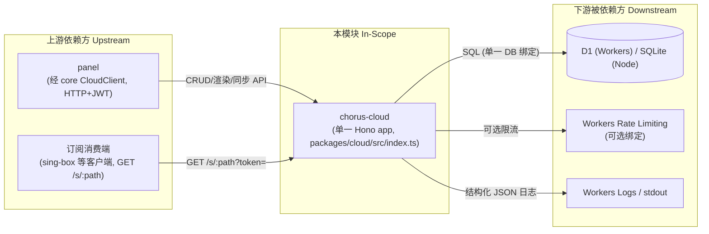

---

project: SingChorus

type: boundaries

description: chorus-cloud（packages/cloud/）是 SingChorus 的云端控制面与数据面：单一 Hono app 承载模板/协议管理、配置渲染引擎、节点编排、客户端配置同步、订阅交付与认证审计。数据所有权集中于 D1（Workers）/SQLite（Node）同构 schema。

base_commit: 5ab6e0b5439b72f3af60ca178147e57dc3fc31d9

---

# 模块边界

## 模块范围

<!-- 依据代码调用点逐项核对，非目录名推断。 -->

|维度|本领域负责|本领域不负责（属于其他领域）|
|-|-|-|
|核心职责|模板/协议 CRUD 与渲染（routes/protocols.ts、templates.ts、render.ts）、订阅交付与降级（routes/subscriptions.ts）、节点登记/身份迁移（routes/nodes.ts）、客户端配置同步存储（routes/clients.ts）、认证审计（auth/、services/audit.ts）|部署执行（docker compose 落盘/容器操作 → core docker-manager）、panel UI 与订阅数据源（panel 同步推送）、sing-box 二进制分发（docker 镜像 tag 由模板 param 声明）|
|数据所有权|nodes/templates/protocol_instances/subscriptions/client_configs/sub_delivery_cache/tokens/users/audit_logs 全部 9 表（db/schema.ts:69-188）|panel 本地配置库、core 节点本地状态（cloud 只存 panel 推送的影子）|
|业务规则|sing-box 版本兼容判定唯一实现（engine/compat.ts:3-7）、tag 全局唯一（routes/tags.ts:5-13）、订阅预校验（routes/subscriptions.ts:341-364）|配置内容正确性（模板由管理员维护）、用户终端 UI 呈现|
|渲染产物|配置文档本体直返（subscriptions.ts:321-326）、compose YAML+entry.sh（deploy.ts:112-120）|产物落地执行与回滚（core 侧职责）|

## 上下游总览

## 上游依赖（Inbound / 谁依赖我）

<!-- 每个 Caller 均在 core/panel 侧核对过调用点。 -->

|依赖方 (Caller)|交互方式 (RPC/HTTP/Event/Direct)|契约/接口路径|
|-|-|-|
|`panel`（经 core `CloudClient`）|HTTP / REST（JWT Bearer）|`/api/auth/login`、`/api/protocols`、`/api/templates`、`/api/singbox-versions`、`/api/render`、`/api/render/deploy`、`/api/clients/*`、`/api/nodes/*`、`/api/tags/check`、`/api/protocol-instances`、`/api/subscriptions`（packages/core/src/services/cloud-client.ts:98-561）|
|`订阅消费端`（sing-box / 任意 HTTP 客户端）|HTTP（query token，非 JWT）|`GET /s/:path?token=`（routes/subscriptions.ts:152-156）|
|`core docker-manager 部署链`|HTTP / REST|`POST /api/render/deploy`（cloud-client.ts:357-388；404 → CLOUD_ENDPOINT_MISSING 触发本地装配回退）|

## 下游依赖（Outbound / 我依赖谁）

|被依赖方 (Callee)|依赖目的|协议/驱动类型|强/弱|
|-|-|-|-|
|`D1`（Workers）/ `SQLite via SqliteD1`（Node）|全部 9 表持久化，订阅行/实例/模板读取|D1 HTTP 绑定 / better-sqlite3|强（管理面：宕机显式 503；交付面：三级降级）|
|`Workers Rate Limiting 绑定`|订阅投递限流|RateLimiter binding（env.d.ts:10-16）|弱（未绑定即不限流，subscriptions.ts:197-206）|
|`Workers Logs / stdout`|结构化 JSON 日志|console.*（logger.ts:1-20）|弱|
|`semver npm 包`|兼容范围解析与匹配|库依赖（compat.ts:1）|强（判定单点）|
|`@noble/curves`|x25519 生成器|库依赖（engine/generators/x25519.ts）|弱（仅模板声明 generator 时）|
|`better-sqlite3`（仅 Node 入口）|本地 SQLite 文件|原生模块，esbuild external（package.json:19）|Node 运行时强依赖，Workers bundle 不引入（d1-sqlite.ts:10-12）|

## 防腐层与协议转换 (Anti-Corruption Layer)

- **外部系统隔离策略**：
  - panel/panel-server 不复制 semver 判定逻辑，只消费 cloud 过滤结果——判定单点隔离，杜绝两端漂移（engine/compat.ts:3-7 注释「设计原则 4」）。
  - D1 接口是唯一持久化抽象：Node 侧以 SqliteD1 适配器 stands in，业务代码读 `c.env.DB` 不变（d1-sqlite.ts:1-12）；适配器镜像 D1 的 bind 拒绝规则（boolean/undefined throw，d1-sqlite.ts:28-43）。
  - 错误信封 `{error:{code,message}}` 是跨模块契约：core 按 code 消费（DB_UNAVAILABLE→5xx 退避，cloud-client.ts:206-214、index.ts:49-54）。
- **DTO / 领域对象映射**：
  - DB snake_case 行 ↔ 驼峰领域对象经显式 parse 函数：parseTemplateRow/parseSubscriptionRow（engine/types.ts:169-199）。
  - 模板短名（server/client/docker）↔ 存储 category（overall-*）经 SHORT_TO_FULL 映射（routes/templates.ts:10-17）。
  - 统一 templates 行按 category 视图化：asProtocol/asOverall 窄化（engine/registry.ts:69-102）。

## 边界变更记录

|日期|变更内容|根因 / 触发|关联工件|
|-|-|-|-|
|2026-09-18|KV Namespace 依赖整体移除，client_configs/sub_delivery_cache 迁入 D1；新增相关表与迁移文件|单存储统一（全局 ADR-001）；KV 适配器与迁移文件清理|commit 7b1ef0e、migrations/0001_init.sql、wrangler.toml:10|
|2026-09-24|subscriptions 表 ALTER 增加 singbox_version NOT NULL DEFAULT ''，兼容 pre-v2.1 存量库|旧库升级后插入订阅报 no such column 500|commit 42063a9、db/schema.ts:57-63、tests/schema-upgrade.spec.ts|

## 全局功能树映射

cloud 在全局功能树中是模板库与渲染的唯一权威端(401/402/403)、订阅交付唯一执行端(502)、云端管理面接入(901-904)、双运行时适配(1003)与配置同步云端对端(201/103)的实现模块；core/panel/ctl 经 HTTP 契约消费其能力。逐域映射见本模块 `function_tree.yml` 尾部注释。
