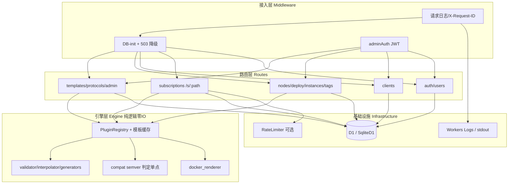
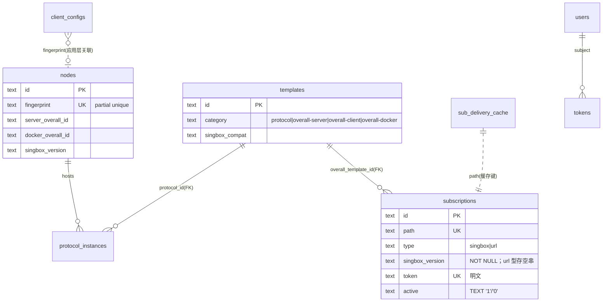
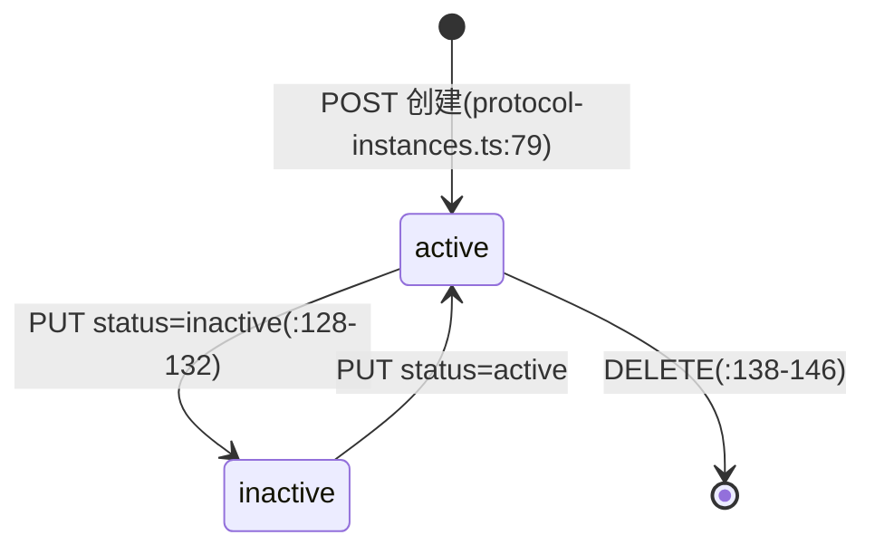
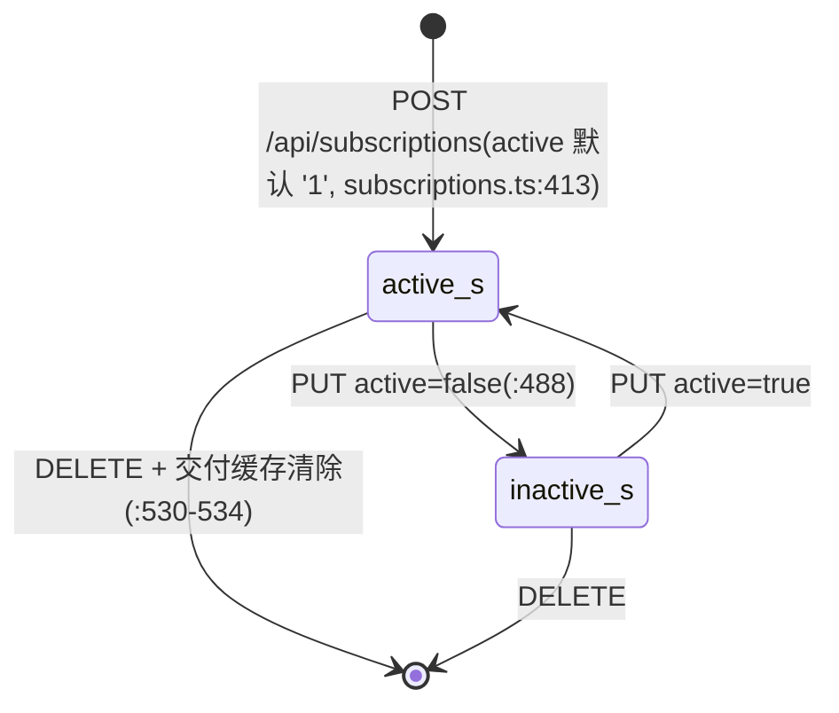
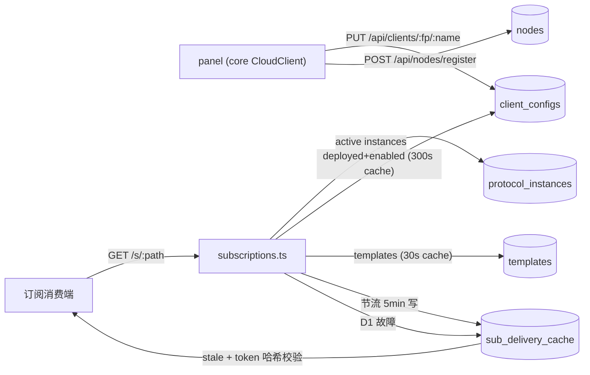

---

project: SingChorus

type: module-design

description: chorus-cloud 以单一 Hono app 同时服务 Workers 与 Node 双运行时；内部分为接入治理、认证、模板、纯逻辑渲染引擎、节点编排、客户端同步、订阅交付与运行时适配八域。核心数据模型为 9 张 D1/SQLite 同构表，渲染引擎零 IO、判定单点、缓存三层。

base_commit: 5ab6e0b5439b72f3af60ca178147e57dc3fc31d9

---

# 模块设计：chorus-cloud（packages/cloud/）

## 模块定位与核心职责

- **一句话定义**：SingChorus 的云端控制面+数据面——管理员/panel 管理模板与节点，订阅消费端从 `/s/:path` 拉取按版本过滤后的 sing-box 配置。
- **核心业务/技术能力**：四类统一模板管理、纯逻辑配置渲染、节点登记与身份迁移、客户端配置同步、订阅交付（三级降级）、JWT 认证审计、双运行时（Workers+D1 / Node+SQLite）。

## 内部架构与分层设计

- **分层模式**：Middleware（日志/DB-init/鉴权）→ Route Handler（zod 边界校验 + SQL）→ Engine（纯逻辑渲染）→ 绑定层（D1/SQLite、RateLimiter）。无 Repository 层——路由直接持 SQL，这是显式取舍（体量小、SQL 面窄）。

- **核心组件与分工**：

|组件/类名|职责描述|依赖|关键文件|
|-|-|-|-|
|`app`（Hono）|路由装配、日志/DB-init 中间件、统一 onError|全部子路由、logger|src/index.ts:18-108|
|`PluginRegistry`|模板加载/缓存 + 四种渲染入口；D1Database 构造注入|D1、validator、interpolator、docker_renderer|src/engine/registry.ts:146-343|
|`resolveAndValidate`|参数归并（user>default>generator>required）+ enum 校验|generators|src/engine/validator.ts:21-57|
|`replacePlaceholders`|`params.X`/`gen.NAME` 占位符求值（整体/内嵌两态）|generators|src/engine/interpolator.ts:17-102|
|`isCompatSatisfied` 等|sing-box 版本兼容判定唯一实现|semver|src/engine/compat.ts|
|`SqliteD1`|D1 表面最小适配（batch=better-sqlite3 事务）|better-sqlite3|src/node/d1-sqlite.ts:101-120|
|`adminAuth`|Bearer JWT 校验 + 吊销检查（fail-open）|jwt.ts、D1|src/auth/middleware.ts:28-64|
|`writeDeliveryCache`/`serveStaleDelivery`|交付缓存写（节流+24h 清理）/ stale 兜底读|D1、hashToken|src/routes/subscriptions.ts:59-101|
|`createLogger`|运行时无关结构化 JSON 日志|console|src/logger.ts:74-108|
|`fireAndForget`|waitUntil（Workers）/分离 Promise（Node）统一|Hono Context|src/services/fire-and-forget.ts:13-19|

## 核心领域模型与状态机

- **关键实体**：
  - `Template`（统一 4 类：protocol / overall-server / overall-client / overall-docker；types.ts:65）
  - `ProtocolInstance`：创建时渲染快照（server_config/client_config 落库，protocol-instances.ts:66-81）
  - `Subscription`：type 双型（singbox=JSON 配置绑定 singbox_version+overall 模板；url=分享链接，不绑版本/模板）+path+token（schema.ts:122-135）
  - `ClientConfig`：panel 推送影子，(fingerprint,name) 主键 + tag/port 镜像列（schema.ts:137-152）
  - `sub_delivery_cache`：交付缓存（path 主键、token_hash、active、config）

### 实体关系 (ER)

### 状态机

- 节点 `status`（online/offline）非严格状态机：register 心跳置 online（nodes.ts:56,74），无自动离线翻转（last_seen 仅记录）[待确认: 是否有计划中的离线判定任务]。
- 消费规则：deploy 与订阅交付均只取 `status='active'` 的实例（deploy.ts:35、subscriptions.ts:212）——status 枚举在 zod 层收窄为 active/inactive（protocol-instances.ts:91）。

## 关键工作流与算法实现

- **核心流程 1：订阅交付（GET /s/:path）**（subscriptions.ts:156-360）：
  1. token 缺失/不匹配/订阅停用 → 401/403（:160-195；停用同时 fireAndForget 删缓存）
  2. 可选限流（SUBSCRIPTION_RATE_LIMITER，:197-206）
  3. 实例来源二级回退：protocol_instances(active) → client_configs(deployed+enabled, 300s isolate 缓存)（:208-234）
  4. **url 型分支**：跳过版本/compat 过滤与 overall 渲染，逐实例 clientConfig 经 engine/share-urls.ts `outboundToShareUrl` 转 URI（vless/hysteria2/trojan/ss/vmess），`\n` 连接后以 `text/plain` 交付；全转换失败 → 500 SHARE_URL_NONE；缓存带 `{__format:'share-urls'}` 标记
  5. singbox 型版本强制校验：overall 模板 compat 不匹配 → 400；协议不兼容实例排除并计数（:250-291）
  6. overall 渲染或简单合并兜底（:293-306）
  7. 节流写交付缓存（json 或 text 格式标记）→ 直返配置本体 / URI 列表 + X-Sbx-Skipped-Instances 头（:317-326）
  8. 任一 D1 异常 → serveStaleDelivery（token 哈希+active 校验+格式标记）→ 无缓存则 503 DB_UNAVAILABLE（:169-176,235-240,307-315）
- **核心流程 2：节点部署物渲染（POST /api/deploy/:nodeId）**（deploy.ts:26-121）：
  1. 校验节点/活跃实例/server-docker 模板齐备（404/400 语义化）
  2. 逐实例 renderProtocolInstance → renderServerOverall 拼装 → deriveDockerOverrides（从 inbounds 提取端口）
  3. renderDocker 产出 composeYaml + entrySh（SING_BOX_CONFIG_PLACEHOLDER 替换为缩进 JSON，:97-101）
  4. 结果仅存于响应（不做云端归档，:103-106）

## 设计模式

|模式|应用位置|解决的问题|关键文件|说明|
|-|-|-|-|-|
|Registry + 共享缓存|`PluginRegistry` + 模块级 Map|路由每请求新建实例导致重复 D1 全表读|engine/registry.ts:118-155|isolate 级 Map+30s TTL，写路径 invalidateTemplateCache 主动失效|
|Adapter|`SqliteD1`|同一 app 跑 Node 而不改业务 SQL|node/d1-sqlite.ts|只实现应用实际用到的 D1 表面，契约由 tests/node/api.spec.ts 钉住|
|Chain of Responsibility|Hono 中间件链|日志/DB-init/鉴权横切关注点|index.ts:29-56、auth/middleware.ts|顺序固定：日志→DB-init→路由级 adminAuth|
|Pure Function Engine|engine/* 全目录|渲染逻辑可测、可跨运行时|engine/（除 registry 构造注入 DB 外零 IO）|IO 只经 PluginRegistry 构造函数注入|
|格式标记缓存|sub_delivery_cache `{__format}` 字段|同一表同时承载 singbox JSON 与 url 型 URI 列表两种交付格式，免再 ALTER|share-urls.ts、subscriptions.ts writeDeliveryCache/serveStaleDelivery|json 格式无标记、text 格式带 `{__format:'share-urls'}`，stale 回放按标记选 Content-Type|
|Snapshot + 重渲染维护|protocol_instances 快照 + /rerender|模板编辑不传播到存量实例|protocol-instances.ts:153-204|CLOUD-C1：批量重渲染，单实例失败不阻断|
|Fail-open 边界|吊销检查、限流器、审计写入|D1 依赖不放大为全站不可用|middleware.ts:45-55、subscriptions.ts:197-206、audit.ts:28-30|每处均有注释声明风险窗口|

## 数据设计

### 2.1 核心数据模型

见上方 ER 图。9 表 = 6 业务表 + 3 认证/审计表（tokens/users/audit_logs）。JSON 大字段以 TEXT 存储（params/server_config/client_config/config），读取侧惰性 JSON.parse 并缓存（registry.ts:172-187）。

### 2.2 存储与持久化设计

- 完整可执行 DDL：`packages/cloud/migrations/0001_init.sql`（136 行，9 表 + 17 索引），与运行时 eager DDL `src/db/schema.ts:69-209` 构成双源真值，由 `tests/schema-fingerprint.spec.ts:7-15`（CLOUD-C3）钉住结构等价。
- 关键约束：
  - `nodes.fingerprint` partial unique（schema.ts:206）——指纹即节点身份，NULL 指纹行不受限
  - `client_configs.tag` partial unique WHERE tag != ''（schema.ts:208）——tag 全局唯一的数据背书
  - `subscriptions.path/token` UNIQUE（schema.ts:125,129）；`singbox_version` NOT NULL（版本绑定闭环数据基础）
  - FK 仅 protocol_instances/subscription→templates 声明；`PRAGMA foreign_keys` 尽力开启（schema.ts:35，部分环境不可用，引用完整性部分靠应用层前置检查 protocols.ts:128-140、nodes.ts:215-221）
  - SQL 字符串内禁写 `--` 注释（会进 sqlite_master 破坏 fingerprint 一致性，schema.ts:120-121 注释）
- 升级路径：ALTER_TABLES 幂等补列（schema.ts:57-63），存量库与新建库行为对齐（42063a9 修复案例）。

### 2.3 缓存策略

|缓存|层级|TTL/节流|失效时机|证据|
|-|-|-|-|-|
|`initPromise` DDL memo|isolate 进程|永久（失败清空重试）|resetDatabaseInitCache（仅测试）|db/schema.ts:10-27|
|模板定义缓存|isolate 模块级（跨实例共享）|30s TTL|模板 CUD → invalidateTemplateCache；/rerender 强刷|engine/registry.ts:125-155、protocol-instances.ts:176-178|
|configsCache（交付用 client_configs）|isolate 模块级|300s|无主动失效（panel 全同步节奏 5min 对齐）；D1 失败 stale 服务|subscriptions.ts:15-33,116-150|
|sub_delivery_cache|D1 表（跨 isolate）|24h stale 上限；写节流 5min/path/isolate|订阅变更/停用/删除、rebind 时 DELETE|subscriptions.ts:47-83、nodes.ts:125|
|MemoryRateLimiter 窗口|进程内存|60s 滑窗|无|node/rate-limiter.ts|

### 数据流图

## 接口契约

### 外部接口

<!-- 签名逐一核对自路由源码；错误码为该端点显式返回值。 -->

|名称|描述|请求方式|请求参数|返回参数|错误码|
|-|-|-|-|-|-|
|健康检查|探活|GET /health|—|{status,service}|—|
|登录换 JWT|AUTH_TOKEN→JWT 24h|POST /api/auth/login|{token}|{accessToken,tokenType,expiresIn}|401 AUTH_INVALID_CREDENTIALS|
|刷新 JWT|吊销旧发新|POST /api/auth/refresh|Bearer JWT|同上|401 *|
|登出|吊销当前 JWT|POST /api/auth/logout|Bearer JWT|{success}|401 *|
|审计查询|分页过滤|GET /api/auth/audit-logs|?limit&offset&resource&actor|{logs,total,limit,offset}|401 *|
|协议列表|可带版本过滤|GET /api/protocols|?singbox_version|{protocols,filtered_count?}|400 SBX_BAD_VERSION|
|协议详情|—|GET /api/protocols/:id|—|{protocol}|404 PROTO_NOT_FOUND|
|协议写路径|CRUD|POST/PUT/DELETE /api/protocols[/:id]|protocolCreateSchema|{protocol}/{success}|400 SBX_BAD_RANGE；409 PROTO_DUPLICATE_ID/PROTO_IN_USE；404 PROTO_NOT_FOUND|
|overall 模板列表|短名映射+版本过滤|GET /api/templates|?category&singbox_version|{templates,filtered_count?}|400 SBX_BAD_VERSION|
|overall 模板详情/写路径|CRUD|GET/POST/PUT/DELETE /api/templates[/:id]|templateCreateSchema|{template}/{success}|400 TMPL_INVALID_JSON/SBX_BAD_RANGE；409 TMPL_DUPLICATE_ID/TMPL_IN_USE；404 TMPL_NOT_FOUND|
|版本目录|聚合 docker 模板 enum|GET /api/singbox-versions|—|{versions[] semver 降序}|—|
|实例列表/详情|按 nodeId 过滤|GET /api/protocol-instances[/:id]|?nodeId|{instances}/{instance}|404 INSTANCE_NOT_FOUND|
|实例创建|创建即渲染快照|POST /api/protocol-instances|{protocolId,nodeId,params}|{instance} 201|404 NODE_NOT_FOUND/PROTO_NOT_FOUND；400 PluginError|
|实例更新|tag 不可变|PUT /api/protocol-instances/:id|{params?,status?}|{instance}|400 TAG_IMMUTABLE；404 INSTANCE_NOT_FOUND|
|实例删除|—|DELETE /api/protocol-instances/:id|—|{success}|404 INSTANCE_NOT_FOUND|
|批量重渲染|维护端点 CLOUD-C1|POST /api/protocol-instances/rerender|{protocolId?}|{rerendered,failed,failures}|404 PROTO_NOT_FOUND；400 VALIDATION_ERROR|
|节点登记心跳|幂等 upsert|POST /api/nodes/register|{fingerprint,name,address?,singboxVersion?}|{node} 201/200|400 SBX_BAD_VERSION|
|节点身份迁移|重装恢复|POST /api/nodes/rebind|{from,to}|{success,moved_configs}|400 BAD_FINGERPRINT；404 NODE_NOT_FOUND；409 TARGET_FINGERPRINT_IN_USE|
|节点 CRUD|档案管理|GET/POST/PUT/DELETE /api/nodes[/:id]|createNodeSchema/updateNodeSchema|{nodes}/{node}/{success}|404 NODE_NOT_FOUND|
|客户端列表|元数据 only|GET /api/clients|?fingerprint|{clients[]}|503 STORAGE_UNAVAILABLE|
|节点配置拉取|全记录|GET /api/clients/:fingerprint|—|{clients[]}|400 BAD_FINGERPRINT；404 CLIENT_NOT_FOUND；503 STORAGE_UNAVAILABLE|
|单客户端查询|—|GET /api/clients/:fingerprint/:name|—|{client}|404 CLIENT_NOT_FOUND|
|客户端 upsert|冲突防护|PUT /api/clients/:fingerprint/:name|upsertSchema|{client} 200/201|409 PORT_CONFLICT/TAG_CONFLICT|
|客户端删除|—|DELETE /api/clients/:fingerprint/:name|—|{success}|404 CLIENT_NOT_FOUND|
|节点部署物|compose+entry+serverConfig|POST /api/deploy/:nodeId|—|{composeYaml,entrySh,serverConfig,instances[]}|404 NODE_NOT_FOUND；400 NO_ACTIVE_PROTOCOLS/NO_SERVER_OVERALL/NO_DOCKER_OVERALL/PluginError|
|渲染 dry-run|协议实例试渲染|POST /api/render|{protocolId,params?,singboxVersion?}|{serverConfig,clientConfig}|400 INVALID_JSON/PROTOCOL_ID_REQUIRED/SBX_BAD_VERSION/SBX_VERSION_INCOMPATIBLE/PluginError|
|部署渲染|panel 部署直接消费|POST /api/render/deploy|{instances,serverOverallId?,dockerOverallId?,serverParams?,dockerParams?,dockerOverrides?,singboxVersion?}|{serverConfig,composeYaml,entrySh,singboxVersion?,singboxImage?}|400 INVALID_JSON/INSTANCES_REQUIRED/SBX_BAD_VERSION/SBX_VERSION_INCOMPATIBLE/SBX_VERSION_NOT_OFFERED|
|整体渲染 dry-run|三类整体模板|POST /api/render/overall|{category,templateId,params?,instances?,overrides?}|{serverConfig}/{clientConfig}/{composeYaml,entrySh}|400 INVALID_JSON/TEMPLATE_ID_REQUIRED/INVALID_CATEGORY/PluginError|
|**订阅交付**|消费端入口|GET /s/:path|?token|singbox 型：配置文档本体；url 型：text/plain 分享链接（每行一条 URI）+ X-Sbx-Skipped-Instances 头|401 AUTH_MISSING_TOKEN/AUTH_INVALID_TOKEN；404 SUB_NOT_FOUND；403 SUB_INACTIVE；429 RATE_LIMITED；400 SBX_VERSION_INCOMPATIBLE/SBX_NO_COMPATIBLE_INSTANCES；500 INSTANCES_MISSING/OVERALL_RENDER_FAILED/SHARE_URL_NONE；503 DB_UNAVAILABLE/STORAGE_UNAVAILABLE|
|订阅 CRUD|含预校验；type 创建后不可变（url 型禁传 singboxVersion/overallTemplateId，singbox 型必传版本）|GET/POST/PUT/DELETE /api/subscriptions[/:id]|createSubSchema/updateSubSchema|{subscriptions}/{subscription}/{success}|400 SUB_PATH_RESERVED/SBX_BAD_VERSION/SBX_VERSION_INCOMPATIBLE/SUB_TYPE_IMMUTABLE/SUB_FIELD_NOT_APPLICABLE；404 SUB_NOT_FOUND/TMPL_NOT_FOUND；409 SUB_PATH_DUPLICATE/SUB_DUPLICATE|
|内置模板播种|幂等 upsert 5 模板|POST /api/admin/seed|—|{seeded[]}|400 CONFIG_VALIDATION_FAILED|
|tag 唯一检查|两次索引查询|GET /api/tags/check|?tag|{tag,available,source?}|400 TAG_REQUIRED|
|用户 CRUD+签发|30d user JWT|GET/POST/PUT/DELETE /api/users[/:id]；POST /api/users/:id/token|createUserSchema/updateUserSchema|{users}/{user}/{accessToken,...}|404 USER_NOT_FOUND；409 USER_DUPLICATE|

\* 401 系列含 AUTH_MISSING_TOKEN/AUTH_INVALID_TOKEN/AUTH_TOKEN_REVOKED（middleware.ts:31,37,51）。

### 内部接口

|名称|描述|调用方|提供方|请求参数|返回参数|
|-|-|-|-|-|-|
|`ensureDatabaseInitialized(db)`|幂等建库+种子（isolate memo）|index.ts 中间件、node/entry.ts|db/schema.ts|D1Database|Promise（reject → 503 路径）|
|`new PluginRegistry(db)` + loadAll/render*|渲染四入口|routes/{render,deploy,protocol-instances,subscriptions}.ts|engine/registry.ts|D1Database、模板 id、params|配置对象 / PluginError|
|`isCompatSatisfied(compat,version)`|兼容判定单点|subscriptions/render/protocols/templates/nodes|engine/compat.ts|range,version|boolean|
|`invalidateTemplateCache()`|写路径缓存失效|protocols/templates/protocol-instances 写路由|engine/registry.ts|—|void|
|`logAction(db,entry)`|审计写入（尽力而为）|auth/users 路由|services/audit.ts|AuditEntry|void|
|`fireAndForget(c,promise)`|后台任务派发|subscriptions 停用路径|services/fire-and-forget.ts|Context,Promise|void|
|`hashToken(token)`|SHA-256+base64url|auth 中间件、login、交付缓存|auth/jwt.ts|token|string|
|`resetDatabaseInitCache/resetRegistryCache/resetSubscriptionCaches`|测试隔离钩子|tests/*|对应模块|—|void|

### 配置接口

|名称|描述|类型|默认值|取值范围|
|-|-|-|-|-|
|`DB`|数据库绑定|D1 binding|—|—|
|`AUTH_TOKEN`|管理员静态令牌|Secret（Workers）/env（Node）|wrangler.toml dev 占位（CI 用）|任意非空；生产 `openssl rand -hex 32`（package.json:26）|
|`JWT_SECRET`|JWT 签名密钥|Secret|同上|同上|
|`LOG_LEVEL`|日志级别（两运行时同字段）|var/env|info|debug/info/warn/error/silent（logger.ts:22-30）|
|`SUBSCRIPTION_RATE_LIMITER`|可选限流绑定（有意不绑定，免费版友好）|RateLimiter binding|未绑定=不限流|env.d.ts:3-16|
|`CHORUS_CLOUD_SUB_RATE_LIMIT_RPM`|Node 限流 RPM|env|未设=不限流|正数（node/entry.ts:114-123）|
|`CHORUS_CLOUD_DB`|Node SQLite 路径|env|data/chorus-cloud.db|文件路径（entry.ts:31）|
|`PORT/HOST`|Node 监听|env|8787/0.0.0.0|—（entry.ts:29-30）|
|`LOG_FORMAT=pretty`|Node 本地调试日志格式|env|json|json/pretty（entry.ts:38）|

### 错误码与异常定义

|错误码|协议层状态|含义|触发场景|处理建议|
|-|-|-|-|-|
|`DB_UNAVAILABLE`|HTTP 503|D1 冷启动/查询失败|init 抛错、交付链路 D1 异常且无 stale 缓存|core 按 5xx 退避重试（cloud-client.ts:206-214）|
|`STORAGE_UNAVAILABLE`|HTTP 503|存储查询失败（clients 列表、交付回退）|D1 异常|调用方禁止把空响应当「无数据」|
|`AUTH_*`（MISSING/INVALID/REVOKED/INVALID_CREDENTIALS）|HTTP 401|认证失败|Bearer 缺失/签名错/吊销/登录令牌错|core 401 清 token 缓存重试一次（cloud-client.ts:183-204）|
|`SUB_*`（NOT_FOUND/INACTIVE/PATH_DUPLICATE/PATH_RESERVED/DUPLICATE/SUB_TYPE_IMMUTABLE/SUB_FIELD_NOT_APPLICABLE）|404/403/409/400|订阅生命周期错误|path 不存在/停用/重复/保留字（api,admin,health）；PUT 改 type；url 型更新传版本/模板字段|panel 提示管理员修正|
|`SHARE_URL_NONE`|HTTP 500|url 型交付无可分享链接|全部实例 clientConfig 转换失败（协议不支持或缺 server/port）|检查实例配置；url 型仅支持 vless/vmess/trojan/ss/hysteria2|
|`SBX_BAD_VERSION`|HTTP 400|版本格式非法|非 X.Y.Z[-suffix]（+build 拒绝）|修正为 docker-tag 安全 semver|
|`SBX_BAD_RANGE`|HTTP 400|兼容范围非法|singboxCompat 非 semver range|修正模板声明|
|`SBX_VERSION_INCOMPATIBLE`|HTTP 400|版本与模板不兼容|预校验/交付强制/render 冲突清单|换版本或改模板 compat|
|`SBX_NO_COMPATIBLE_INSTANCES`|HTTP 400|全部实例被版本排除|交付端过滤后为空|升级订阅绑定版本|
|`SBX_VERSION_NOT_OFFERED`|HTTP 400|版本不在 docker 模板 enum|render/deploy 版本目录一致性检查|改用 enum 内版本或扩模板|
|`TAG_IMMUTABLE`/`TAG_CONFLICT`/`TAG_REQUIRED`|400/409/400|tag 规则|创建后改 tag/tag 撞全局唯一/缺参|tag 是合并标识，创建即定|
|`PORT_CONFLICT`|HTTP 409|同节点端口冲突|client upsert 端口已被同节点其他配置占用|改端口|
|`*_IN_USE`（PROTO/TMPL）|HTTP 409|删除被引用资源|协议有实例/模板被订阅绑定|先删实例/解绑订阅|
|`PLG_*`（PluginError 族：UNKNOWN_TYPE/UNKNOWN_PARAM/UNKNOWN_GENERATOR/INVALID_EXPRESSION/MISSING_PARAM/VALIDATION_FAILED）|HTTP 400（onError 统一映射）|引擎校验/渲染失败|模板缺字段、参数缺失、生成器未注册、占位符非法|修正模板或参数；index.ts:83-86|
|`INTERNAL_ERROR`|HTTP 500|未预期异常|非 PluginError 抛出|查 Workers Logs；响应含 err.message 不含堆栈（index.ts:87-93）|
|`NOT_FOUND`|HTTP 404|路由不存在|—|—|

## 开发指南

### 洞察

- 路由「每请求 new PluginRegistry」但缓存是模块级——实例廉价，D1 全表读才是贵的（registry.ts:118-124 注释）。
- `sub_delivery_cache` 只存 token 哈希：token 轮换后 stale 路径自然拒绝，无需显式失效（subscriptions.ts:42-45）。
- 停用订阅的 403 路径也要删缓存——否则 D1 宕机期间 stale 路径会继续服务已停用订阅（subscriptions.ts:188-195）。
- deploy.ts:103-106 记录了「为何不做 KV 归档」的决策残留：键位与 clients 域漂移并泄漏孤儿记录。
- 路由层无 try/catch D1 是常态（依赖 onError 500 直通 message），但**交付链路必须 catch**（要走 stale 降级）——两种风格并存是有意的。

### 扩展指南

新增管理端点的既定路径：
1. 在 `src/routes/<域>.ts` 建 Hono 子路由；写接口挂 `adminAuth`；请求体用 zod schema + `zValidator('json', ...)`。
2. 错误一律 `{error:{code,message}}` 信封；唯一约束冲突把 `UNIQUE constraint failed` 翻译成精确 409（参照 subscriptions.ts:441-449）。
3. 路由挂载到 `src/index.ts`（`app.route('/api/xxx', xxx)`）。
4. 若新增 D1 列：**同步改** `db/schema.ts` CREATE_TABLES + `migrations/0001_init.sql` +（存量库）ALTER_TABLES，跑 schema-fingerprint/schema-upgrade 测试。
5. 若新增 Env 绑定：Workers 走 wrangler.toml/wrangler.prod.toml；Node 走 node/entry.ts 的 env 对象；可选绑定写进 env.d.ts 并在代码里 `?.`+try/catch。
6. 若新增 Node 侧 D1 方法用法：确认 `SqliteD1` 已实现该方法，否则 tests/node/api.spec.ts 补用例钉住。

### 风格与约定

- SQL 手写于路由内，参数化 bind；禁止拼接用户输入进 SQL（现库仅动态 SET 列名，来自白名单字段映射）。
- 测试隔离三钩子：resetDatabaseInitCache / resetRegistryCache / resetSubscriptionCaches（vitest-pool-workers 模块状态跨测试存续）。
- 注释记录决策 ID 与设计文档节号（CLOUD-A2、§13.1/13.2/13.7、CLOUD-P2/P3/P4、CLOUD-C1/C3）。
- ID 生成统一 `crypto.randomUUID()`；时间统一 `datetime('now')`（DB 内）或 `new Date().toISOString()`（应用侧）。

### 设计哲学

- **一个 app、一个 seam**：业务代码零运行时分支；差异全部收敛到绑定注入（index.ts:106-108、entry.ts:96-106）。
- **管理面 fail loudly、交付面 fail stale**：管理员要明确错误，终端用户要可用性（index.ts:49-54 vs subscriptions.ts:36-46）。
- **昂贵调用防御**：D1 计入 50 subrequest 预算 → 所有热路径读均有 memo/TTL，所有写路径均有主动失效。
- **判定单点**：semver 兼容逻辑只存 cloud（compat.ts:3-7）；消费端只拿结果。

### 修改检查清单

- [ ] 改 schema：schema.ts 与 migrations/0001_init.sql 是否同步？存量库需要 ALTER_TABLES 吗？fingerprint 测试过吗？
- [ ] 改模板写路径：是否调用 invalidateTemplateCache？compat 范围校验（SBX_BAD_RANGE）在吗？
- [ ] 改订阅字段：PUT 后 sub_delivery_cache 失效联动是否覆盖该字段（subscriptions.ts:511-515）？
- [ ] 改交付链路：三级降级路径（row lookup/instance lookup/template load 三处 catch）是否都保留 stale 兜底？
- [ ] 新增 Env 用法：双运行时都注入了吗？可选绑定有 `?.` 保护吗？
- [ ] 新增 D1 方法调用：SqliteD1 支持吗？node api.spec 覆盖了吗？
- [ ] 引擎改动：保持零 IO？PluginError 语义是否仍映射 400？
- [ ] 版本相关改动：SINGBOX_VERSION_RE/目录聚合/四道防线（列表过滤/预校验/交付强制/render 冲突）是否需要联动？
