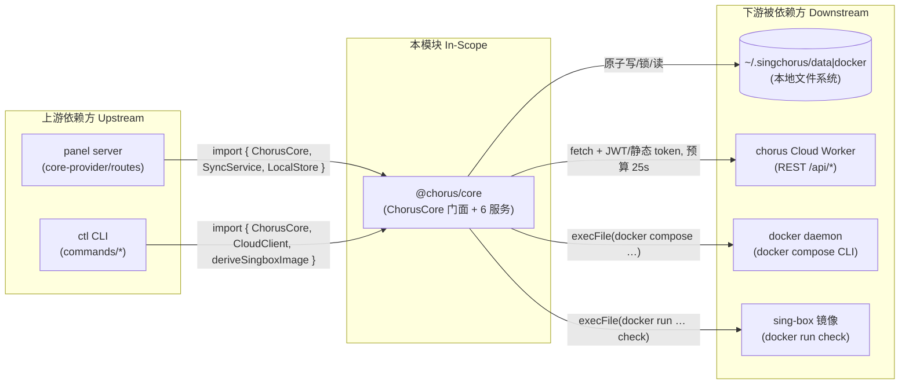

---

project: SingChorus

type: boundaries

description: @chorus/core（packages/core）是跨端领域内核：本地配置存储、节点身份、云端双向同步、docker 部署执行与 sing-box 校验。以零运行时依赖被 panel（常驻服务）与 ctl（CLI）两个宿主共享，自身通过 HTTP 依赖 chorus-cloud 与 docker CLI。

base_commit: 5ab6e0b5439b72f3af60ca178147e57dc3fc31d9

---

# 模块边界

## 模块范围

<!-- guideline: 明确本领域负责什么、不负责什么。职责划分基于代码事实（Gemba），逐条附证据。 -->

|维度|本领域负责|本领域不负责（属于其他领域）|
|-|-|-|
|核心职责|配置生命周期管理与内容指纹（`src/services/config-manager.ts`、`src/services/hash.ts`）；本地原子持久化与自愈（`src/services/store.ts`）；跨进程文件锁（`src/services/lock.ts`）；云端 REST 通信（`src/services/cloud-client.ts`）；后台同步引擎（`src/services/sync-service.ts`）；双向同步算法（`src/core.ts:170-338`）；部署制品落盘与 docker compose 驱动（`src/services/docker-manager.ts`）；sing-box 校验（`src/services/validator.ts`）；本地回退合并（`src/services/merger.ts`）|HTTP 路由与会话（panel `packages/panel/server/`）；CLI 参数解析与命令注册（ctl `packages/ctl/src/commands/`）；模板渲染、订阅下发与 KV/D1 存储（cloud `packages/cloud/`）；前端 UI（`packages/panel/src/`）|
|数据所有权|`~/.singchorus/data/` 全部文件（configs/enabled|disabled/.history/app_config.json/fingerprint/remote-configs，`store.ts:9-17`）；`~/.singchorus/docker/` 部署制品（docker-manager.ts:87-91）|cloud 侧 nodes/client_configs/subscriptions 行（cloud Worker）；panel 自身配置文件（`packages/panel/server/config.ts`）|
|业务规则|端口冲突拒绝、tag 不可变、内容哈希同步判定、空库删除守卫、部署集合名单制（config-manager.ts / core.ts:246-271）|订阅版本 compat 判定（cloud 交付端）；sing-box 模板参数校验（cloud 渲染端）|
|进程模型|panel/ctl 双进程共享数据目录的互斥与缓存失效（lock.ts、store.ts:90-105）|panel 内请求上下文/AsyncLocalStorage（`packages/panel/server/request-context.ts`）|

## 上下游总览

## 上游依赖（Inbound / 谁依赖我）

<!-- instruct: 由代码中的调用点反推，每条已核实。 -->

|依赖方 (Caller)|交互方式 (RPC/HTTP/Event/Direct)|契约/接口路径|
|-|-|-|
|`panel server`|Direct import（进程内）|`packages/panel/server/core-provider.ts:15` import `ChorusCore, SyncService, LocalStore`；`routes/settings.ts:6`、`routes/init.ts:7` import `CloudClient`；`src/lib/types.ts:6` import 类型|
|`ctl` CLI|Direct import（进程内）|`packages/ctl/src/index.ts:11`、`commands/{config,deploy,subscription,cloud,remote,validate,node}.ts` 均 import `ChorusCore` 等|
|`panel 前端`（间接）|经 panel server 转发|`packages/panel/src/lib/http.ts:18-25` 锚定 core 导出常量 REQUEST_BUDGET_MS（core-D2）|
|`cloud 契约测试`（单向锁定）|测试契约|`packages/cloud/tests/contract-core.spec.ts:7`（core-D4/CLOUD-D2 契约锁）|

## 下游依赖（Outbound / 我依赖谁）

|被依赖方 (Callee)|依赖目的|协议/驱动类型|强/弱|
|-|-|-|-|
|`~/.singchorus/data`|配置/指纹/应用配置/远端缓存持久化|fs（sync API + rename 原子写）|强（无文件系统不可用）|
|`~/.singchorus/docker`|部署制品（compose/entry.sh/config.json/deploy-meta.json）|fs + chmod + docker CLI|强（部署功能）|
|`chorus Cloud Worker`|渲染/上传/拉取/订阅/注册（`cloud-client.ts` 全部端点）|HTTP fetch + JWT/静态 token|强于部署与同步；弱于本地 CRUD（离线可改本地，同步退避重试）|
|`docker daemon`|compose up/down/restart/ps/logs 与 run 校验、prepull|`execFile('docker', …)`（docker-manager.ts:136-139、validator.ts:28-40）|强于部署/校验（daemon 不可用时校验放行、状态报 unavailable：validator.ts:139-142、docker-manager.ts:344-370）|
|`sing-box 镜像`|校验与运行时|docker run / compose|强（镜像 tag 由 deriveSingboxImage 推导，validator.ts:52-60）|
|Node.js ≥20|Atomics.wait、fetch、fs sync API|运行时（package.json:23-25）|强|

## 防腐层与协议转换 (Anti-Corruption Layer)

- **外部系统隔离策略**：
  - 云端记录统一以 `Record<string, unknown>` 进入，经 `toRemoteEntry` 转换为域内 `ConfigEntry`（只读远端副本），字段缺失给默认值（core.ts:341-359）。
  - docker/sing-box 全部经 `execFile` 参数数组调用，无 shell 插值（validator.ts:80-82,152-158；docker-manager.ts:36-48）。
  - 宿主能力注入：Logger / getRequestId 经 `CoreOptions` 注入，core 不硬编码日志与请求追踪实现（core.ts:13-22、logger.ts:1-13）。
- **DTO / 领域对象映射**：
  - renderDeploy 响应 camelCase/snake_case 双兼容（serverConfig/server_config），旧 cloud 缺 singboxVersion/Image 字段按 undefined 交给调用方（cloud-client.ts:342-345,380-386）。
  - 非 JSON 错误体（如 CDN 错误页）降级为 `{raw}` 文本，避免误判为网络错误（cloud-client.ts:143-154）。
  - 错误翻译：锁超时→busy 错误（store.ts:181-186）、LockTimeoutError→DeployInProgressError 409（docker-manager.ts:124-126）、云端错误→`CLOUD_*` AppError 信封（cloud-client.ts:436-439 等）。

## 边界变更记录

|日期|变更内容|根因 / 触发|关联工件|
|-|-|-|-|
|2026-09（≤ base）|legacy 单段 client 端点移除，云端仅服务指纹命名空间路由|core-D1/CLOUD-D1：两台机器同名配置互覆|cloud-client.ts:401-406|
|2026-09（≤ base）|deployed 标志与部署集合名单制引入|订阅只应包含已部署配置|config-manager.ts:185-199、schemas/config.ts:30-31|
|2026-09（≤ base）|singbox_version pin 进入 AppConfig 与 ConfigEntry 快照|版本绑定/漂移提示（设计 §13.3-13.4，ADR-007）|schemas/config.ts:41-47、validator.ts:44-60|

## 全局功能树映射

core 在全局功能树（`../../architecture_views/function_tree.yml`）中是配置生命周期(101)、双向同步(201/202/203)、部署编排(301/302)、本地校验(701)、本地持久化(1001)与跨进程互斥(1002)的唯一执行体，也是模板/订阅/身份(401/501/601)、渲染制品(402)与系统设置(804)的持久化或通信权威端；panel/ctl 为其入口层，cloud 为其云端对端。逐域映射见本模块 `function_tree.yml` 尾部注释。
