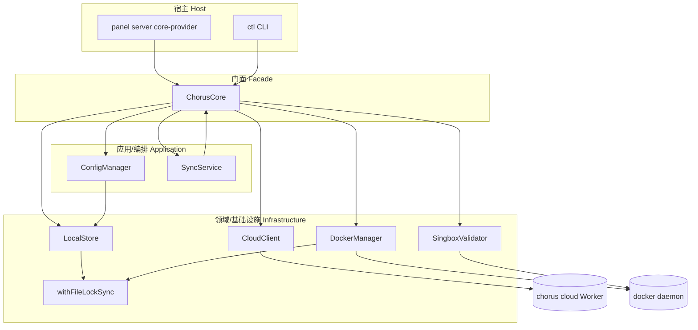
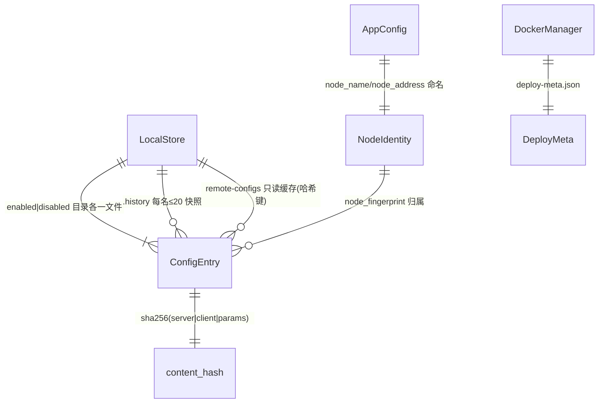
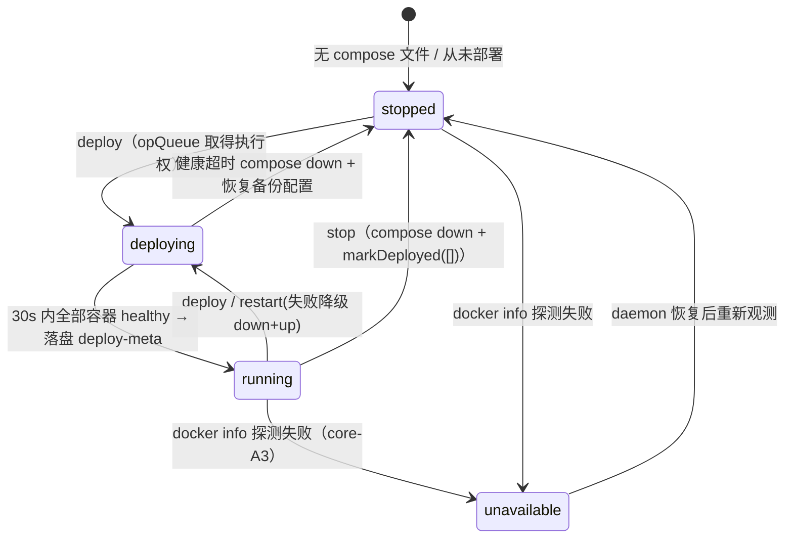
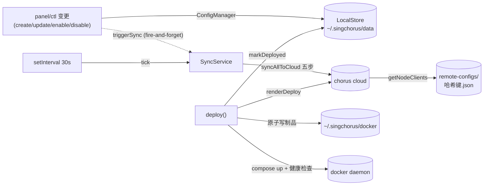

---

project: SingChorus

type: module-design

description: @chorus/core 以 ChorusCore 门面组装 6 个服务（store/config-manager/cloud-client/validator/docker + SyncService 编排），零运行时依赖。核心数据模型是 ConfigEntry（内容哈希+synced/deployed 标志），核心流程是五步双向同步与云端渲染驱动的 docker 部署。

base_commit: 5ab6e0b5439b72f3af60ca178147e57dc3fc31d9

---

# 模块设计：@chorus/core（跨端领域内核）

## 模块定位与核心职责

- **一句话定义**：panel 与 ctl 共享的零依赖领域内核，管理 sing-box 配置的本地生命周期、云端双向同步与本机 docker 部署。
- **核心业务/技术能力**：
  1. 配置 CRUD + 端口冲突/tag 不可变守卫 + 内容指纹（config-manager.ts、hash.ts）
  2. `~/.singchorus/data` 原子持久化、损坏自愈、目录签名缓存（store.ts）
  3. 跨进程互斥（O_EXCL 文件锁 + mtime 陈旧回收，lock.ts）
  4. chorus-cloud REST 通信（25s 预算 + 退避 + JWT 缓存，cloud-client.ts）
  5. 五步双向同步算法与后台同步引擎（core.ts:170-338、sync-service.ts）
  6. 云端渲染制品落盘 + docker compose 生命周期 + 健康检查回滚（docker-manager.ts）
  7. docker run sing-box check 校验 + 三层昂贵调用防御（validator.ts）

## 内部架构与分层设计

- **分层模式**：宿主（panel/ctl）→ 用例门面（ChorusCore）→ 领域服务（ConfigManager/SyncService）→ 基础设施（LocalStore/CloudClient/DockerManager/锁）。依赖单向向下，基础能力经构造注入（logger、getRequestId，core.ts:43-51）。

- **核心组件与分工**：

|组件/类名|职责描述|依赖|关键文件|
|-|-|-|-|
|`ChorusCore`|门面：组装服务、编排双向同步/部署/订阅用例|全部服务|`src/core.ts:35-51`|
|`LocalStore`|数据目录持久化：原子写/自愈/缓存/指纹/远端缓存|lock、logger|`src/services/store.ts`|
|`ConfigManager`|配置生命周期与同步状态判定|LocalStore、hash|`src/services/config-manager.ts`|
|`CloudClient`|云端 REST 全端点 + 预算重试 + JWT 缓存|logger|`src/services/cloud-client.ts`|
|`SyncService`|后台同步引擎：trigger/tick/退避/单飞|ChorusCore|`src/services/sync-service.ts`|
|`DockerManager`|制品落盘 + compose 驱动 + opQueue/部署锁|lock、execFile|`src/services/docker-manager.ts`|
|`SingboxValidator`|docker run 校验 + 缓存/单飞/队列防御|execFile|`src/services/validator.ts`|
|`merger` / `hash` / `tag`|本地回退合并 / 内容指纹 / 标签组合|—|`src/services/merger.ts`、`hash.ts`、`src/tag.ts`|
|`withFileLockSync`|跨进程咨询锁原语|fs sync|`src/services/lock.ts`|



## 核心领域模型与状态机

- **关键实体 (Entities / Value Objects)**：
  - `ConfigEntry`（schemas/config.ts:25-47）：name/type/enabled/deployed?/synced/content_hash/server_config/client_config/params/node_fingerprint?/singbox_version?
  - `AppConfig`（schemas/config.ts:63-75）：cloud_url/cloud_token/singbox_image/singbox_version/validate_timeout_seconds/prepull/node_name/node_address/docker_dir?
  - `NodeIdentity`（schemas/config.ts:77-82）：fingerprint + name + address
  - `Subscription`（schemas/config.ts:49-61）、`SyncStatus`（:23，'pending_upload'|'pending_update'|'synced'|'unknown'）
  - `DeployMeta`（docker-manager.ts:29-34）：singboxVersion/singboxImage/deployedAt

- **状态转换逻辑**：
  - 单条配置同步状态：初始 `pending_upload`（云端无记录）→ 上传成功 `markSynced` → 云端 hash/enabled/deployed 全一致 `synced` → 任一漂移 `pending_update`（config-manager.ts:209-221）。
  - 内容变更裁决：update 后重算 hash，**hash 不变不翻转 synced/deployed；变了才双双失效**（config-manager.ts:99-106）——冲突裁决规则是「内容哈希说了算」。

### 实体关系 (ER)



### 状态机

部署生命周期（进程内 + 文件系统观测）：



## 关键工作流与算法实现

- **核心业务流程 1：五步双向同步（core.ts:170-303）**：
  1. `registerNode` 心跳（尽力而为，失败仅 warn，:182-193）
  2. `listNodes` 取他节点指纹集；`getClients` 失败**中止本轮**（空云误判会全量重传，:196-207）
  3. 逐条比对（synced 标志 + computeSyncStatus）增量 `uploadNodeClient`，失败累积进 `failures`（:217-244）
  4. 删除对账：云端有本地无→`deleteNodeClient`；**空库守卫**：本地 0 条且云端>0（重装现场）跳过并 warn（:246-271）
  5. 并行拉取他节点：`Promise.allSettled` + `withTimeout` 共享 `deadline=now+REQUEST_BUDGET_MS`，逐节点拉取/清理已删副本（:273-301）

- **核心业务流程 2：部署（core.ts:428-454 → docker-manager.ts:249-302）**：
  1. enabled 为空抛 CFG_NONE_ENABLED
  2. `renderDeploy`（云端渲染 server 配置+compose+entry.sh；版本 pin 注入）→ 404 报 CLOUD_ENDPOINT_MISSING
  3. `withDeploying(withDeployLock(deployRenderedLocked))`：备份 config → 原子写三制品 → chmod entry → compose up -d → 30s 健康窗口
  4. 健康通过→写 deploy-meta.json→`markDeployed(enabled 名单)`；失败→compose down+恢复备份+抛 DockerError

- **核心业务流程 3：写路径自愈（store.ts）**：saveConfig = 锁内 [rename 迁移对侧旧文件 → 原子写 → 历史快照 → 裁剪 20 份 → 失效缓存]；读路径遇损坏 JSON → 历史快照恢复（RPO≤20 次变更）或改名隔离。

## 设计模式

|模式|应用位置|解决的问题|关键文件|说明|
|-|-|-|-|-|
|Facade|ChorusCore|宿主只见用例不见服务拼装|core.ts:35-51|6 服务构造期组装，panel/ctl 同一入口|
|依赖注入|CoreOptions(logger/getRequestId)|零依赖内核被多宿主复用（ADR-004）|core.ts:13-22|CLI 可整体省略注入项|
|Budget + Exponential Backoff|request 循环|不可达云端的快速可解释失败|cloud-client.ts:156-239|总预算截断退避，401 例外重试|
|Single-flight + Cache + Queue|validator.validate|防并发校验放大成多个容器任务（core-P1）|validator.ts:100-137|同内容共享一次 docker run|
|opQueue 串行链|DockerManager/validator.enqueue|容器操作互斥且拒绝不断链（ADR-008）|docker-manager.ts:99-109|`queue.then(op,op)` 吞链上拒绝|
|原子写 + 自愈|atomicWrite/repairOrQuarantine|崩溃只留完整旧/新文件，损坏可恢复|store.ts:40-45,118-152|同目录 temp 防 EXDEV|
|Mtime 签名缓存|dirSignature|双进程互写后缓存自动失效（core-P2）|store.ts:90-105|rename 换 dirent 必更目录 mtime|
|Fail-loudly（无降级回退）|deploy/render|绝不静默服务旧配置（ADR-003）|core.ts:421-427|merger 仅作显式回退 API 保留|

## 数据设计

### 2.1 核心数据模型

见上方 ER。`content_hash = sha256(stable(server) + '|' + stable(client) + '|' + stable(params))`（hash.ts:19-26）；stableStringify 递归排序键（hash.ts:12-17）。

### 2.2 存储与持久化设计

不适用（无关系型数据库）。文件布局（store.ts:9-17、docker-manager.ts:87-89）：

```
~/.singchorus/
├── data/
│   ├── configs/enabled/<name>.json     # 启用条目
│   ├── configs/disabled/<name>.json    # 停用条目
│   ├── configs/.history/<name>/<ts>.json  # ≤20 快照
│   ├── app_config.json                 # AppConfig（0600）
│   ├── fingerprint                     # 32-hex（0600）
│   ├── remote-configs/<sha256-24>.json # 他节点只读缓存
│   └── .lock                           # 数据目录跨进程锁
└── docker/
    ├── docker-compose.yml / data/entry.sh / data/config.json
    ├── data/config.json.bak.<ts>       # ≤5 份（BACKUP_KEEP=5）
    ├── deploy-meta.json / tls/
    └── .deploy.lock                    # 部署跨进程锁
```

### 2.3 缓存策略

|缓存|内容|Key|TTL/失效|一致性|
|-|-|-|-|-|
|LocalStore.configsCache|全量 ConfigEntry 列表|enabled+disabled 目录 mtime 签名|签名变化即失效；本进程写显式失效（store.ts:90-105,208）|返回浅拷贝防调用方污染（store.ts:230-231,245）|
|CloudClient.cachedToken|JWT|单例|过期前 60s 刷新（TOKEN_REFRESH_MARGIN）|401 清缓存重试一次（cloud-client.ts:60,90-91,183-187）|
|SingboxValidator.cache|校验结果|sha256(stable(config))|5min TTL、容量 100、refresh-on-set≈LRU（validator.ts:23-26,115-124）|in-flight 去重并发同 key|

### 数据流图



## 接口契约

### 外部接口（chorus-cloud REST，经 CloudClient）

|名称|描述|请求方式|请求参数|返回参数|错误码|
|-|-|-|-|-|-|
|`POST /api/auth/login`|静态 token 换 JWT|POST|`{token}`|`{accessToken,expiresIn}`|非 200 回退静态 token|
|`POST /api/nodes/register`|节点注册/心跳|POST|fingerprint/name/address/singboxVersion|—|CLOUD_UNREACHABLE 502|
|`POST /api/nodes/rebind`|指纹重绑定迁移|POST|`{from,to}`|`{moved_configs}`|透传云端 code，502|
|`GET /api/nodes`|节点列表|GET|—|`{nodes[]}`|—|
|`GET /api/clients`|全量配置列表|GET|—|`{clients[]}`|≥400 抛错（禁当空云）|
|`PUT /api/clients/:fp/:name`|上传本节点配置|PUT|config/server_config/params/type/hash/enabled/deployed|`{client}`|CLOUD_UPLOAD_FAILED 502|
|`GET /api/clients/:fp`|按指纹拉配置|GET|—|`{clients[]}`（404=空）|CLOUD_UNREACHABLE 502|
|`DELETE /api/clients/:fp/:name`|删云端配置|DELETE|—|—（404 视为成功）|CLOUD_DELETE_FAILED 502|
|`GET/POST /api/protocols`、`GET /api/templates?category=`|协议/模板（版本过滤）|GET|singbox_version|templates+filtered_count|—|
|`GET /api/singbox-versions`|版本目录|GET|—|`{versions[]}`|非 200 返回 []|
|`POST /api/render`|渲染单协议|POST|protocolId/params(+tag)|server/client_config|CFG_GENERATE_FAILED 400|
|`POST /api/render/deploy`|渲染部署制品|POST|instances/serverOverallId/dockerOverallId/singboxVersion|serverConfig/composeYaml/entrySh/singbox*|CLOUD_ENDPOINT_MISSING 502 / CLOUD_RENDER_DEPLOY_FAILED 502|
|`/api/subscriptions[...]`|订阅 CRUD|GET/POST/PUT/DELETE|—|subscription|CLOUD_CREATE/UPDATE/DELETE_FAILED 502|
|`GET /api/tags/check`|标签预检|GET|tag|`{available}`|失败视为可用（noRetry）|

### 内部接口（@chorus/core 包导出，index.ts:1-13）

|名称|描述|调用方|提供方|请求参数|返回参数|
|-|-|-|-|-|-|
|`ChorusCore`（约 30 个公共方法）|门面用例层|panel/ctl|core.ts|见 core.ts 逐签名|ConfigEntry/状态/制品结果等|
|`SyncService.trigger/tick/status/dispose`|后台同步|panel core-provider|sync-service.ts|—|Promise/状态对象|
|`LocalStore`（15 方法）|存储直用（仅 panel 读 app_config）|panel|store.ts|—|—|
|`CloudClient`（20+ 方法）|云端直调|panel routes/settings、init、ctl cloud|cloud-client.ts|—|—|
|`REQUEST_BUDGET_MS`|跨模块预算常量（core-D2）|panel 前端 http.ts 锚定 30s|cloud-client.ts:59|—|25000|
|`deriveSingboxImage` / `mergeServer` / `mergeSubscription` / `computeContentHash`(内部)|工具函数|ctl/门面|validator.ts:52 / merger.ts|—|—|
|`withFileLockSync` / `releaseLock` / `LockTimeoutError`|锁原语|store/docker|lock.ts|path+fn+opts|T / 抛超时|
|`AppError` / `ERRORS` / `Logger` / 类型|错误与日志注入|全宿主|errors.ts / logger.ts / schemas/config.ts|—|—|

### 配置接口

|名称|描述|类型|默认值|取值范围|
|-|-|-|-|-|
|`cloud_url`|云端地址|AppConfig|`http://localhost:8787`|URL（尾斜杠归一，cloud-client.ts:76）|
|`cloud_token`|静态 AUTH_TOKEN|AppConfig|''|非空才启用认证（:87）|
|`singbox_image`|基础镜像|AppConfig|`ghcr.io/sagernet/sing-box:latest`|镜像引用|
|`singbox_version`|版本 pin（''=未设）|AppConfig|''|semver，渲染/镜像 tag 推导（validator.ts:52-60）|
|`validate_timeout_seconds`|校验超时|AppConfig|30|>0，×1000ms|
|`prepull_singbox_image`|校验前预拉镜像|AppConfig|true|bool|
|`node_name`/`node_address`|节点标识|AppConfig|''|非空且 token 非空才算初始化（core.ts:106-109）|
|`CHORUS_FINGERPRINT`|指纹回收 env|环境变量|—|`^[A-Za-z0-9_-]{8,128}$`（store.ts:59-61,298-311）|
|`docker_dir`|部署目录|AppConfig 可选|`~/.singchorus/docker`|路径|

### 错误码与异常定义

|错误码|协议层状态|含义|触发场景|处理建议|
|-|-|-|-|-|
|`CFG_NOT_FOUND`|404|配置不存在|get/delete/enable/disable 目标缺失|调用方视为终态|
|`CFG_DUPLICATE`|409|配置重名|add 已存在同名|改用 upsert 或改名|
|`CFG_NAME_REQUIRED`|422|名称必填|add/upsert 空名|补名称|
|`CFG_TAG_IMMUTABLE`|400|标签不可变|update 试图改 params.tag/client_config.tag|保持原 tag|
|`CFG_PORT_CONFLICT`|409|端口冲突|生效端口被本机其他配置占用|换端口|
|`CFG_NONE_ENABLED`|400|无启用配置|deploy/generateServerConfig/Subscription 无 enabled|先启用配置|
|`CLOUD_UNREACHABLE`|503/502|云端不可达|预算耗尽/注册拉取失败|检查云端地址与网络|
|`CFG_GENERATE_FAILED`/`CLOUD_GENERATE_FAILED`|400/502|渲染失败|render 非 200|按 message 修参数|
|`CLOUD_ENDPOINT_MISSING`|502|云端缺端点|renderDeploy 404|升级 cloud|
|`CLOUD_UPLOAD/DELETE/CREATE/UPDATE/REBIND_FAILED`|502|云端写操作失败|对应端点 ≥400|看透传的云端 code|
|`INVALID_FINGERPRINT`|422|指纹格式非法|importFingerprint/CHORUS_FINGERPRINT|8-128 位合法字符|
|`DEPLOY_IN_PROGRESS`|409|部署进行中|并发 deploy/stop/restart 或他进程持锁|稍后重试|
|`DockerError`|500 默认|部署失败|compose 失败/健康超时/空制品|看 stderr 与回滚日志|
|`LockTimeoutError`|—|锁竞争超时|withFileLockSync 等待超时|store 转译 busy；docker 转 409|

## 开发指南

### 洞察

- 同步判定是「三要素一致」：hash+enabled+deployed（config-manager.ts:209-221）；enable/disable 只翻 enabled 靠 synced 标志触发重传（core.ts:220-222 注释）。
- `getClients` 失败绝不能当空云：空云误判→全量重传；空库守卫则相反方向防重装误删（core.ts:201-207,246-258）。
- 并行拉取预算复用 `REQUEST_BUDGET_MS`（core-D2），panel 前端 30s axios 超时必须保持在其之上（cloud-client.ts:49-59、panel/src/lib/http.ts:18-25）。
- 内嵌决策 ID 索引（代码注释可检索）：core-P1（校验防御）、core-P2（列表缓存）、core-P3（拉取预算）、core-D1（门面单查远端/指纹命名空间）、core-D2（预算常量）、core-D3（tick≥30s 契约）、core-R1（execFile 无 shell）、core-R2（存储互斥）、core-R3（原子写）、core-R4（部署互斥）、core-R5（防冗余同步）、core-R6（compose ps 解析兼容）、core-A1（隔离自愈）、core-A3（daemon 不可用区分）、core-C1（双份残留）。

### 扩展指南

新增一个云端能力：1) 在 `cloud-client.ts` 加请求方法（复用 `request()`，按语义决定 noRetry 与错误码）；2) 若涉及同步，在 `core.ts` 同步流程中挂步骤并在返回值补字段；3) 需要本地落盘的加 `LocalStore` 方法（必须走 `locked()`）；4) 在 `index.ts` 导出（新类型进 `schemas/config.ts`）；5) 补 `packages/cloud/tests/contract-core.spec.ts` 契约锁。新增本地变更类操作：在 panel 侧变更完成后调 `triggerSync()`（fire-and-forget，core-provider.ts:131-135）。

### 风格与约定

- 注释携带决策 ID（core-P*/D*/R*/A*/C*）与跨模块契约锚点，先因后果；中英混排均可。
- 文件写入一律 `atomicWrite`（temp+同目录 rename）；同步临界区一律 `withFileLockSync`；子进程一律 `execFile` 参数数组。
- 错误一律 `AppError(code,message,status)` 或 `DockerError`，禁裸字符串 throw。
- Logger 注入式：服务构造收 `Logger`，默认 consoleLogger/noopLogger。

### 设计哲学

- 云端是唯一事实源：渲染、模板、版本目录都在 cloud；core 只落盘与驱动（ADR-003）。
- Fail loudly：失败要可解释（错误信封 + failures 明细 + 日志 meta），不做静默降级。
- 崩溃一致性优先：原子写 + 历史快照 + 陈旧锁回收，假设进程随时可死。
- 单管理员单机假设：opQueue/409 而非持久化任务队列（ADR-008）。

### 修改检查清单

- [ ] 改 `REQUEST_BUDGET_MS` 必须同步核对 panel 前端 30s 超时与 core 拉取预算两处锚点（core-D2）。
- [ ] 改同步流程须保持空库守卫与 getClients 中止语义，并核对 SyncService 契约（tick≥30s、fire-and-forget trigger）。
- [ ] 改 store 写路径必须维持：锁内执行、rename 迁移、原子写、缓存失效四件套。
- [ ] 改锁实现必须同时评估 store（等待语义）与 docker（fail-fast 409）两个调用方，并复查 RISK-CORE-001 缺口。
- [ ] 改部署链路必须保持「云端渲染、无本地回退」与备份/回滚顺序（先备份后写、健康过才写 meta）。
- [ ] 改 ConfigEntry 字段须同步 toRemoteEntry 映射与 cloud 契约测试。
- [ ] 新增依赖前核对零依赖纪律（package.json dependencies 为空，ADR-004）。
