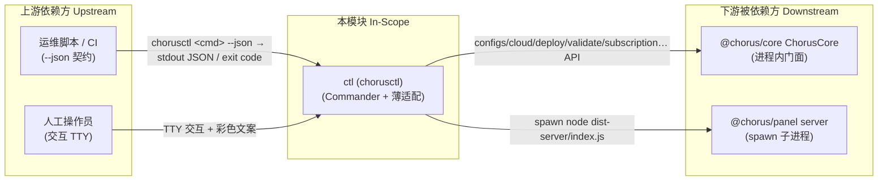

---

project: SingChorus

type: boundaries

description: ctl（@chorus/ctl，chorusctl）是 SingChorus 的 CLI 薄适配层：解析命令、按 --json 契约输出结果，业务能力全部经 ChorusCore 门面委托 core。与 panel 构成共享 ~/.singchorus/data 的双进程，互斥由 core 的文件锁保障。

base_commit: 5ab6e0b5439b72f3af60ca178147e57dc3fc31d9

---

# 模块边界

## 模块范围

|维度|本领域负责|本领域不负责（属于其他领域）|
|-|-|-|
|核心职责|命令解析与注册（commander）、双模式输出（--json/人读）、交互确认、panel 进程启动|配置/部署/同步的业务逻辑（core，`packages/core/src/core.ts:35`）|
|数据所有权|无自有数据；--json 状态仅为进程内存态（`packages/ctl/src/config.ts:6`）|配置/订阅/指纹持久化（core LocalStore，`packages/core/src/services/store.ts:17`）|
|业务规则|参数合法性前置校验（端口 1-65535、版本正则、--active/--inactive 互斥）（`packages/ctl/src/commands/config.ts:234`、`packages/ctl/src/commands/subscription.ts:86`）|sing-box 配置渲染/合并/校验算法（core merger/validator）|
|外部交互|spawn panel 子进程（`packages/ctl/src/commands/panel.ts:112`）|云端 REST API 实现与 Docker CLI 调用（core CloudClient/DockerManager）|

## 上下游总览

## 上游依赖（Inbound / 谁依赖我）

|依赖方 (Caller)|交互方式 (RPC/HTTP/Event/Direct)|契约/接口路径|
|-|-|-|
|运维脚本 / CI|子进程 CLI + stdout JSON + 退出码|`chorusctl <command> --json`；错误形态 `{ok:false,error[,detail]}`（`packages/ctl/src/utils.ts:16-24`）；文案格式不保证稳定（`packages/ctl/src/index.ts:19`）|
|人工操作员|交互式 TTY|彩色文案 + confirm 提示（`packages/ctl/src/utils.ts:45-53`）|
|场景：定时同步脚本|CLI 调用链|见 `docs/knowledge/architecture_views/scenario_view.md:81`|

## 下游依赖（Outbound / 我依赖谁）

|被依赖方 (Callee)|依赖目的|协议/驱动类型|强/弱|
|-|-|-|-|
|`@chorus/core`|全部业务能力（配置/部署/同步/订阅/校验/身份）|进程内 ESM import（workspace:\*，`packages/ctl/package.json:30`；消费 dist 产物）|强|
|`commander`|命令解析框架|进程内（`packages/ctl/package.json:31`）|强|
|`@chorus/panel`|`panel start` 启动 Web UI|spawn 子进程；已装包优先、monorepo 回退（`packages/ctl/src/commands/panel.ts:39-92`）|弱（仅 panel start 需要）|
|Node.js ≥20 / pnpm|运行时 / panel 按需构建|engines 约束（`packages/ctl/package.json:18-20`）；pnpm 预检查（`packages/ctl/src/commands/panel.ts:71-77`）|弱（按需构建时才需 pnpm）|
|Docker daemon / cloud 服务|间接（经 core DockerManager / CloudClient）|core 内部封装|间接强（deploy/sync 时）|

## 防腐层与协议转换 (Anti-Corruption Layer)

- **外部系统隔离策略**：无独立领域模型，近乎透传消费 core 的 ConfigEntry/Subscription/NodeIdentity 结构；防腐仅体现在输出侧——`fail()` 将任意 core 异常统一转换为 `{ok:false,error}` + 退出码 1（`packages/ctl/src/utils.ts:16-24`），cloud 错误码（CFG_NOT_FOUND 等，`packages/core/src/errors.ts:11-19`）以 err.message 文本透传给用户。
- **DTO / 领域对象映射**：唯一映射点是参数组装（CLI option → core 入参，如 `--template none` → `overallTemplateId: null`，`packages/ctl/src/commands/subscription.ts:93`）；敏感信息在输出侧脱敏（token 只报 `token_set` 或前 8 位，`packages/ctl/src/commands/cloud.ts:106-107`、`packages/ctl/src/utils.ts:208`）。
- **双进程互斥归属**：ctl 与 panel 共享 `~/.singchorus/data`，写互斥完全由 core 的文件锁承担（`packages/core/src/services/store.ts:17,177-183`，全局原则 principles_005）；ctl 自身无锁逻辑。

## 边界变更记录

|日期|变更内容|根因 / 触发|关联工件|
|-|-|-|-|
|[]|[]|[]|[]|

## 全局功能树映射

ctl 在全局功能树中是 core 能力的 CLI 入口层：配置/部署/同步/订阅/身份/镜像/校验命令入口(101/102/301/302/201/501/601/603/103/701)、面板启动编排(1004)与 CLI 输出契约(1005)。零业务逻辑，全部直调 core 门面。逐域映射见本模块 `function_tree.yml` 尾部注释。
