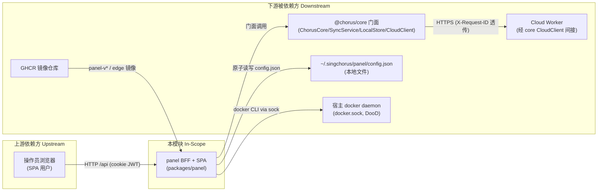

---

project: SingChorus

type: boundaries

description: panel（ChorusPanel）是 SingChorus 的 Web 管理面板：Express BFF（server/）+ Vue 3 SPA（src/），经 @chorus/core 门面驱动本地 docker 部署（DooD）、本地配置存储与云端（Cloud Worker）协同。本文件界定其职责边界与上下游契约。

base_commit: 5ab6e0b5439b72f3af60ca178147e57dc3fc31d9

---

# 模块边界

## 模块范围

<!-- 证据颗粒度：文件夹为主，关键结论落至 path:line -->

|维度|本领域负责|本领域不负责（属于其他领域）|
|-|-|-|
|核心职责|管理员认证与会话（packages/panel/server/auth.ts, routes/auth.ts）；初始化向导（routes/init.ts）；配置/订阅/部署/设置/看板 BFF 路由（server/routes/）；SPA 页面与状态（packages/panel/src/）；core 实例生命周期与同步触发（server/core-provider.ts）；自托管交付（Dockerfile, docker-compose.yml, bin/）|协议参数生成、配置校验、同步执行逻辑（@chorus/core 门面内部，packages/core/src/）；云端模板渲染/订阅发布（packages/cloud/）；CLI 命令（packages/ctl/）|
|数据所有权|panel 配置文件 `~/.singchorus/panel/config.json`（server/config.ts:42,48-50）；登录限流内存态（routes/auth.ts:16）|core 数据目录 `~/.singchorus/data/`（packages/core LocalStore）；云端 D1/KV 数据；docker 卷数据（宿主 daemon 所有）|
|业务规则|密码强度策略（auth.ts:38-58）；登录限流 5 次/15min（routes/auth.ts:14-16）；tag/端口预检（routes/core/configs.ts:69-115）；sing-box 版本 pin 校验（routes/settings.ts:27-34）|singbox_compat 版本过滤执行（cloud 端）；端口冲突云端裁决（cloud 按 fingerprint）；配置内容 hash/同步冲突裁决（core SyncService）|
|部署边界|panel 自身镜像与健康检查（Dockerfile:55-58）；sing-box 容器生命周期指令下发（routes/core/deploy.ts）|sing-box 容器的 compose 渲染（cloud 渲染后经 core 落盘）；docker daemon 本体（宿主）|

## 上下游总览

## 上游依赖（Inbound / 谁依赖我）

|依赖方 (Caller)|交互方式 (RPC/HTTP/Event/Direct)|契约/接口路径|
|-|-|-|
|操作员浏览器（panel 自带 SPA）|HTTP / REST（同源，dev 经 Vite 代理 vite.config.ts:23-28）|`/api/auth/*`、`/api/core/*`、`/api/settings/*`、`/api/info`、`/api/init/*`（app.ts:119-123）|
|仓库内 vitest 测试|Direct（supertest 注入 app，不绑端口）|`createApp()`（app.ts:62；tests/helpers.ts:19-22）|
|chorus-panel bin / docker CMD|进程加载|`dist-server/index.js` 启动即监听（bin/chorus-panel.mjs:51；index.ts:18）|

> 说明：Cloud Worker 不回调 panel；panel 与云端之间只有 panel 侧发起的出站请求（经 core）。无其他模块依赖 panel 的运行时接口。

## 下游依赖（Outbound / 我依赖谁）

|被依赖方 (Callee)|依赖目的|协议/驱动类型|强/弱|
|-|-|-|-|
|`@chorus/core` ChorusCore|配置存取、远端配置、订阅、部署、云代理（唯一服务端入口，server/core-provider.ts:15,86-96）|Direct import（workspace:*，package.json:38）|强|
|`@chorus/core` SyncService|后台/即时同步执行（core-provider.ts:100,109-114）|Direct import|弱（未配置 cloud_token 时全部跳过，core-provider.ts:124,133）|
|`@chorus/core` LocalStore|直读 singbox_version/image（与 ctl 共享单一事实源；core-provider.ts:50）|Direct import（绕过门面，已知债）|强|
|`@chorus/core` CloudClient|初始化/设置页候选云端探活（routes/init.ts:53-56；routes/settings.ts:108-111）|Direct import|弱（探活失败有明确降级路径）|
|`~/.singchorus/panel/config.json`|管理员哈希、JWT secret、云端连接、节点身份|fs 原子读写（config.ts:118-133）|强|
|宿主 docker daemon|sing-box 部署/停止/重启/日志（deploy 路由→core→docker CLI）|unix socket 挂载（docker-compose.yml:37）|部署功能强依赖；其余功能不依赖|
|Cloud Worker|模板/订阅/同步/注册（全部经 core 间接调用，panel 不直连）|HTTPS（core CloudClient）|弱（可降级本地运行，check-tag 降级见 configs.ts:88-95）|
|GHCR|自托管镜像分发（PANEL_IMAGE 覆盖，docker-compose.yml:20-21）|OCI registry|弱（默认本地构建）|

## 防腐层与协议转换 (Anti-Corruption Layer)

- **外部系统隔离策略**：
  - SPA 永不直连 core/云端：所有数据经自家 BFF `/api`（src/lib/http.ts:11），前端仅从 @chorus/core 导入**类型**（src/lib/types.ts:1-6，type-only），运行时耦合为零。
  - 云端不可达不渗入 UI 语义：路由层把 core 错误统一翻译为 502/503 + `CLOUD_UNREACHABLE` 码（routes/core/cloud.ts:52,96,117）。
  - 候选云端探活走独立 CloudClient 实例，不污染已缓存 core（routes/settings.ts:108-114）。
- **DTO / 领域对象映射**：
  - core 错误 → HTTP：`toCoreError` 抽取 statusCode/code/message（routes/core/helpers.ts:7-14）；Zod 错误 → 单行消息（api-error.ts:26-31）。
  - 前端错误归一：`extractApiError` 兼容 `{code,message}` 与嵌套 `{error:{code,message}}` 两种历史形状（src/lib/http.ts:59-84）。
  - 远端配置条目扩展 `node_fingerprint` 字段标注归属（src/lib/types.ts:15-19）。
- **版本契约**：panel 用 zod ^4.4.3（package.json:53），cloud 用 ^3.24.0（packages/cloud/package.json:36）——两侧 schema 各自独立、无共享 schema 包，靠注释互镜像正则（routes/settings.ts:26-27）维持语义一致，属刻意的松耦合。

## 边界变更记录

|日期|变更内容|根因 / 触发|关联工件|
|-|-|-|-|
|2026-09（≤5ab6e0b）|各路由文件独立实例化 ChorusCore 收敛为 core-provider 单例提供者|消除配置漂移与重复 fallback（core-provider.ts:1-14 注释）|packages/panel/server/core-provider.ts|
|2026-09（≤5ab6e0b）|远端配置单条读取改走 core 门面 getRemoteConfig（core-D1）|避免深读 core.store 内部|routes/core/configs.ts:194-203；packages/core/src/core.ts:366-370|

## 全局功能树映射

panel 在全局功能树中承担入口层与自有接入面：配置/部署/同步/订阅的 BFF 入口(101/102/103/301/302/202/501)、面板会话与网关(801/802)、看板与前端交互(803/805)、节点初始化向导(603)、系统设置入口(804)与面板服务自举(1004)。业务逻辑全部下沉 core，云端能力经 core 间接访问。逐域映射见本模块 `function_tree.yml` 尾部注释。
