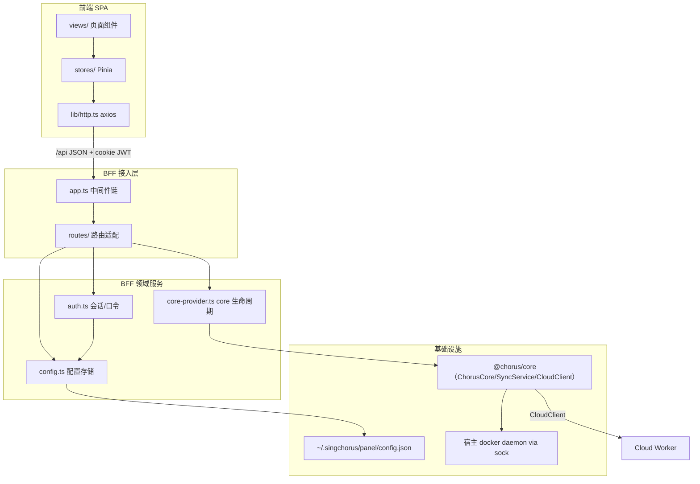
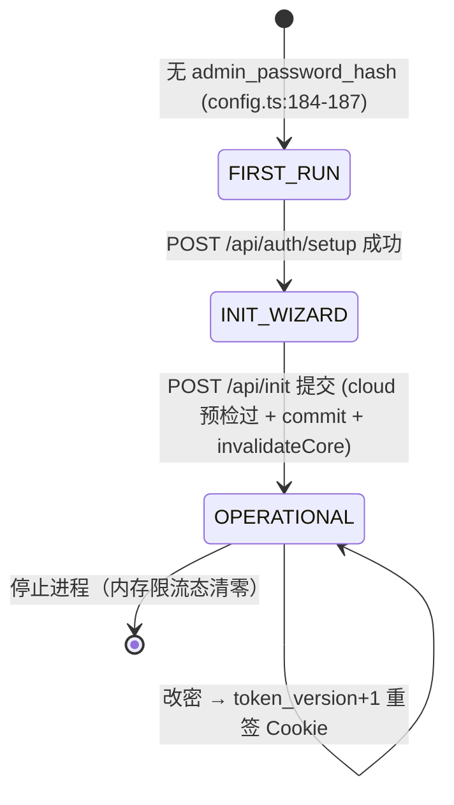
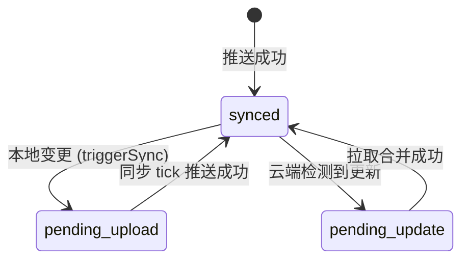
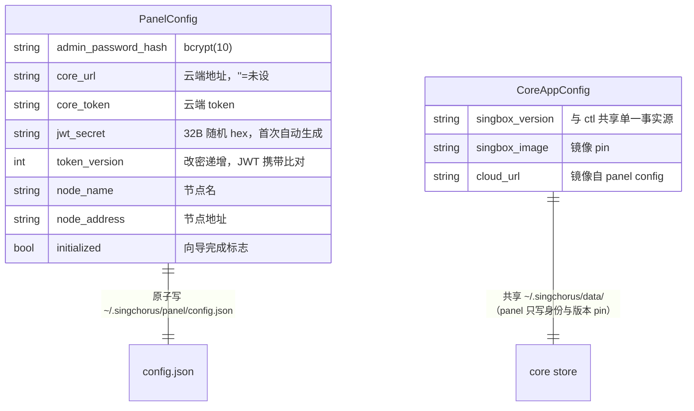

---

project: SingChorus

type: module-design

description: panel 由 Express BFF（server/，core 生命周期唯一管理者 + REST 面）与 Vue 3 SPA（src/，仅经 /api 通信）组成；核心数据模型是单文件配置 config.json + core store 共享目录；对外接口为 5 组 /api 路由与 GHCR/npm 双交付通道。

base_commit: 5ab6e0b5439b72f3af60ca178147e57dc3fc31d9

---

# 模块设计：panel（ChorusPanel 管理面板）

## 模块定位与核心职责

- **一句话定义**：SingChorus 节点上的单管理员 Web 控制台——Express BFF 包装 @chorus/core 提供 REST 面，Vue 3 SPA 提供操作界面，经 DooD 驱动宿主 docker 管理 sing-box。
- **核心业务/技术能力**：认证会话、初始化向导（含重装恢复）、协议配置 CRUD/预检、订阅与模板浏览（云端协同）、sing-box 部署运维、系统设置（版本 pin）、后台自动同步触发、自托管交付。

## 内部架构与分层设计

- **分层模式**：SPA 视图（views/）→ 前端状态（stores/）→ HTTP 客户端（lib/http.ts）→ BFF 路由适配（routes/）→ 领域服务（auth.ts / config.ts / core-provider.ts）→ core 门面（@chorus/core）。BFF 是唯一有运行时 core 依赖的层。

- **核心组件与分工**：

|组件/类名|职责描述|依赖|关键文件|
|-|-|-|-|
|`createApp`|Express 应用装配：CORS/CSRF/安全头/日志/请求上下文/错误信封/SPA 静态托管|auth、env、logger、routes|server/app.ts|
|`authMiddleware`/`requireAuth`|Cookie JWT 验签 + token_version 比对；路由级强制认证|config|server/auth.ts:134-163|
|`loadConfig`/`updateConfig`/`runConfigExclusive`|panel 配置 TTL 缓存 + mtime 复验 + 原子写 + 进程级写互斥|fs|server/config.ts:65-182|
|`getCore`/`getSyncService`/`triggerSync`/`invalidateCore`|ChorusCore 单例缓存（快照比对重建）、同步服务重绑、30s 后台 tick、变更即时触发|@chorus/core、config|server/core-provider.ts|
|`routes/core/*`|configs/cloud/deploy 三域代理路由，Zod 校验 + 错误翻译 + triggerSync|core-provider、helpers|server/routes/core/|
|`http`（axios 实例）|baseURL=/api、30s 超时（>core 25s 预算）、401 拦截、错误归一|vue-router|src/lib/http.ts|
|Pinia stores|按 auth/cloud/config/deploy/info/init/settings/subscription/template 分域的页面状态|http|src/stores/|

<!-- 依赖方向：适配层只向领域服务调用；领域服务经 core 门面朝外，不触达 core 内部（core-D1 债务点除外：core-provider.ts:50 直读 LocalStore） -->

## 核心领域模型与状态机

- **关键实体**：
  - `PanelConfig`（config.json 单文件，config.ts:6-16）：admin_password_hash、core_url/core_token、jwt_secret、token_version、node_name/node_address、initialized。
  - `ChorusCore` 单例（core-provider.ts:35-38 缓存）：由四元组快照（cloudUrl/cloudToken/singboxVersion/singboxImage）键控。
  - 会话 = JWT Cookie（chorus_panel_token，12h，auth.ts:8-9）。

### 状态机

**面板生命周期状态**（initialized × first_run 驱动路由，router/index.ts:29-44）：

**配置同步状态**（每配置，展示层枚举，src/lib/sync-status.ts:4-16）：

## 关键工作流与算法实现

- **登录限流算法**（routes/auth.ts:22-52）：`failures: Map<ip, {count, lockedUntil}>`；连续 5 次失败 → 锁 15min 并清零计数；成功/过期即清；每次登录机会式清扫过期项。键为 `req.ip`（受 trust proxy 影响，env.ts:44-50）。
- **配置读取缓存算法**（config.ts:65-85）：500ms TTL 内直接回缓存；过期后 `statSync` 比 mtime，未变仅刷新时间戳，变了才重读——避免每请求 stat 又及时感知带外编辑。
- **写互斥算法**（config.ts:173-182）：`configWriteQueue = configWriteQueue.then(fn)` 串行化跨越 bcrypt await 的读改写尾段，防两个并发请求交错覆盖 password_hash/token_version（RISK-PANEL-001）。
- **初始化向导提交序**（routes/init.ts:43-154）：Zod 校验 → 候选 CloudClient 探活（noRetry）→（可选）previous_fingerprint 改绑（提交前，失败中止）→ updateConfig 提交 → invalidateCore → 镜像写 core app config → registerNode（best-effort）→ restoreFromCloud（best-effort）→ ensureSyncTimer + triggerSync。

**部署流程时序**（routes/core/deploy.ts:19-40 + src/stores/deploy.ts:35-52）：

1. 前端 POST /api/core/deploy（timeout 放宽至 150s，含镜像拉取+健康检查轮询最长约 2min）
2. BFF `core.deploy(overallIds)` → core 经 docker CLI 驱动宿主 daemon
3. 成功/失败均记 durationMs；失败必留痕（容器可能已启动但 deployed 标记未写）
4. 成功后 triggerSync → 订阅端立即反映新可见性

## 设计模式

|模式|应用位置|解决的问题|关键文件|说明|
|-|-|-|-|-|
|BFF / 网关聚合|server/ 整体|SPA 与 core/云端解耦、认证收敛、错误形状统一|server/app.ts|前端零运行时 core 依赖（仅 type import）|
|单例提供者 + 快照失效|getCore|配置热更新时实例重建的一致性，消除多路由重复实例漂移|server/core-provider.ts:74-103|替代历史上各路由独立 new ChorusCore|
|原子写 + 带外编辑防护|saveConfig/updateConfig|崩溃不留半写文件；手工编辑不被缓存覆盖|server/config.ts:118-156|tmp+rename；写前 mtime 复验|
|进程级互斥队列|runConfigExclusive|序列化跨 await 的读改写|server/config.ts:173-182|单进程假设下的轻量锁|
|信封错误 + 错误码翻译|toErrorEnvelope/toCoreError|全 API 错误形状稳定，前端可按 code 分支|server/api-error.ts；routes/core/helpers.ts|5xx 生产脱敏但服务端全量留痕|
|装饰性中间件上下文|requestContext (ALS)|任意异步深度取 request id 透传云端|server/request-context.ts|pino-http genReqId 注入|

## 数据设计

### 核心数据模型

- panel 配置与 core store 分文件：singbox 版本/镜像**不属于** panel config，使 ctl 与 panel 看到同一份（core-provider.ts:43-50）。

### 存储与持久化设计

- 不适用（无数据库；单 JSON 文件 + core 的 JSON 存储）。
- 写路径保障：tmp+rename 原子写（config.ts:121-126）、chmod 0600（config.ts:126）、损坏文件改名 `.corrupt-<ts>` 隔离后重建（config.ts:107-115）、legacy sentinel 127.0.0.1:8080 一次性迁移为 ''（config.ts:34,95-98）。

### 缓存策略

- config.json：500ms TTL + mtime 复验（config.ts:36-40）。
- ChorusCore 实例：进程内单例，四元组快照不匹配才重建（core-provider.ts:74-103）。
- 登录限流：内存 Map，机会式清扫（routes/auth.ts:16,47-52）。

## 接口契约

### 外部接口（BFF REST，均返回统一错误信封）

|名称|描述|请求方式|请求参数|返回参数|错误码|
|-|-|-|-|-|-|
|认证状态|首启三态|GET /api/auth/status|-|first_run/initialized/authenticated|-|
|管理员设置|首次设口令|POST /api/auth/setup|password|ok|already_setup/bad_password/too_many_attempts|
|登录|口令换 Cookie|POST /api/auth/login|password|ok|first_run/wrong_password/too_many_attempts/missing_password|
|改密|旧换新+重签|POST /api/auth/change-password|old_password,new_password|ok|PASSWORD_TOO_SHORT/PASSWORD_TOO_WEAK/wrong_password|
|配置 CRUD|本机协议配置|GET/POST /api/core/configs, PUT/DELETE /api/core/configs/:name|见 configs.ts:11-26 schema|ConfigEntry|VALIDATION_ERROR/CORE_ERROR|
|标签/端口预检|创建前校验|POST /api/core/configs/check-tag、/check-port|tag / port|available+source/conflictWith|VALIDATION_ERROR|
|远端配置|他机配置只读+删|GET/DELETE /api/core/remote-configs/:fingerprint/:name|-|ConfigEntry|CFG_NOT_FOUND|
|模板浏览|版本过滤|GET /api/core/cloud/templates?role&singbox_version|-|templates+filtered_count|CLOUD_UNREACHABLE|
|订阅管理|云端订阅 CRUD|GET/POST /api/core/cloud/subscriptions, PUT/DELETE /:id|见 cloud.ts:16-35|subscription|SUB_NOT_FOUND/CLOUD_*_FAILED|
|同步健康|状态+失败明细|GET /api/core/cloud/sync-status|-|statuses+failures|CLOUD_UNREACHABLE|
|部署|sing-box 生命周期|POST /api/core/deploy、/stop、/restart；GET /status、/meta、/logs?tail|serverOverallId/dockerOverallId 可选|status/meta/logs lines|DEPLOY_FAILED/DOCKER_UNAVAILABLE/VALIDATION_ERROR|
|系统设置|查看/保存/探活|GET/POST /api/settings、POST /test、/test-candidate|见 settings.ts:29-35|settings+effective_cloud_url|VALIDATION_ERROR|
|初始化|向导读/提交/测连|GET/POST /api/init、POST /test|见 init.ts:31-41（含 previous_fingerprint）|initialized/rebound/restored|CLOUD_UNREACHABLE/REBIND_FAILED/VALIDATION_ERROR|
|运行信息|看板汇总|GET /api/info|-|data_dir/config_count/sync/version|（core 未就绪时降级零值）|

### 内部接口

|名称|描述|调用方|提供方|请求参数|返回参数|
|-|-|-|-|-|-|
|getCore()|共享 ChorusCore|全部 core 路由|core-provider|无（读配置快照）|ChorusCore 实例|
|triggerSync()|变更后即时同步|configs/cloud(deploy)/deploy/init/settings 路由|core-provider|无|void（fire-and-forget）|
|invalidateCore()|丢弃缓存实例|init/settings 路由|core-provider|无|void|
|toCoreError(err)|core 错误翻译|core 子路由|routes/core/helpers|unknown|{status,code,message}|
|currentRequestId()|请求 ID 透传|core-provider 构造 ChorusCore|request-context|无|string/undefined|

### 配置接口

|名称|描述|类型|默认值|取值范围|
|-|-|-|-|-|
|CHORUS_PANEL_PORT|监听端口|env|8088|整数|
|CHORUS_PANEL_HOST|监听地址|env|127.0.0.1（容器内 0.0.0.0）|主机名/IP|
|CHORUS_PANEL_CORS_ORIGIN|CORS 白名单|env|dev 反射/生产拒绝|逗号分隔 origin（env.ts:24-31）|
|CHORUS_PANEL_TRUST_PROXY|信任代理|env|false|true/false/IP 列表（env.ts:44-50）|
|CHORUS_LOG_LEVEL|日志级别|env|prod=info,dev=debug,test=warn|pino 级别（logger.ts:12-16）|
|SINGCHORUS_HOME|容器内 $HOME 锚点|compose|/root|须与宿主路径一致（docker-compose.yml:8-11,28）|
|PANEL_IMAGE|镜像覆盖|compose|chorus-panel:latest|GHCR 引用（docker-compose.yml:21）|

### 错误码与异常定义

|错误码|协议层状态|含义|触发场景|处理建议|
|-|-|-|-|-|
|`VALIDATION_ERROR`|422|请求体校验失败|Zod safeParse 不通过|前端按字段提示|
|`unauthorized`|401|未认证|Cookie 缺失/验签失败/ver 不匹配|跳登录（豁免 /auth/*）|
|`too_many_attempts`|429|登录锁定|同 IP 连续 5 次失败|15min 后重试|
|`FORBIDDEN_ORIGIN`|403|跨域写请求被拒|Origin 非同源且不在白名单|配置 CORS 白名单|
|`CLOUD_UNREACHABLE`|502/503|云端不可达|core/探活请求失败|检查云设置/网络|
|`DOCKER_UNAVAILABLE`|503|docker 不可达|sock 调用失败|检查 sock 挂载与 daemon|
|`DEPLOY_FAILED`|400|部署失败|core.deploy 抛错|看 /api/core/logs 与服务端日志|
|`CFG_NOT_FOUND`/`SUB_NOT_FOUND`|404|资源不存在|名称/指纹/ID 未命中|刷新列表|
|`INTERNAL_ERROR`|500|未分类错误|兜底（生产脱敏消息）|服务端日志必含全量 err|

## 开发指南

### 洞察

- cookie `secure` 必须 `req.secure` 而非 NODE_ENV：纯 HTTP 生产曾陷入不可见 401 死循环（auth.ts:110-116 注释）。
- 前端 30s 超时必须 **大于** core 的 REQUEST_BUDGET_MS 25s，云不可达才能以结构化信封而非前端超时呈现（http.ts:18-21；packages/core/src/services/cloud-client.ts:59）。
- express.json strict 模式下，全局强制 Content-Type 会让 axios 把 null body 序列化为字符串 "null" 而 400（http.ts:13-16 注释）。
- /api 未知路径必须 JSON 404，否则 SPA catch-all 回 index.html 让客户端解析崩溃（app.ts:126-129）。

### 扩展指南

新增 BFF 端点：1) 在 `server/routes/<domain>.ts` 加路由并 `router.use(requireAuth)`；2) 请求体用 zod schema + `safeParse` → 422 `VALIDATION_ERROR`；3) 经 `getCore()` 调门面，`catch` 走 `toCoreError`；4) 改变本地状态后调 `triggerSync()`；5) 测试放 `tests/`（supertest + `makeTempHome` 隔离 $HOME，须在模块加载前，tests/helpers.ts:11-22）。新增 SPA 页面：views/ 加组件 → router/index.ts 注册（MainLayout 子路由）→ 需要时加 store。

### 风格与约定

- 错误响应一律 `toErrorEnvelope(code, message)`；code 用大写蛇形（auth 域遗留小写 code 保持兼容）。
- 路由文件不做业务计算，只做：校验→门面调用→翻译→triggerSync→日志（req.log）。
- 注释必须记录「为什么」与历史事故（如 secure cookie、deploy 留痕），不止「是什么」。
- 日志经 `req.log`（pino-http 子实例）或 `logger.child({component})`；禁止打印密钥（logger redact 兜底）。

### 设计哲学

- **单管理员本地面板**：内存态限流、单进程写 config.json、无多实例防护都是有意识的取舍（config.ts:136-137、routes/auth.ts:8-16 注释明示）。
- **BFF 即防腐层**：core/云端的失败形状不进前端；前端只见稳定信封与业务码。
- **可观测性优先**：deploy 失败必留痕、同步失败明细上 UI、request id 端到端透传——都源于 VPS 上「看得见容器却查不出原因」的真实故障。

### 修改检查清单

- [ ] 新端点是否挂 requireAuth？/api 404 兜底是否仍在其后？
- [ ] 是否需要 triggerSync？未配置 cloud_token 时是否静默跳过？
- [ ] 写 config.json 是否在 runConfigExclusive 内（跨 await 的读改写必须）？
- [ ] 错误是否走信封？5xx 生产是否脱敏但服务端留痕？
- [ ] 前端新请求超时是否需要放宽（部署类 90-150s）？是否大于 core 25s 预算？
- [ ] 改 cookie 属性时 issueToken/clearToken 是否同步修改？
- [ ] Dockerfile 依赖顺序（core 先于 panel 构建）是否被破坏？
- [ ] 改 $HOME 相关逻辑时，容器内路径与宿主一致性约束（docker-compose.yml:8-11）是否仍成立？
