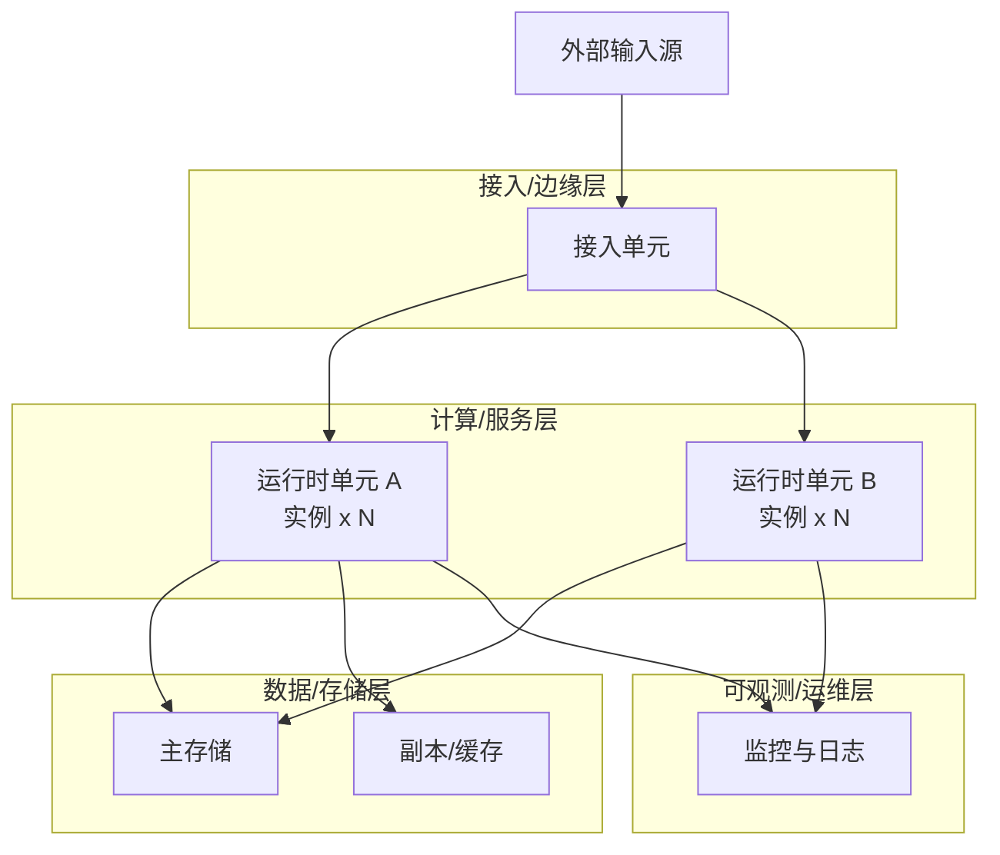
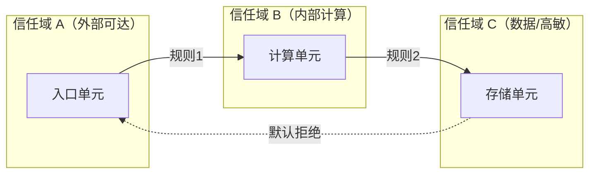

# 部署视图（物理部署与拓扑）

> 本模板为**通用部署视图**，适用于 Web/云原生、嵌入式、桌面、移动、IoT、企业应用等各类系统。
> 方括号 `[...]` 为待填占位；HTML 注释 `<!-- example: ... -->` 给出不同领域的替换示例，按需保留或删除。

## 1. 全局部署拓扑

<!-- guideline: 展示从"外部输入"到"数据持久化"的完整物理路径。
     按实际层次划分 subgraph，不必套用下面四层。 -->

<!-- example (云原生 Web): SRC=用户 ; EDGE=CDN+WAF+ALB+API Gateway ; UNIT=K8s Pod ; STORE=RDS/Redis/Kafka -->
<!-- example (嵌入式设备): SRC=传感器/按键 ; EDGE=驱动/中断 ISR ; UNIT=RTOS 任务 ; STORE=Flash/EEPROM -->
<!-- example (桌面/移动): SRC=用户操作 ; EDGE=UI 进程 ; UNIT=后台进程/Worker ; STORE=本地 DB/文件 -->
<!-- example (IoT 端云):   SRC=设备遥测 ; EDGE=MQTT/HTTP 网关 ; UNIT=云函数/容器 ; STORE=时序库/对象存储 -->
<!-- example (企业内部应用): SRC=内网用户 ; EDGE=反向代理 ; UNIT=应用服务器集群 ; STORE=Oracle/DB2 -->

## 2. 运行时单元与资源配置

<!-- guideline: 列出可独立部署/运行的单元及其实例数、资源约束、调度/扩缩策略。
     "运行时单元"泛指 K8s Deployment、systemd 服务、RTOS 任务、移动端进程、固件模块等。 -->

### 2.1 单元划分与调度

|单元名称|职责|实例数(min/max)|资源约束|调度/扩缩策略|
|-|-|-|-|-|
|[unit-a]|[]|[]|[]|[]|
|[unit-b]|[]|[]|[]|[]|

<!-- example (云原生):  资源约束=CPU/Mem Request/Limit ; 调度=HPA on CPU>70% -->
<!-- example (嵌入式):  资源约束=栈大小/CPU 占用率 ; 调度=固定优先级抢占 -->
<!-- example (企业应用): 资源约束=JVM 堆/线程池 ; 调度=垂直扩展/手动扩容 -->
<!-- example (桌面/移动): 资源约束=内存/后台配额 ; 调度=系统按需拉起/保活 -->

### 2.2 部署制品与关键资源位置

|制品/资源类型|位置|说明|
|-|-|-|
|[清单/配置]|[路径]|[]|
|[密钥/凭据]|[密管系统/路径]|禁止明文入库|
|[隔离/网络策略]|[路径]|[]|

<!-- example (K8s):     Deployment/ConfigMap/Secret(Vault)/NetworkPolicy 文件路径 -->
<!-- example (嵌入式):   镜像/烧录配置/分区表/密钥区在 Flash 的偏移 -->
<!-- example (桌面/移动): 安装包/配置文件/许可证/签名证书位置 -->

## 3. 隔离边界与访问控制

<!-- guideline: 描述"信任域"划分、隔离机制及域间访问控制规则。
     隔离机制包括：网络层 VPC/子网、进程层沙箱/容器、OS 层权限、硬件层 MMU/TrustZone。 -->

|来源|目标|端口/接口|协议/机制|规则|
|-|-|-|-|-|
|[]|[]|[]|[]|[]|

<!-- example (云原生):  信任域=VPC 公网/私网/数据子网 ; 端口=5432 ; 协议=TCP ; 规则=安全组放行 -->
<!-- example (嵌入式):  信任域=非安全世界/TrustZone ; 接口=共享内存/SMC调用 ; 机制=特权级校验 -->
<!-- example (桌面):    信任域=用户/系统进程 ; 接口=IPC/管道 ; 机制=OS ACL/沙箱 -->
<!-- example (IoT):     信任域=设备/边缘/云 ; 接口=MQTT topic ; 机制=设备证书+ACL -->

---

## 4. 入口路径与流量/事件调度

<!-- guideline: 描述外部输入如何进入系统、被路由/分发到内部单元，包括路由规则、认证、限流/回压、协议转换等。 -->

### 4.1 入口路由规则

|入口标识|目标单元|中间处理（认证/限流/熔断/转换）|说明|
|-|-|-|-|
|[]|[]|[]|[]|

<!-- example (Web API Gateway): 路由前缀 /api/v1/orders -> order-service, JWT Auth + RateLimit(1000/min) -->
<!-- example (IoT MQTT):        topic devices/+/telemetry -> ingest-worker, 设备证书双向认证 -->
<!-- example (嵌入式):          中断号/事件源 -> ISR/任务, 优先级 + 队列深度 -->
<!-- example (桌面):           URL Scheme/菜单项 -> handler, 权限校验 -->
<!-- example (企业应用):        交易码/URL -> 服务端 EJB/服务, IP 白名单 + SSO -->

### 4.2 （可选）边缘缓存/缓冲策略

<!-- guideline: 若系统在"边缘"有缓存或缓冲（计算前暂存），在此描述；无则整节删除。 -->

|资源/事件类型|缓存/缓冲策略|失效/回压策略|说明|
|-|-|-|-|
|[]|[]|[]|[]|

<!-- example (Web CDN):    静态资源缓存 30 天, 文件 hash 失效回源 -->
<!-- example (IoT):       遥测数据设备本地缓冲, 网络恢复后回传 -->
<!-- example (嵌入式):     中断事件 FIFO, 满则丢弃最旧/最新 -->
<!-- example (消息队列):   死信队列 + 消费限速回压 -->

## 5. 环境矩阵

<!-- guideline: 列出所有环境及其配置差异，确保环境隔离清晰。环境数量与命名按项目实际调整。 -->

|环境|用途|运行平台|存储|外部依赖|访问控制|
|-|-|-|-|-|-|
|[dev]|开发自测|[]|[]|[]|[]|
|[staging]|集成测试|[]|[]|[]|[]|
|[prod]|生产|[]|[]|[]|[]|

<!-- example (云原生): 运行平台=本地 minikube / EKS Multi-AZ ; 访问控制=IAM+MFA -->
<!-- example (嵌入式): 运行平台=QEMU 仿真 / 评估板 / 产线烧录 ; 访问控制=JTAG 物理管控 -->
<!-- example (桌面/移动): 运行平台=开发机 / 内测分发 / 应用商店 ; 访问控制=签名/许可证 -->
<!-- example (企业应用): 运行平台=开发库 / UAT 集群 / 生产集群 ; 访问控制=域账号+堡垒机 -->

## 6. 容灾与高可用设计

<!-- guideline: 描述系统在各类故障场景下的容灾能力与恢复目标。故障域按系统实际层级列出，不限于下表四行。 -->

|故障场景|影响范围|恢复机制|RTO|RPO|
|-|-|-|-|-|
|单实例故障|[]|[]|[]|[]|
|单可用区/单机故障|[]|[]|[]|[]|
|主存储故障|[]|[]|[]|[]|
|整区域/整站点故障|[]|[]|[]|[]|

<!-- example (云原生):  单 Pod 故障 RTO<30s ; 主库故障 RDS Failover RTO<2min RPO<30s ; 全区域手动切 DR -->
<!-- example (嵌入式):  单任务崩溃由看门狗重启 ; 整机掉电由非易失存储恢复, RPO 取决于落盘周期 -->
<!-- example (桌面/移动): 进程崩溃由系统重启恢复状态 ; 配置云同步, RPO 视同步频率 -->
<!-- example (IoT):     设备离线本地缓冲, 联网回传 ; 云端单元多副本自动切换 -->
<!-- example (企业应用): 中间件 HA 切换 ; 异地容灾 RTO<4h, 依赖日志归档重放 -->