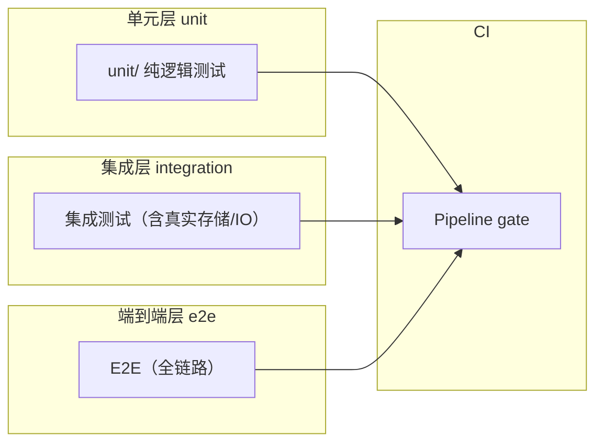

# 开发视图（源码结构与开发者视角）

> 本模板为**通用开发视图**，适用于微服务、单体多模块、嵌入式、桌面、移动、IoT、企业应用等各类系统。
> "开发单元"泛指构建产物、源码模块、测试套件等**构建期**可独立对待的实体（对应 4+1 的 Development View）。
> `[...]` 为待填占位；`<!-- example: ... -->` 给出不同领域的替换示例，按需保留或删除。

## 1. 源码仓库工程结构

<!-- guideline: 展示构建期视图下的源码组织：仓库布局、源码根、构建产物目标、按开发单元分组。
     与 logical_view §1 的结构树互补但不重复 — 这里标注「谁构建出什么、源放在哪、产物去哪」。 -->

```text
project-root/
├── cmd/                       # 可执行程序入口（构建产物 → deployment 视图的运行时单元）
│   ├── api-server/
│   └── worker/
├── internal/                  # 私有库（不被外部导入，保障 API 面稳定）
├── pkg/                       # 公开共享库
├── test/                      # 测试资源/集成测试 与源码分离组织
└── Makefile                   # 构建工具链入口（见 §2）
```

|构建产物|源码根|构建目标|对应运行时单元（deployment §2）|
|-|-|-|-|
|[api-server]|[cmd/api-server/]|[./out/api-server]|[unit-a]|
|[]|[]|[]|[]|

<!-- example (微服务): 产物=可执行文件/容器镜像 ; 源码根=cmd/ 或 src/ ; 目标=repo 内 dist 或镜像仓库 -->
<!-- example (嵌入式): 产物=固件镜像(.bin/.hex) ; 源码根=app/bsp/drivers ; 目标=Flash 分区偏移 -->
<!-- example (JavaScript): 产物=bundle/包 ; 源码根=src/ ; 目标=dist/, 对应 npm 包名 -->

## 2. 构建与依赖工具链

<!-- guideline: 描述构建系统、依赖管理、版本锁定策略、多平台/环境矩阵。为开发者提供「改哪里→怎么构建→怎么验证」的最小路径。 -->

### 2.1 构建命令

|动作|命令|说明|
|-|-|-|
|[构建]|[]|[]|
|[测试]|[]|[]|
|[静态检查]|[]|[]|
|[产物校验]|[]|[]|

<!-- example (标准): make build / npm build / cargo build --release / cmake --build -->
<!-- example (嵌入式): 交叉编译工具链 + 链接脚本 + 烧录命令 -->

### 2.2 依赖与版本管理

|依赖层面|管理机制|版本锁定|备注|
|-|-|-|-|
|[语言依赖]|[go.mod / package.json / Cargo 等]|[lockfile]|[]|
|[基础镜像/工具链]|[]|[]|[]|

## 3. 测试策略与布局

<!-- guideline: 展示测试套件的组织与分层策略，标识「改动某个模块该跑哪些测试」。
     与 governance findings 的 Tests 索引互补 — 这里从开发者视角给到「测试拓扑」，而非存量缺口清单。 -->



|测试层|位置|跑法（命令/触发）|覆盖目标|
|-|-|-|-|
|[单元]|[]|[]|[]|
|[集成]|[]|[]|[]|
|[E2E]|[]|[]|[]|

<!-- example (微服务): 单元=internal/*/..., 集成=带 testcontainers 重现依赖, E2E=全链路 smoke -->
<!-- example (嵌入式): 单元=host 上跑逻辑, 硬件在环 HIL 集成, 产线 smoke=E2E -->
<!-- example (桌面): 单元=Jest/Vitest 组件级, 集成=含窗口/存储, E2E=Playwright 用户流 -->

---

## 4. 开发者入手路径

<!-- guideline: 给「从未接触该项目的工程师」一条最短路径：从仓库根 → 改一处功能 → 构建 → 测试 → 提交。

     这是 4+1 Development View 的核心增量 — 四张运行期视图都不回答「我该怎么开始改代码」。 -->

|步骤|做什么|关键文件/命令|
|-|-|-|
|1. 定位入口|找 main / app 装配点，看架构如何被组装|[cmd/.../main.go]|
|2. 理解一个功能|从 subsystems/<module>/function_tree.yml 叶子 → code_mapping 落点|[按功能名搜 function_tree.yml]|
|3. 本地改起|修改 + 热重载/编译循环|[make dev / npm run dev]|
|4. 验证|跑该模块测试 + 静态检查|[§2.1 命令]|
|5. 提交规范|分支/提交消息/CI 要求|[CONTRIBUTING.md / Git Hook]|

<!-- example: 新功能从架构的哪个视图进入都行，但改代码永远从「源码工程结构 + code_mapping」切入。 -->

## 5. 开发环境与产物一致性

<!-- guideline: 描述开发/CI/产线各自如何产出最终运行物，确保「本地能跑 ≠ 产物一致」被显式写清。 -->

|构建服务|环境|产物差异|一致性保障|
|-|-|-|-|
|[本地开发]|[]|[]|[]|
|[CI/CD]|[]|[]|[]|
|[产线构建]|[]|[]|[]|

<!-- example: 本地=非优化+热重载, CI=优化+单测门禁, 产线=可复现构建/锁版本+签名 -->