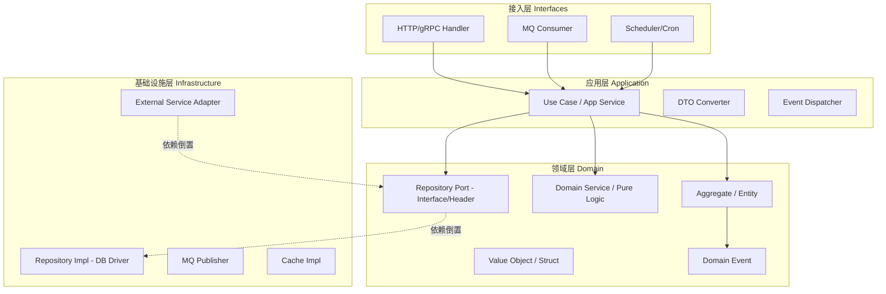
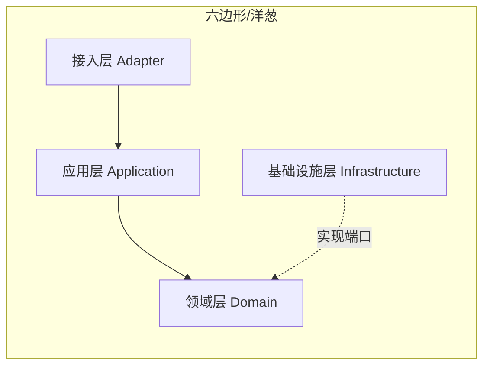
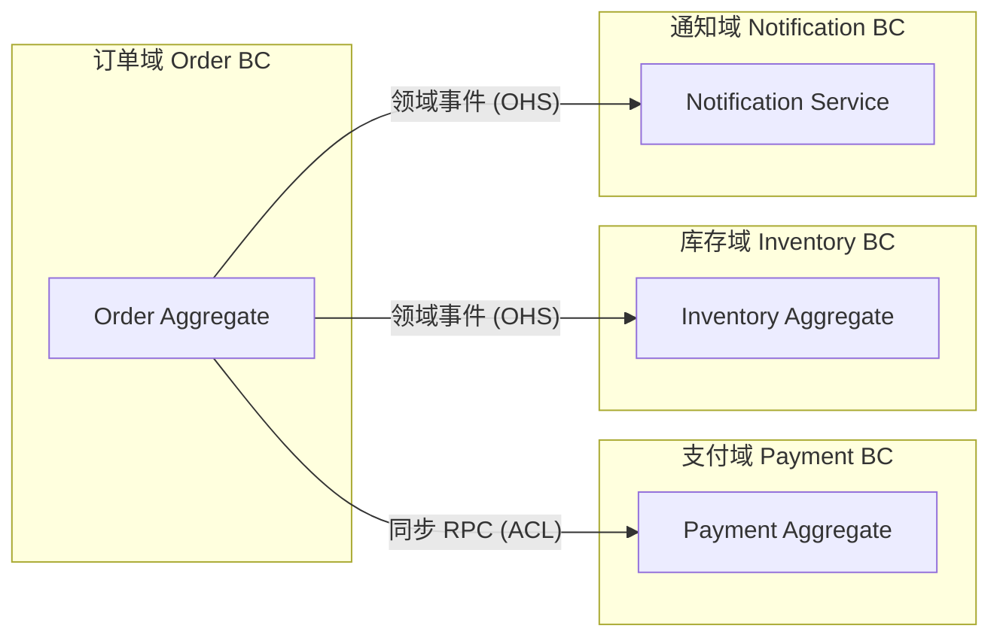

# 逻辑视图

## 代码结构与模块划分

<!-- guideline: 展示项目模块结构，说明每个模块的职责与归属层次。重点标注模块之间的依赖方向（可通过构建系统配置约束），禁止出现循环依赖。 -->

```text
project-root/
├── bin/                      # 可执行程序（接入层入口）
│   ├── api-server/           # [说明：对外提供 REST/RPC 服务]
│   └── worker/               # [说明：后台任务/定时任务调度]
├── lib/                      # 共享库（静态/动态库）
│   ├── domain/               # 领域模型（无外部依赖）
│   ├── application/          # 应用服务（依赖 domain）
│   └── infrastructure/       # 基础设施（依赖 domain，实现 ports）
├── services/                 # 独立微服务（如果适用）
│   ├── order-service/
│   └── payment-service/
└── build/                    # 构建脚本与工具链配置
```

### 模块依赖矩阵

|模块名|依赖模块|禁止依赖|说明|
|-|-|-|-|
|domain|无|所有其他模块|纯领域逻辑，零基础设施依赖|
|application|domain|infrastructure|编排用例，不感知持久化细节|
|infrastructure|domain|application|实现 domain 定义的 Ports（接口）|
|bin/*|application, infrastructure|domain（直接）|作为组装入口，通过应用服务间接访问领域|

## DDD 架构分层

<!-- guideline: 用图示清晰表达各层职责边界与依赖规则（依赖倒置原则）。在非面向对象语言中，依赖倒置通常通过函数指针、回调、接口结构体或抽象头文件实现。 -->



### 架构层因果关系

<!-- policy: 领域层不得直接依赖基础设施层，必须通过端口（接口）反转依赖。 -->



|层|核心职责|允许依赖|禁止事项|
|-|-|-|-|
|接入层|协议转换、路由、参数校验|应用层|不得包含业务逻辑|
|应用层|用例编排、事务边界、领域事件分发|领域层|不得直接操作数据库|
|领域层|聚合根、实体、值对象、领域服务|无（纯领域）|不得依赖框架、数据库、外部服务|
|基础设施层|持久化、消息队列、外部 API 客户端|领域层端口接口|不得包含业务规则|

### 领域边界划分（Bounded Context Map）

<!-- guideline: 描述各 Bounded Context 之间的关系模式（ACL/OHS/Partnership 等）。说明跨域调用的集成方式（同步 RPC / 异步事件 / IPC / 共享内存 等）。 -->



|上游 BC|下游 BC|集成模式|集成方式|防腐层位置|
|-|-|-|-|-|
|订单域|支付域|ACL（下游隔离）|HTTP/gRPC|`order_service/infra/adapters/payment_acl.c`|
|订单域|库存域|OHS（事件发布）|MQ / Message Queue|`order_service/infra/mq/order_event_publisher.c`|

## 领域映射

<!-- guideline: 列出所有限界上下文及其对应的 模块子路径。 -->

|限界上下文|模块路径|核心聚合|上下游上下文|关系类型|
|-|-|-|-|-|
|订单|subsystems/Order_Domain|Order, OrderItem|库存、支付|客户/供应商|
|[]|[]|[]|[]|[]|
