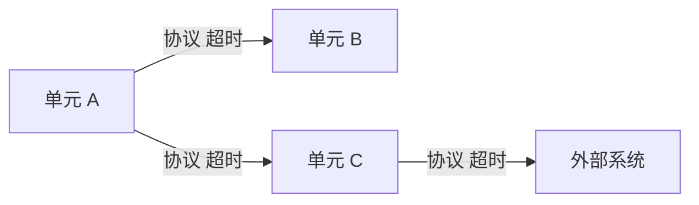
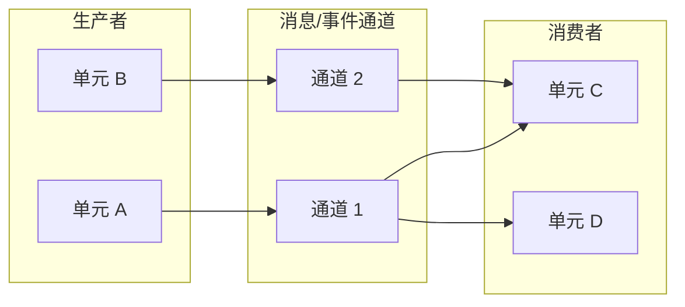
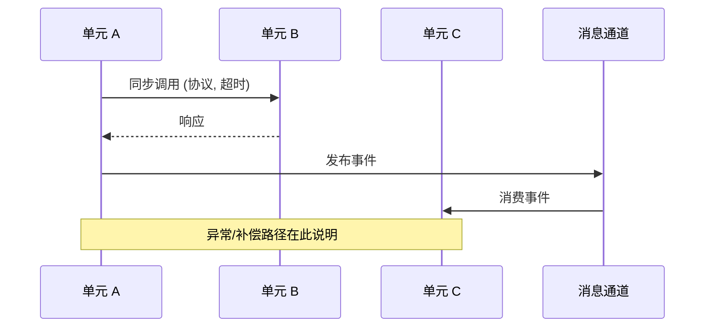
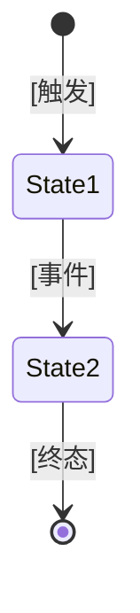

# 进程视图（跨单元运行时协作）

> 本模板为**通用进程视图**，适用于微服务、单体多模块、嵌入式多任务、桌面多进程、IoT 端云等各类系统。
> "运行时单元"泛指进程/服务/任务/模块等可独立行为的最小调度实体。
> `[...]` 为待填占位；`<!-- example: ... -->` 给出不同领域的替换示例，按需保留或删除。

## 1. 跨单元协作流程总览

<!-- guideline: 列出所有需要多单元协作的业务流程。
     标注协作模式与一致性级别，作为全文档索引。 -->

|流程 ID|流程名称|涉及单元|协作模式|一致性级别|详情章节|
|-|-|-|-|-|-|
|[GP-001]|[]|[]|[]|[]|§5|
|[GP-002]|[]|[]|[]|[]|§5|

<!-- example (微服务): 协作模式=编排型 Saga / 事件驱动编舞 ; 一致性级别=最终一致 -->
<!-- example (嵌入式): 协作模式=任务间消息队列 / 直接调用 ; 一致性级别=强一致(共享锁) -->
<!-- example (桌面):   协作模式=进程间 IPC ; 一致性级别=本地事务 -->
<!-- example (IoT):    协作模式=设备↔云端遥测/命令 ; 一致性级别=最终一致(离线缓冲) -->

---

## 2. 同步调用拓扑

<!-- guideline: 展示单元间同步调用关系（请求-响应/阻塞式），标注协议、超时、重试、熔断/降级。
     异步交互见 §3。无同步调用可整节删除。 -->



|调用方|被调用方|协议/机制|超时|重试策略|熔断/降级|关键文件|
|-|-|-|-|-|-|-|
|[]|[]|[]|[]|[]|[]|[]|

<!-- example (微服务): 协议=gRPC/REST ; 重试=3次指数退避 ; 熔断=错误率>50%/10s -->
<!-- example (嵌入式): 机制=函数调用/信号量 ; 超时=看门狗周期 ; 无熔断 -->
<!-- example (桌面):   机制=IPC/本地HTTP ; 重试=1次 ; 降级=离线模式 -->
<!-- example (企业应用): 协议=RMI/HTTP ; 重试=固定间隔 ; 熔断=线程池满快速失败 -->

---

## 3. 异步消息/事件拓扑

<!-- guideline: 展示单元间异步交互：消息/事件的生产、路由、消费。
     "通道"泛指 Kafka topic、RabbitMQ exchange、进程内事件总线、信号槽、中断队列等。
     无异步交互可整节删除。 -->

### 3.1 拓扑与清单



|通道|分区/并发|保留/缓冲|生产者|消费者|消费保障|备注|
|-|-|-|-|-|-|-|
|[]|[]|[]|[]|[]|[]|[]|

<!-- example (Kafka):    通道=topic ; 分区=Partitions/RF ; 保留=7天 ; 保障=At-Least-Once -->
<!-- example (RabbitMQ): 通道=exchange+queue ; 并发=consumer prefetch ; 死信=DLQ -->
<!-- example (进程内):   通道=event bus ; 缓冲=FIFO ; 保障=最多一次/至少一次 -->
<!-- example (嵌入式):   通道=中断/消息队列 ; 缓冲=环形缓冲 ; 保障=尽力而为 -->

### 3.2 事件契约（Schema）

<!-- guideline: 定义所有跨单元事件/消息的格式契约，作为生产者与消费者的约定。无契约则删除本节。 -->

```
// Event: [事件名] -> [通道]
{
  "eventId":    "唯一标识",
  "eventType":  "[类型]",
  "version":    "[语义版本]",
  "occurredAt": "[时间戳]",
  "aggregateId":"[聚合/实体 ID]",
  "payload":    { /* 业务字段 */ },
  "metadata":   { "traceId":"", "source":"" }
}
```

<!-- example: 也可用 Protobuf / Avro / 自定义二进制帧描述 -->

### 3.3 投递语义与保障

|保证维度|策略|实现方式|说明|
|-|-|-|-|
|投递保证|至少一次/最多一次/恰好一次|[]|[]|
|幂等消费|业务幂等键|[键去重表/唯一索引]|[]|
|顺序保证|分区有序/单消费者|[按键 hash 分区]|[]|
|异常处理|死信/重试/告警|[N 次重试后入死信]|[]|

<!-- example (微服务): 投递=At-Least-Once + 手动 ACK ; 幂等=event_id 唯一索引 ; 异常=DLQ+告警 -->
<!-- example (嵌入式): 投递=最多一次(尽力) ; 异常=覆盖最旧/丢弃最新 -->
<!-- example (桌面):   投递=进程内同步派发 ; 幂等=状态校验 -->

---

## 4. 一致性策略

<!-- guideline: 总结跨单元写操作的一致性策略，作为开发决策参考。 -->

### 4.1 策略决策表

|场景|策略|实现方式|适用流程|
|-|-|-|-|
|跨单元写（强关联）|[]|[]|[]|
|本地存储+发消息原子性|[]|[]|[]|
|跨单元查询|[]|[]|[]|
|并发控制|[]|[]|[]|
|幂等性|[]|[]|[]|

<!-- example (微服务): 跨单元写=Saga编排/TCC/2PC ; 原子性=Outbox+CDC ; 查询=CQRS读模型 ; 并发=分布式锁(RedLock)/乐观锁(CAS) ; 幂等=幂等键去重 -->
<!-- example (嵌入式): 跨单元写=共享内存+自旋锁 ; 并发=临界区/关中断 ; 幂等=状态机校验 -->
<!-- example (桌面):   跨单元写=本地事务(SQLite) ; 并发=文件锁/互斥量 ; 幂等=主键约束 -->
<!-- example (企业应用): 跨单元写=XA 两阶段提交 ; 并发=行级锁 ; 幂等=请求号唯一索引 -->

### 4.2 补偿操作清单（仅在使用补偿/Saga 时）

<!-- guideline: 若采用补偿事务，列出每个正向操作对应的补偿操作及其幂等保证。无则删除本节。 -->

|步骤|正向操作|补偿操作|补偿幂等性|补偿超时|备注|
|-|-|-|-|-|-|
|[]|[]|[]|[]|[]|[]|

<!-- example: 正向=扣减库存 ; 补偿=释放库存 ; 幂等=order_id+lock_id ; 超时=10s -->

---

## 5. 端到端核心时序

<!-- guideline: 选 2-3 个最重要的跨单元流程，绘制完整时序：正常路径 + 异常/补偿/超时路径。
     有状态机的流程附状态图。 -->

### 5.1 流程：[流程名]

**触发条件**：[]
**参与单元**：[]
**一致性策略**：[]（协调方：[]）
**关键文件**：[]



**状态机（若有）**



<!-- example (微服务下单): 正常=锁库存→创支付→支付成功→确认 ; 补偿=支付失败→释放库存 ; 状态机=PENDING→LOCKED→PAID→CONFIRMED / CANCELLED -->

## 6. （可选）横切上下文传播

<!-- guideline: 描述跨单元横切上下文如何传播（链路追踪、身份/授权、租户）。
     无跨单元横切需求则删除本节。 -->

|横切关注点|实现规范|传播方式|采样/策略|
|-|-|-|-|
|链路追踪|[]|[]|[]|
|身份/授权|[]|[]|N/A|

<!-- example (微服务): 追踪=OpenTelemetry, Header=traceparent, 采样=Prod10% ; 身份=JWT Claims 经 Header 透传 -->
<!-- example (嵌入式): 追踪=任务执行日志 ; 身份=任务优先级/特权级 -->
<!-- example (桌面):   追踪=本地日志 ; 身份=OS 用户 SID -->