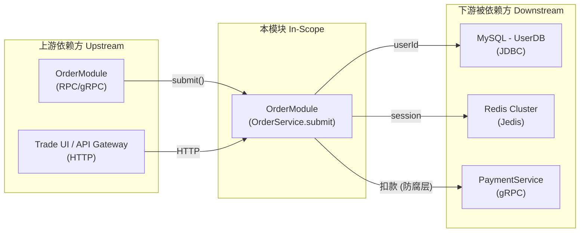

---

project: [Project Name]

type: boundaries

description: [2–3 句描述本子领域的核心职责、业务边界与依赖与上下游交互。]

base_commit: e7a3f1c92b4d5860a1f3c8e7b2d4a6f9c0e1b3d5

---

# 模块边界

## 模块范围

<!-- guideline: 明确本领域负责什么、不负责什么。 -->
<!-- instruct: 职责划分基于代码事实（Gemba），逐行核对证据 `path/to/file:line`；仅凭文件名或目录名不能作为"负责/不负责"的依据。 -->

|维度|本领域负责|本领域不负责（属于其他领域）|
|-|-|-|
|核心职责|订单创建、状态流转、订单查询|支付扣款、物流配送|
|数据所有权|Order, OrderItem 聚合|Payment, Shipment 聚合|
|业务规则|订单金额计算、优惠券校验|支付渠道选择、物流费计算|

## 上下游总览

<!-- guideline: 一张图看清"谁依赖我 / 我依赖谁 / 对外契约"。上下行表格的图形化汇总，二者任一发生变更都必须同步更新本图。 -->

## 上游依赖（Inbound / 谁依赖我）

<!-- guideline: 列出调用本模块、向本模块发送请求或依赖本模块的外部组件与契约（结合跨域集成模式，如 同步 RPC / 异步事件 / 共享内存 等）。 -->
<!-- instruct: 由代码中的调用点反推。每个 Caller 至少核实一条调用链并附证据；无法定位调用点的依赖不得臆造。 -->

|依赖方 (Caller)|交互方式 (RPC/HTTP/Event/Direct)|契约/接口路径|
|-|-|-|
|`OrderModule`|RPC / gRPC|`OrderService.submit()`|
|`Trade UI / API Gateway`|HTTP / REST|`POST /api/v1/orders`|

## 下游依赖（Outbound / 我依赖谁）

<!-- guideline: 列出本模块运行所依赖的外部模块、数据库、第三方服务或基础组件。 -->
<!-- instruct: 区分强依赖与弱依赖：强依赖缺失即不可用；弱依赖缺失可降级。协议/驱动列可从连接池配置、Factory/Driver 注册处提取证据。 -->

|被依赖方 (Callee)|依赖目的|协议/驱动类型|强/弱|
|-|-|-|-|
|`MySQL - UserDB`|用户数据持久化|JDBC / MyBatis|强|
|`Redis Cluster`|分布式缓存/会话|Jedis / Lettuce|弱（可降级直查 DB）|

## 防腐层与协议转换 (Anti-Corruption Layer)

<!-- guideline: 本模块作为上游模型方或下游隔离方时，如何避免外部模型渗入本领域。跨域集成模式（ACL/OHS/Partnership）须与 `architecture_views/logical_view.md` 的 Bounded Context Map 保持一致。 -->
<!-- example (微服务): 外部系统隔离策略=下游服务 DTO 与域内模型隔离，经 Adapter 换算；DTO/领域对象映射=字段语义、单位、枚举值在 Adapter 内显式转换 -->
<!-- example (嵌入式):  外部设备协议经中断/轮询层隔离；寄存器布局与领域值对象映射 -->
<!-- example (桌面):   外部 SDK / 文件格式经 Adapter 层隔离；版本化 DTO 与内部模型双向转换 -->

- **外部系统隔离策略**：
- **DTO / 领域对象映射**：

## 边界变更记录

<!-- guideline: 本模块范围一旦被修改，在此追加条目（新增职责 / 剥离职责 / 上下行依赖变更），后续锚定 `base_commit` 可追溯。 -->

|日期|变更内容|根因 / 触发|关联工件|
|-|-|-|-|
|[]|[]|[]|[]|
