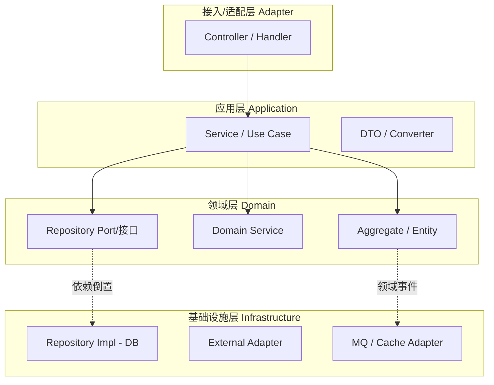
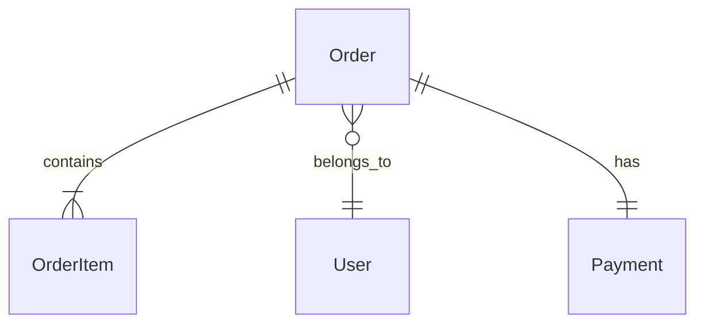
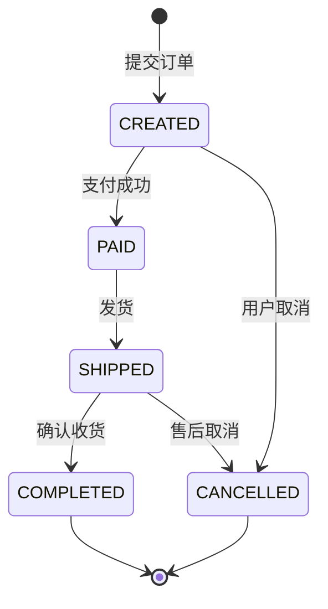
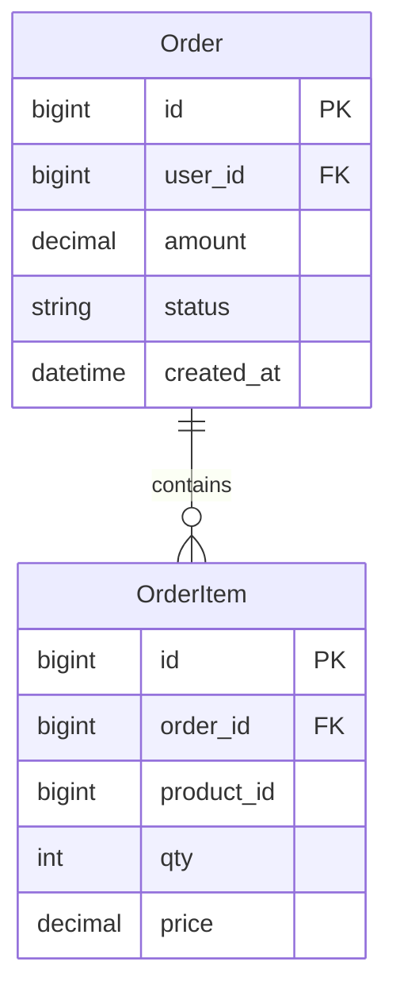
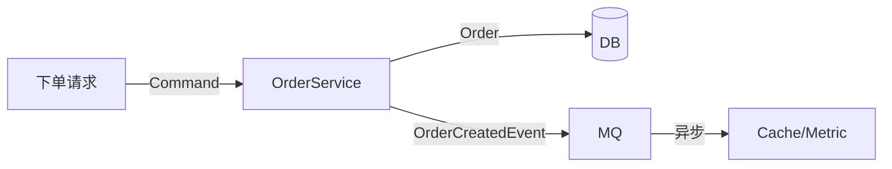

---

project: [Project Name]

type: module-design

description: [2-3 句话：本子系统的内部模块划分原则、核心数据模型、主要对外接口]

base_commit: e7a3f1c92b4d5860a1f3c8e7b2d4a6f9c0e1b3d5

---

# 模块设计：[子系统 / 模块名称]

## 模块定位与核心职责

- **一句话定义**：
- **核心业务/技术能力**：

## 内部架构与分层设计

- **分层模式**：（如：Controller / Service / Repository / Domain Model）

- **核心组件与分工**：

|组件/类名|职责描述|依赖|关键文件|
|-|-|-|-|
|`ExampleManager`|示例核心调度逻辑|||

<!-- guideline: 使用组件分层图表达依赖方向与边界。箭头方向沿"适配/编排→领域"，领域层朝外一律通过接口（端口）反向依赖。 -->

## 核心领域模型与状态机

- **关键实体 (Entities / Value Objects)**：
  - `EntityA`：核心属性与生命周期管理

- **状态转换逻辑**：
  - 状态机流转图或核心状态枚举
  - 列出每个状态转换的**触发事件、执行动作、进入条件**，注明分支冲突的裁决规则

### 实体关系 (ER)

<!-- guideline: 绘制本模块核心实体关系。可先用 erDiagram 呈现，再在其下补充关系语义。 -->

### 状态机

<!-- guideline: 核心状态试图：状态为节点、迁移标注 [触发事件 / 执行动作 / 进入条件]。分支冲突时引入 guard（条件）。终态需显式收敛到 `[*]`。禁止无触发事件的状态自循环。 -->

## 关键工作流与算法实现

- **核心业务流程1(时序/步骤)**：
  1. 步骤一
  2. 步骤二

<!-- guideline: 选择性地为流程补充时序图。展示了"参与者→过程→数据/基础设施"的调用链；异步解耦、补偿路径（失败/重试）同样在图中标注。 -->

## 设计模式

<!-- guideline: 列出本子系统采用的核心模式，并解释"为什么选它"。不要堆砌模式名；每个模式必须能回答"解决什么问题、为什么不是替代方案"。-->

|模式|应用位置|解决的问题|关键文件|说明|
|-|-|-|-|-|
|Repository Pattern|OrderRepositoryPort / OrderRepositoryImpl|解耦领域层与持久化|[]|领域层定义接口，基础设施层实现|
|Domain Event|OrderCreatedEvent 等|解耦聚合间通信|[]|事件通过 EventPublisher 发布|

## 数据设计

### 2.1 核心数据模型

<!-- guideline: 描述本子系统管理的核心数据结构/模型及其关系。
     - 关系型数据：用 ER 图（Mermaid erDiagram）
     - 结构体/对象模型：用类图或结构体关系图
     - 内存/磁盘布局：用结构体定义 + 偏移/对齐说明
     任何方向都需要让读者看清"有哪些数据实体、它们如何关联/嵌套"。 -->

### 2.2 存储与持久化设计

<!-- guideline: 当持久化采用关系型数据库时，提供完整可执行 DDL，含注释、约束、默认值。
     不适用时写"不适用"并删掉本小节。 -->

[]

[//]: # (TODO: 提供 DDL；或写"不适用"并删除本节)

### 2.3 缓存策略

<!-- guideline: 仅当子系统存在缓存层（内存缓存/分布式缓存/页缓存/硬件缓存）时填写。
     说明：缓存什么、Key/索引如何设计、TTL 或失效策略、一致性保证。 -->

[]

### 数据流图（可选）

<!-- guideline: 数据在"写入路径 / 读路径 / 离线任务"三条链路上的流转（入口→处理→存储→副作用）。无跨组件数据流则删除本节。 -->

## 接口契约

### 外部接口

|名称|描述|请求方式|请求参数|返回参数|错误码|
|-|-|-|-|-|-|
|[]|[]|[]|[]|[]|[] <!-- condition: AsNeeded -->|

<!-- example: 名称=创建订单 ; 方式=POST /orders ; 参数=order_items+amount ; 返回=OrderSummary ; 错误码=ORDER_NOT_FOUND / PARAM_INVALID -->

### 内部接口

|名称|描述|调用方|提供方|请求参数|返回参数|
|-|-|-|-|-|-|
|[]|[]|[]|[]|[]|[]|

<!-- example: 名称=OrderRepository.Save ; 调用方=OrderApplicationService ; 提供方=OrderRepositoryImpl ; 参数=Order aggregate ; 返回=持久化 id -->

### 配置接口

|名称|描述|类型|默认值|取值范围|
|-|-|-|-|-|
|[]|[]|[]|[] <!-- condition: AsNeeded -->|[] <!-- condition: AsNeeded -->|

### 错误码与异常定义

<!-- guideline: 所有方向都需要。统一错误码与语义，避免随实现漂移。
     互联网服务常用字符串错误码 + HTTP 状态；操作系统用 errno；库用返回码 + error 对象。
     表格列按实际方向取舍。 -->

|错误码|协议层状态|含义|触发场景|处理建议|
|-|-|-|-|-|
|`ORDER_NOT_FOUND`|HTTP 404|订单不存在|orderId 在 DB 中不存在|调用方视为终态|
|`EINVAL`|errno 22|非法参数|sys_read 传入非法 fd|用户态修正参数|
|`MK_E_DIM`|返回码|矩阵维度不匹配|mk_mat_mul 维度不一致|调用方检查 shape|

## 开发指南

### 洞察

- [ ] [To be filled]

### 扩展指南

<!-- instruct: Explain how to add new functionality to this module following existing patterns.

     For example: "To add a new API endpoint you need to: 1) create a route file under routes/ 2) create a handler under handlers/ 3) ..." -->

### 风格与约定

<!-- instruct: Record module-specific coding conventions (beyond project-level conventions).

     For example: naming rules, error handling approach, log format, etc. -->

### 设计哲学

<!-- instruct: Record this module's design principles and key tradeoff decisions.
     For example: "We chose event-driven over direct calls because ___" -->

### 修改检查清单

<!-- instruct: List the items that must be checked when modifying this module. Generate based on actual dependencies and code structure. -->

- [ ] [To be filled]